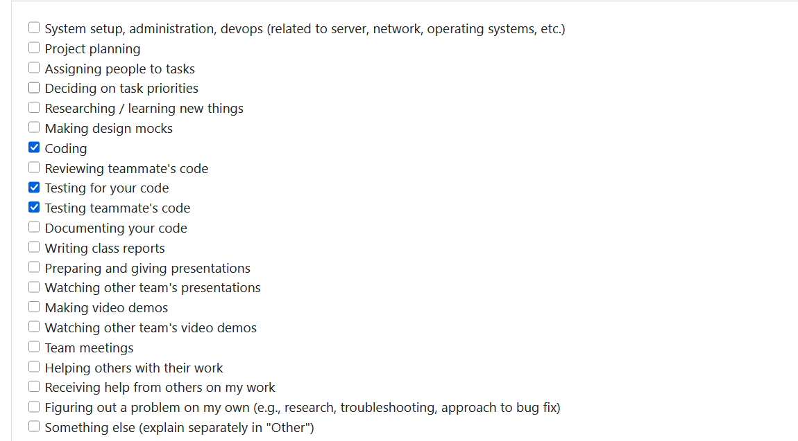
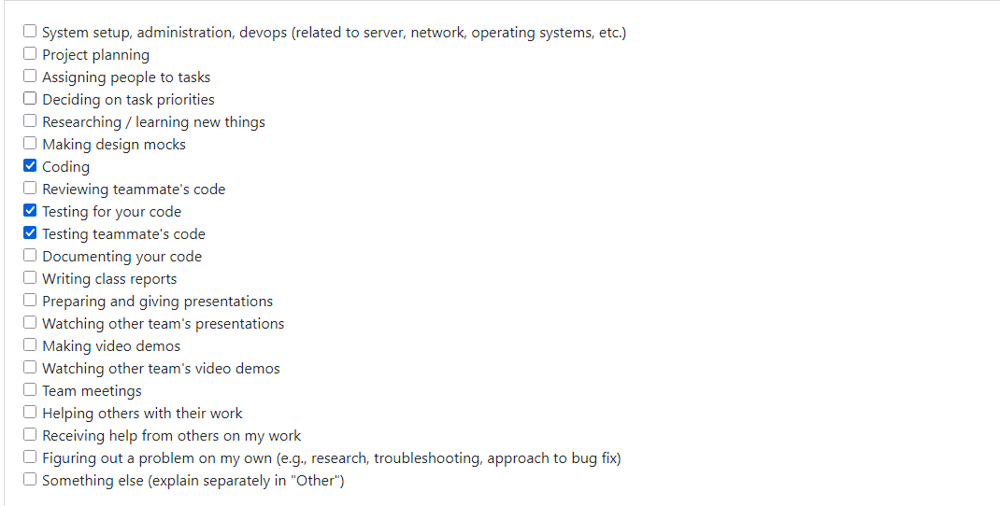
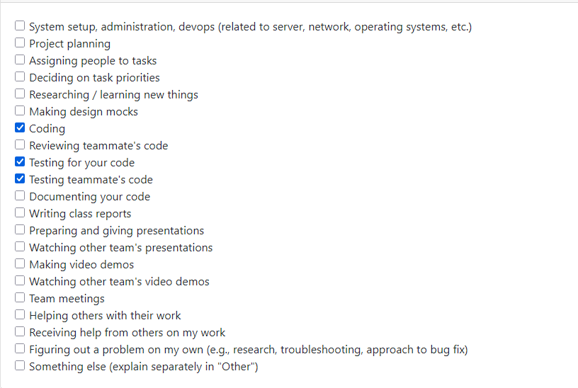
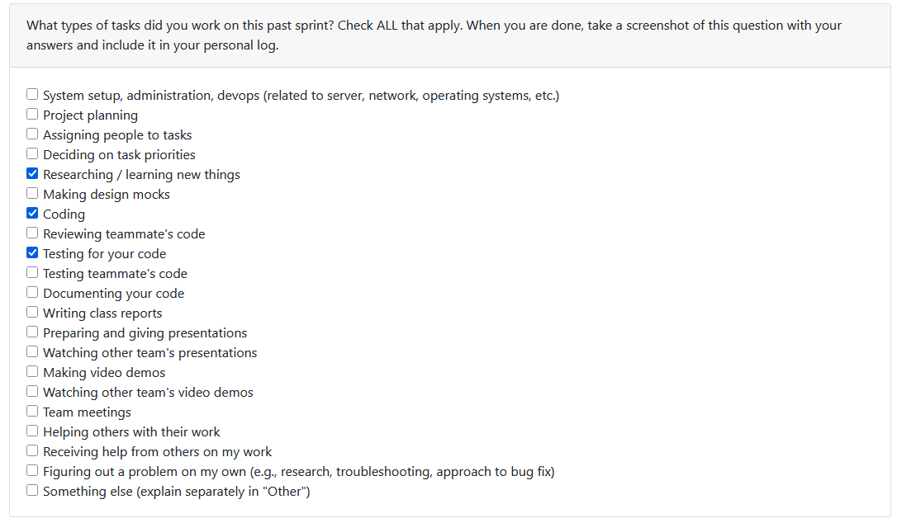
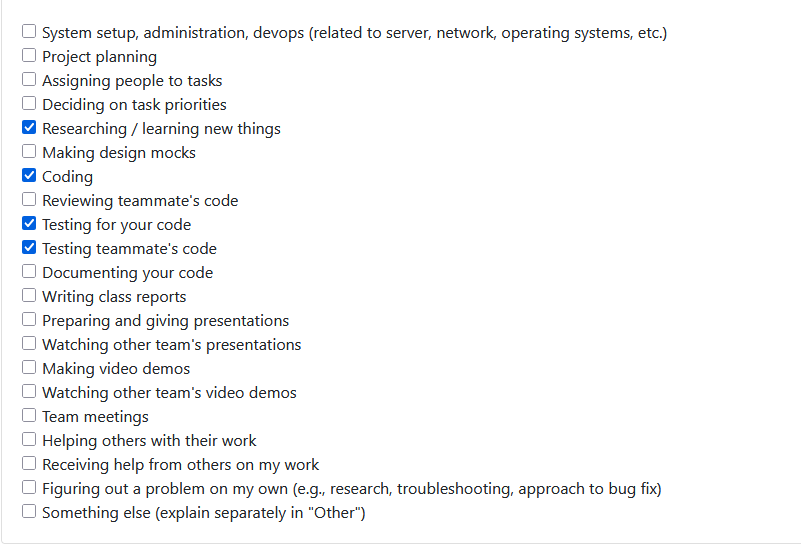
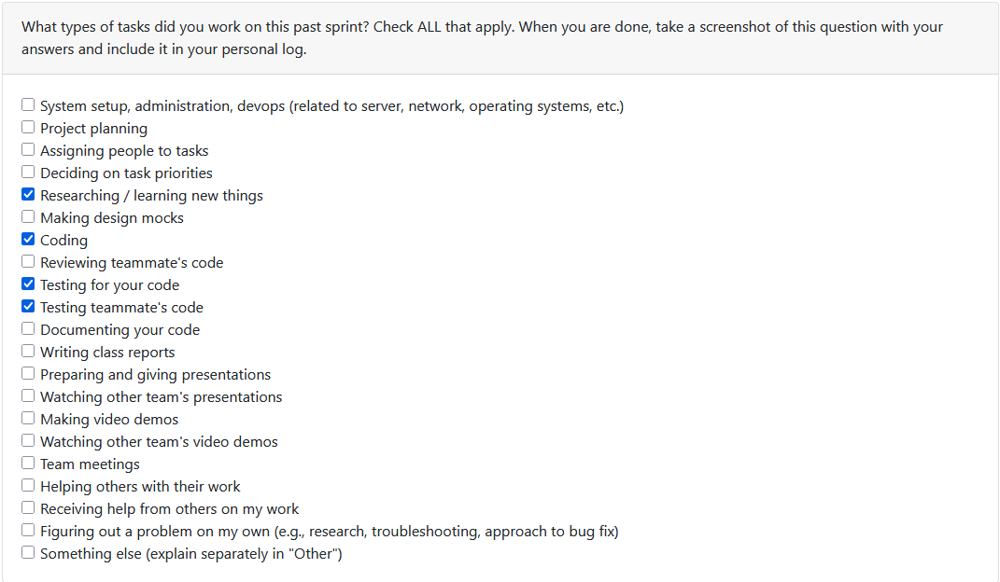
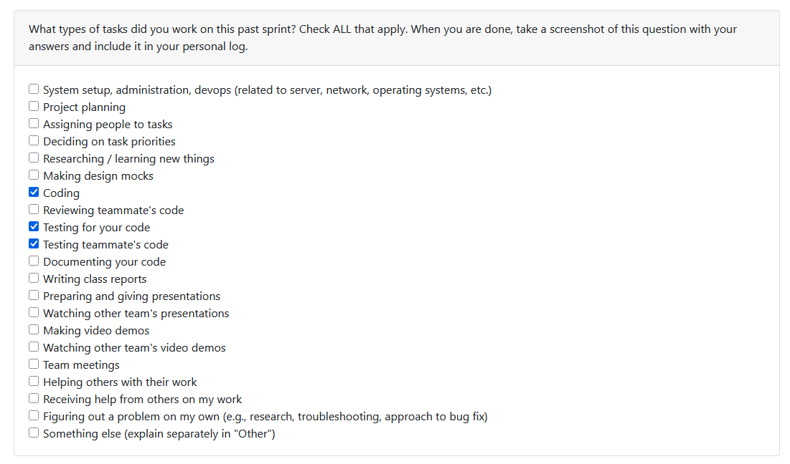
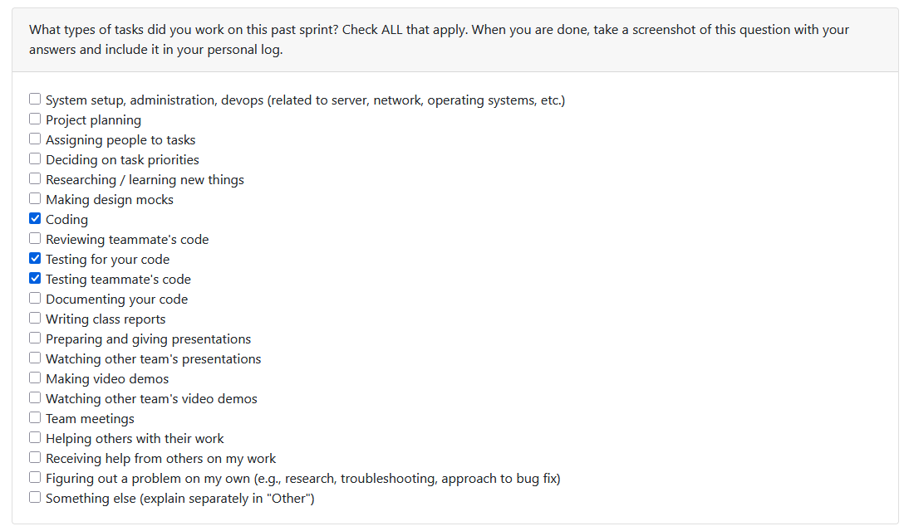
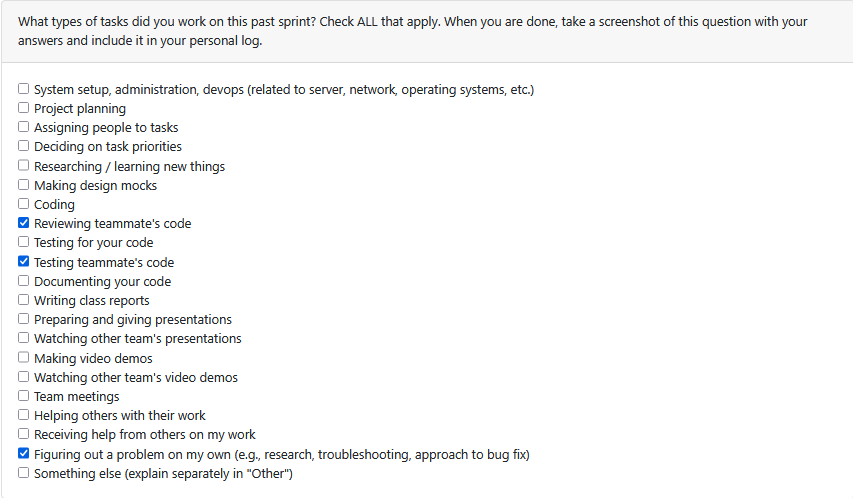

# Individual Log - Abhinav Malik

[Semester 2 - Week 1](#s2w1) | [Semester 2 - Week 2](#s2w2) | [Semester 2 - Week 3](#s2w3)  
[Semester 1 - Week 3](#s1w3) | [Semester 1 - Week 4](#s1w4) | [Semester 1 - Week 5](#s1w5) | [Semester 1 - Week 6](#s1w6) | [Semester 1 - Week 7](#s1w7) | [Semester 1 - Week 8](#s1w8)  
[Semester 1 - Week 9](#s1w9) | [Semester 1 - Week 10](#s1w10) | [Semester 1 - Week 12](#s1w12) | [Semester 1 - Week 13](#s1w13) | [Semester 1 - Week 14](#s1w14)

## Semester 2

## Semester 2 - Week 1 (Week 15 - January 5 to January 11, 2026)

### 1. Type of Tasks Worked On  

---

### 3. Recap of Weekly Goals  

My contributions included: - designing and implementing support for user-defined project roles as editable metadata - extending the storage layer with a new normalized table for project customizations - integrating role data into existing project retrieval flows without re-running analysis - exposing API endpoints to allow setting and updating a user's role for a project - ensuring backward compatibility with existing Milestone 1 data and outputs  

---

### 4. Features Owned in Project Plan - Project Customization - User Role Metadata  

---

### 5. Tasks from Project Board Associated with These Features - Incorporate key role of the user in a given project  

---

### 6. Tasks Completed / In Progress in the Last 2 Weeks  
| Task ID | Issue Title                                   | Status     | Notes |
|---------|-----------------------------------------------|------------|-------|
| 198       | Project User Role Customization  | Completed  | Added persistent user role support with storage, API, and retrieval integration |

---

### 7. Additional Context - The role metadata is stored separately from extracted insights to preserve immutability of analysis results. - Changes were tested locally and in Docker to confirm persistence, correct API behavior, and safe deletion handling.

## Semester 2 - Week 2 (Week 16 - January 12 to January 18, 2026)

### 1. Type of Tasks Worked On

---

### 3. Recap of Weekly Goals
This week focused on implementing the FastAPI service layer skeleton (Milestone 2, Requirement 31).  
My contributions included: - creating the FastAPI app entrypoint with OpenAPI docs support - adding minimal health and read-only runs endpoints - wiring the API to the existing ProjectInsightsStore via dependency injection - implementing and stabilizing API tests on Windows - documenting how to run the server and validate endpoints  

---

### 4. Features Owned in Project Plan - API Service Layer (FastAPI Skeleton) - Backend-Frontend Communication (R31)  

---

### 5. Tasks from Project Board Associated with These Features - PR #214 - FastAPI service layer skeleton  

---

### 6. Tasks Completed / In Progress in the Last 2 Weeks
| Task ID | Issue Title                                   | Status     | Notes |
|---------|-----------------------------------------------|------------|-------|
| 214     | FastAPI service layer skeleton (R31)          | Completed  | Added /health and /runs endpoints with tests and DB wiring |

---

### 7. Additional Context - Verified /docs, /health, and /runs with a stored pipeline run. - Resolved pytest environment and Windows temp DB cleanup issues to get tests passing.
This work satisfies Milestone 2 requirement 31 only; full endpoint coverage (R32) will be implemented in next week sprint.

## Semester 2 - Week 3 (Week 17 - January 19 to January 25, 2026)

### 1. Type of Tasks Worked On

---

### 2. Recap of Weekly Goals

This week focused on implementing Phase 1 of Milestone 2 Requirement 32 by adding a small, coherent set of API endpoints.  
My contributions included: 
- adding API routes for privacy consent, project upload, project list/detail, and portfolio showcase 
- wiring dependency injection for config, role, and storage access 
- triggering the pipeline from the upload endpoint and persisting results in the existing store 
- merging user role metadata into project detail responses 
- validating endpoints via Swagger UI and PowerShell requests

---

### 3. Features Owned in Project Plan

 - FastAPI service layer for project upload and retrieval

---

### 4. Tasks from Project Board Associated with These Features 

- Issue #229 - FastAPI service layer for project upload and retrieval

---

### 5. Tasks Completed / In Progress in the Last 2 Weeks
| Task ID | Issue Title                                   | Status     | Notes |
|---------|-----------------------------------------------|------------|-------|
| 229     | FastAPI core endpoints for projects, consent, and portfolio viewing | Completed  | Added routes, pipeline trigger, and tests for new endpoints |

---

### 6. Additional Context

 - Confirmed upload pipeline executes successfully against a demo ZIP and persists results.
 - Verified Swagger UI workflow for consent, upload, list, detail, and portfolio endpoints. 

---

### 7. Next Week's Focus
 - Implement remaining R32 endpoints (skills, resume, portfolio edit/generate) 
 - Improve API error handling and response consistency - Support frontend integration with API responses

## Semester 1

## Week 3 - September 15 to September 21

### 1. Type of Tasks Worked On
  

---

### 3. Recap of Weekly Goals
This week was mainly focused on early requirement gathering and planning activities. My contributions included: - helping define the project requirements and scope - reviewing features related to artifact collection and analysis with the team - collaborating with group members to finalize the initial requirements document  

---

### 4. Features Owned in Project Plan - Requirements Documentation  

---

### 5. Tasks from Project Board Associated with These Features - Project Requirements  

---

### 6. Tasks Completed / In Progress in the Last 2 Weeks
| Task ID | Issue Title          | Status     | Notes |
|---------|----------------------|------------|-------|
| 3       | Project Requirements | Completed  | Drafted and reviewed with team |

---

### 7. Additional Context
N/A

## Week 4 - September 22 to September 28

### 1. Type of Tasks Worked On

---

### 3. Recap of Weekly Goals
This week, the focus shifted to design and proposal activities. My contributions included: - collaborating on creating the system architecture diagram - contributing to drafting and completing the project proposal  

---

### 4. Features Owned in Project Plan - System Architecture Diagram - Project Proposal  

---

### 5. Tasks from Project Board Associated with These Features - System Architecture Diagram - Project Proposal  

---

### 6. Tasks Completed / In Progress in the Last 2 Weeks
| Task ID | Issue Title              | Status       | Notes |
|---------|--------------------------|--------------|-------|
| 4       | System Architecture      | Completed    | Worked with team to finalize diagram |
| 5       | Project Proposal         | In Progress  | Draft completed, reviewing with team |

---

### 7. Additional Context
N/A  

--- 

## Week 5 - September 29 to October 5

### 1. Type of Tasks Worked On

---

### 3. Recap of Weekly Goals
This week focused on data flow diagrams and system modeling activities. My contributions included: - collaborating on creating Level 0 and Level 1 Data Flow Diagrams (DFDs) - reviewing and refining the DFDs with the team to ensure logical flow and accuracy - discussing with other teams for feedback and improvement  

---

### 4. Features Owned in Project Plan - Data Flow Diagram  

---

### 5. Tasks from Project Board Associated with These Features - Data Flow Diagram  

---

### 6. Tasks Completed / In Progress in the Last 2 Weeks
| Task ID | Issue Title          | Status     | Notes |
|---------|----------------------|------------|-------|
| 6       | Data Flow Diagram    | Completed  | Created Level 0 and Level 1 DFDs with team collaboration |

---

### 7. Additional Context
N/A  

## Week 6 - October 6 to October 12

### 1. Type of Tasks Worked On

---

### 3. Recap of Weekly Goals
This week was focused on revising and refining the system architecture diagram to align with updated workflow and consent management logic in the Mining Digital Work Artifacts System.  
My contributions included: - updating and restructuring the system architecture diagram based on feedback - improving clarity in actor interactions (User, Administrator, Reviewer, External LLM/API) - aligning data flow with the Level 1 DFD for consistency - preparing updated documentation for submission  

---

### 4. Features Owned in Project Plan - System Architecture Diagram (Revision) - Documentation Updates  

---

### 5. Tasks from Project Board Associated with These Features - System Architecture Revision - Documentation Updates  

---

### 6. Tasks Completed / In Progress in the Last 2 Weeks
| Task ID | Issue Title                    | Status      | Notes |
|---------|--------------------------------|-------------|-------|
| 7       | System Architecture Revision   | Completed   | Revised diagram to reflect updated workflow and external service permissions |
| 8       | Documentation Updates          | Completed | Updated README.md and project documentation to include revised architecture |

---

### 7. Additional Context - - 

---

## Week 7 - October 13 to October 19

### 1. Type of Tasks Worked On

---

### 3. Recap of Weekly Goals
This week focused on developing and testing the consent management functionality for the system.  
My main contributions included: - implementing the LLM Consent Manager module to handle user consent for external LLM data access - writing and running unit tests to verify consent operations such as grant, revoke, and reset - designing the system to be compatible with future modules like directory access consent and external LLM analysis  

---

### 4. Features Owned in Project Plan - User Consent - External LLM Data Access - Consent Management Module  

---

### 5. Tasks from Project Board Associated with These Features - User Consent - External LLM Data Access (#17) - LLM Consent Management Implementation (Internal)  

---

### 6. Tasks Completed / In Progress in the Last 2 Weeks
| Task ID | Issue Title                           | Status       | Notes |
|----------|---------------------------------------|--------------|-------|
| 17       | User Consent - External LLM Data Access | Completed  | Implemented backend LLM consent manager with JSON persistence and test coverage |
| - | LLM Consent Management Implementation  | Completed    | Added module to handle user opt-in/out consent  |

---

### 7. Additional Context - All tests for the LLM consent manager passed successfully after debugging one write-handling issue. - Code was structured to integrate easily with future directory access consent and external LLM analysis features. - Preparing to begin work on the External LLM Analysis module in the next sprint. - Continued documenting and refining the module for clarity and maintainability.  

## Week 8 - October 20 to October 26

### 1. Type of Tasks Worked On

---

### 3. Recap of Weekly Goals
This week focused on implementing and testing the Video Analyzer feature, which automates metadata extraction and statistical analysis from local video files and directories.  
My main contributions included: - developing the VideoAnalyzer module with methods for analyzing single files and directories - implementing detailed metrics aggregation (total duration, average FPS, audio count, etc.) - adding colorized CLI output via colorama for improved terminal feedback - writing comprehensive automated tests achieving over 95% coverage - performing manual validation with real video files to ensure correct metadata extraction  

---

### 4. Features Owned in Project Plan - Video Analyzer Module - Local Video Metrics Extraction - Testing and CLI Integration  

---

### 5. Tasks from Project Board Associated with These Features - local analyzer - video processor  

---

### 6. Tasks Completed 
| Task ID | Issue Title                          | Status      | Notes |
|----------|--------------------------------------|-------------|-------|
| 21       | Local analyzer - video processor           | Completed   | Added functionality to extract metadata and compute collection metrics |

---

### 7. Additional Context - Ensured compatibility with moviepy and ffmpeg for video processing. - Integrated robust error handling for corrupt or unsupported file formats. - Verified that all CLI interactions worked across different operating systems (Windows + Git Bash). - Documented the full testing process and created a dedicated Testing Guide (VIDEO_ANALYZER_TESTING_GUIDE.md).  

---

### 8. Next Week's Focus - Begin integration of Video Analyzer results into the overall artifact collection pipeline. - Implement optional JSON export for analyzed results to enable downstream data use. - Work on connecting VideoAnalyzer outputs with the Consent Manager to ensure local-only privacy compliance

## Week 9 - October 27 to November 2

### 1. Type of Tasks Worked On

---

### 3. Recap of Weekly Goals
This week focused on extending the Video Analyzer module to support audio transcription and improving system robustness.  
My main contributions included: - integrating Whisper-based audio transcription to extract spoken content from video files with audio tracks - updating unit tests to validate transcription logic and ensure accurate metadata-to-text pipeline coverage - debugging runtime issues related to subprocess handling and ensuring the analyzer gracefully skips missing or invalid configurations - verifying real-world test cases using local MP4 and MOV files for full functional validation  

---

### 4. Features Owned in Project Plan - Video Analyzer - Transcription Extension - FFmpeg + Whisper Integration - Video Analyzer Unit Tests Update  

---

### 5. Tasks from Project Board Associated with These Features - Video Analyzer - Transcription and Audio Processing - Update Test Suite for VideoAnalyzer  

---

### 6. Tasks Completed / In Progress in the Last 2 Weeks
| Task ID | Issue Title                               | Status       | Notes |
|----------|-------------------------------------------|--------------|-------|
| 92       | local Analyzer - video transcriber | Completed    | Added Whisper model support for speech-to-text transcription |

---

### 7. Additional Context - Ensured Whisper models (`tiny`, `base`, etc.) run efficiently with automatic error handling for unavailable models. - Verified cross-platform setup by documenting FFmpeg installation for Windows, macOS, and Linux users. - Updated the project's `README.md` to include system dependency setup and usage instructions for transcription. - Conducted successful end-to-end runs of `video_example_usage.py` to validate real video input, transcription output, and JSON export pipeline.  

---

### 8. Next Week's Focus - Begin integrating transcribed text data with the artifact collection and consent validation modules. - Work on a method for storing analyzed metadata and transcription results in a structured database - Explore how this data layer can connect to the broader artifact analysis pipeline for unified retrieval and reporting.

## Week 10 - November 3 to November 9

### 1. Type of Tasks Worked On

---

### 3. Recap of Weekly Goals
This week focused on implementing and validating the **Advanced Skill Extractor** for Python files, introducing confidence-based skill scoring and structured JSON output.  
My main contributions included: - implementing confidence-based scoring logic using AST-based static analysis - integrating evidence-level reasoning (pattern type, location, and confidence) for detected skills - extending directory-wide analysis with JSON export support for automated result aggregation - performing multiple test iterations to verify accuracy and consistency across diverse Python samples  

---

### 4. Features Owned in Project Plan - Advanced Skill Extractor (Python) - Confidence-Based Skill Scoring - JSON Export Integration  

---

### 5. Tasks from Project Board Associated with These Features - Advanced Skill Extractor Implementation - Confidence Score Integration - JSON Export for Skill Analysis  

---

### 6. Tasks Completed / In Progress in the Last 2 Weeks
| Task ID | Issue Title                              | Status      | Notes |
|----------|------------------------------------------|-------------|-------|
| 123      | Implement confidence-based evidence scoring for Python in AdvancedSkillExtractor | Completed   | Added AST-driven confidence calculation using detection frequency and pattern context |

---

### 7. Additional Context - Currently, confidence scoring applies only to Python-based analysis; cross-language support will be added later. - Verified single-file and directory analyses using both manual command-line testing and automated pytest validation.  

### 8. Next Week's Focus - Extend the confidence scoring framework to other languages (Java, C++, JavaScript). - Add skill category mapping for architecture, performance, and design patterns.

## Week 12 - November 10 to November 16

### 1. Type of Tasks Worked On

---

### 3. Recap of Weekly Goals
This week focused on enhancing the Advanced Skill Extractor by expanding its ability to detect deeper computer-science concepts across multiple languages.  
My contributions included: - adding detection for OOP principles such as abstraction, encapsulation, inheritance, and polymorphism - extending multi-language analysis to identify functional constructs, algorithm usage, memory-management patterns, and module architecture - improving detection of code structure indicators like coupling and cohesion - updating directory-level JSON export to reflect the enriched skill set - removing confidence scoring logic and restructuring evidence to remain deterministic and consistent with the new design - validating the implementation by updating and running the entire test suite, ensuring all previous tests passed after changes  

---

### 4. Features Owned in Project Plan - Advanced Skill Extractor - Deep CS Concept Detection - Multi-Language Skill Extraction Enhancements  

---

### 5. Tasks from Project Board Associated with These Features - Issue #144 - Deep CS Concept Detection for Skill Extractor  

---

### 6. Tasks Completed / In Progress in the Last 2 Weeks
| Task ID | Issue Title                                      | Status     | Notes |
|---------|---------------------------------------------------|------------|-------|
| 144     | Deep CS Concept Detection for Skill Extractor     | Completed  | Added multi-language OOP, algorithmic, architectural, and functional analysis |

---

### 7. Additional Context - Updated the entire test suite to align with the redesigned extractor, removing deprecated confidence tests. - Confirmed compatibility with existing modules and JSON serialization.  

---

### 8. Next Week's Focus - Implement the final complexity analysis module for deeper algorithmic reasoning. - Add chronological ordering logic for skill evidence and structured output.  

## Week 13 - November 17 to November 23

### 1. Type of Tasks Worked On  

---

### 3. Recap of Weekly Goals  
This week focused on finalizing the **Advanced Skill Extractor** by completing the time-complexity analysis module and preparing it for integration into the pipeline.  
My contributions included: - implementing a multi-language time-complexity detection module using AST and regex heuristics - extending the extractor to generate aggregated complexity insights such as loop depth, recursion, algorithm usage, branch count, and class method metrics - improving snippet extraction, evidence formatting, and category prioritization - validating the new design by running the full test suite and ensuring all 25 tests passed successfully - performing manual checks inside Docker to confirm consistent behavior in isolated environments  

---

### 4. Features Owned in Project Plan - Advanced Skill Extractor - Time Complexity Module - Evidence + Category Ordering Logic - Multi-Language Complexity Support  

---

### 5. Tasks from Project Board Associated with These Features - Issue #153 - Implement and integrate time-complexity analysis into the Advanced Skill Extractor  

---

### 6. Tasks Completed / In Progress in the Last 2 Weeks  
| Task ID | Issue Title                                          | Status     | Notes |
|---------|-------------------------------------------------------|------------|-------|
| 153     | Time Complexity Analysis for Skill Extractor          | Completed  | Added multi-language loop-depth, recursion, and algorithm detection with full test validation |

---

### 7. Additional Context - Confirmed that the output remains a single JSON-serializable object, ensuring compatibility with the orchestrator and downstream systems. - Verified that the updated extractor works consistently in Docker and does not break existing pipeline tests. - Improved maintainability by consolidating pattern libraries and removing duplicate logic across languages.

---

### 8. Next Week's Focus - Fix any remaining issues or inconsistencies across analyzer modules. - Clean up and polish logic across the extractor to ensure stable integration. - Support teammates during final integration to ensure all components work smoothly together.

## Week 14 - November 24 to November 30

### 1. Type of Tasks Worked On  

---

### 3. Recap of Weekly Goals  
This week focused on final review, troubleshooting, and confirming full requirement coverage across the system.  
My contributions included: - troubleshooting edge-case behaviors across multiple modules and reporting bugs to teammates for fixes - validating pipeline output for correctness and stability in both local and Docker environments - reviewing all milestone requirements (R1-R12) to ensure each was implemented and documented - coordinating with teammates to close remaining gaps before integration and demo preparation  

---

### 4. Features Owned in Project Plan - System Review and Requirement Verification - Troubleshooting and Stability Analysis  

---

### 5. Tasks from Project Board Associated with These Features - Final Requirement Review - Edge-Case Troubleshooting and Reporting  

---

### 6. Additional Context - Performed multiple full pipeline runs to verify stability and output structure. - Helped ensure the system meets all milestone deliverables before final submission.
