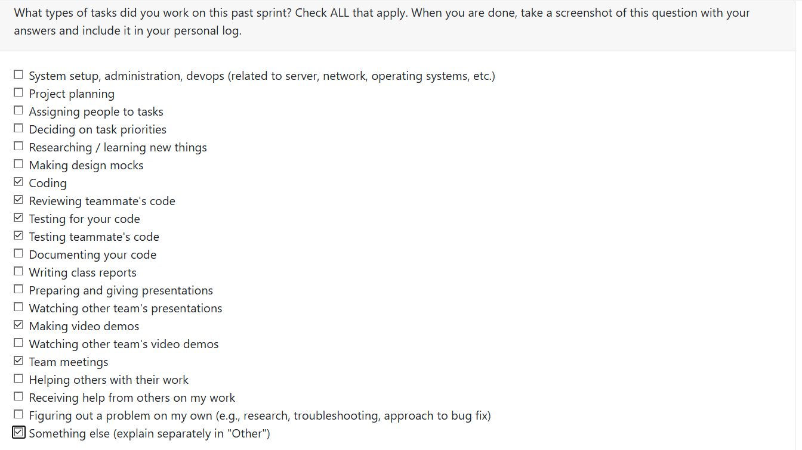
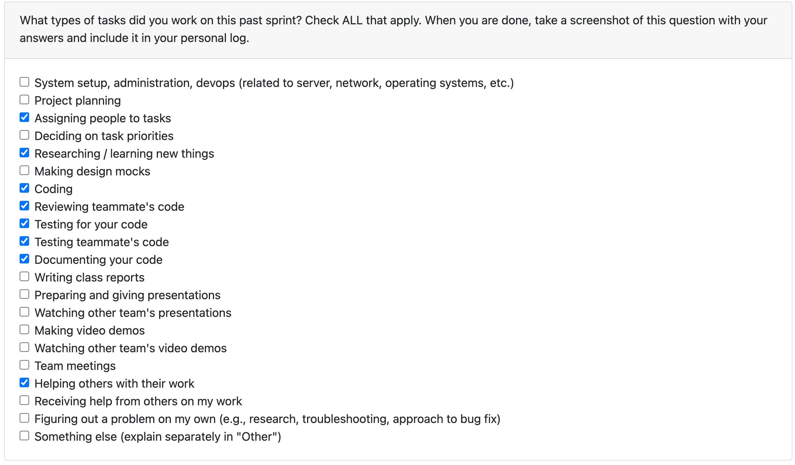
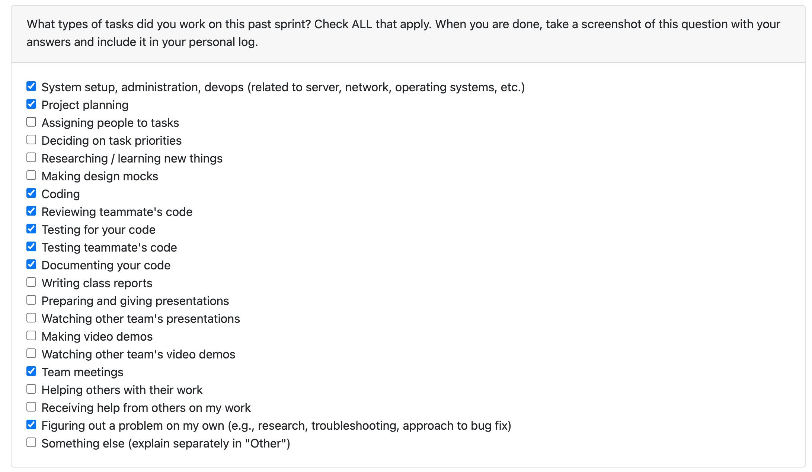
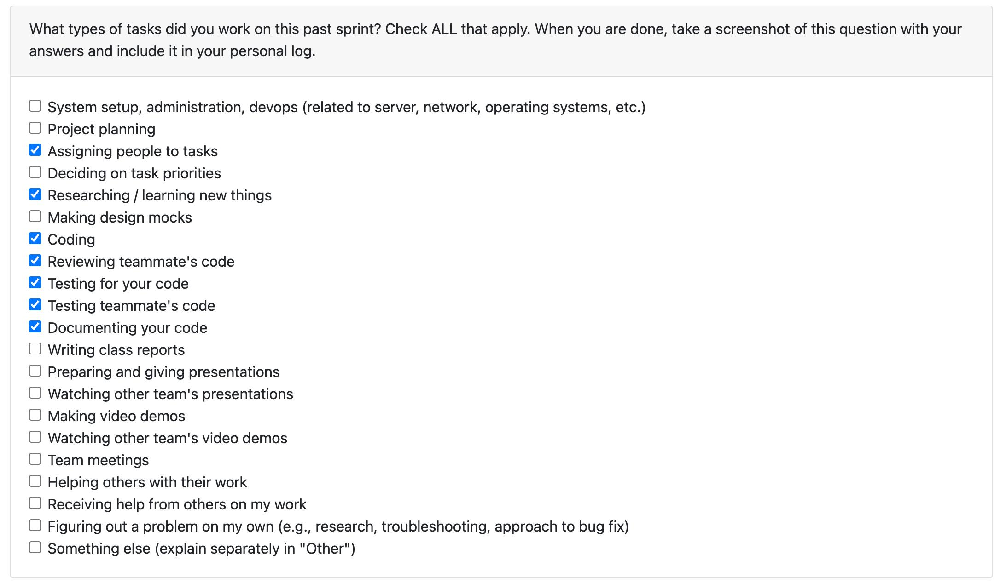
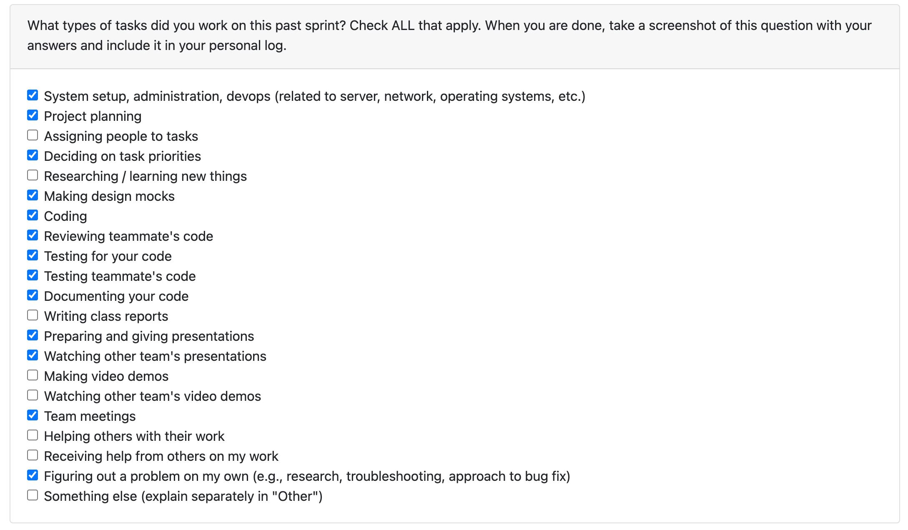
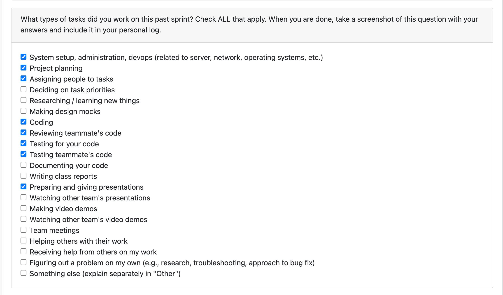

# Individual Log – Misha Gavura

## Week 5
This section outlines the individual log for week 5

### 29th September 2025 - 5th October 2025

### Tasks

### Weekly Goals

#### What I did
- Co-created Level 0 (context) and Level 1 DFDs.
- Met with other teams to compare models and resolve naming, scope, and data-flow differences.
- Incorporated feedback and finalized a team-approved diagram set with brief notes.

#### Project board
- **Task:** Data Flow Diagram (L0 & L1)
- **Deliverables:** Diagrams + short legend/decision log

#### Status
- Completed — diagrams uploaded and linked on the board.

#### Impact / Next
- Shared, clear view of system boundaries and data movement.
- Will version updates as requirements evolve and use these as inputs for the data dictionary and interface specs.

## Week 7
This section outlines the individual log for week 7

### 12th October 2025 - 19th October 2025

### Tasks

### Weekly Goals

#### What I did
Built a production-ready OpenAI integration that analyzes code/commits/projects and generates portfolio content, with comprehensive tests and 5 detailed guides showing exactly how to use and customize it.

#### Project board
- **Task:** 
External LLM Analysis #20: https://github.com/COSC-499-W2025/capstone-project-team-14/issues/20

#### Status
Result: Team can now use AI to analyze artifacts, extract skills, and generate professional portfolio summaries. Just add an API key and it works! 🚀

#### Impact / Next
- Connect the integration with the file separator
- Ensure that conscent screen is present before running the LLM access and sending requests

## Week 9
This section outlines the individual log for week 9

### 27th October 2025 - 2 November 2025

### Tasks

### Weekly Goals

#### What I did
Creates a summary using OpenAI API for the docx, pptx, text files, ready to use.
Planning on expanding it and working for more file types.

#### Project board
- **Task:** 
External LLM Analysis #20: https://github.com/COSC-499-W2025/capstone-project-team-14/issues/20

#### Status
Creates a summary using OpenAI API for the docx, pptx, text files, ready to use.
Planning on expanding it and working for more file types.

#### Impact / Next
- Work on image summary
- Work on code summary

## Week 13
This section outlines the individual log for week 13

### November 23 2025 to November 30  

### Tasks

### Weekly Goals

#### What I did
I'm in a progress of implementation of a chronological timeline generator that analyzes project artifacts by modification date and builds a unified skills timeline. The system processes code files, documents, images, and videos, extracting skills and metadata from each. It sorts all artifacts chronologically, tracking when specific skills first appeared and how they evolved over time. The analyzer integrates outputs from multiple specialized analyzers (code, text, image, video) into a single timeline view. Results export to JSON, CSV, and plain text formats, showing skill progression across the entire project history. This enables portfolio creators to demonstrate skill development and project evolution with concrete timestamps.
Output: Chronological skill timeline with timestamps, categories, and detected skills per artifact.

Worked on a presentation and prepared slide for the Git Code Analysis and History

#### Project board
- **Task:** 
External LLM Analysis #33: https://github.com/orgs/COSC-499-W2025/projects/19/views/2?pane=issue&itemId=133282130&issue=COSC-499-W2025%7Ccapstone-project-team-14%7C33

#### Status
In progress, most part is done, doing some testing

#### Impact / Next
- Generate Chronological Project List Issue #35

### Week 14
### December 1 2025 to December 7  

### Tasks

### Weekly Goals

#### What I did
Continued working on the chronological timeline generator and focused on **fixing and refining the chronological list updates**. I improved how artifacts are sorted and grouped, resolved issues with duplicate entries, and handled edge cases where timestamps or file metadata were inconsistent. The generator now produces a cleaner unified skills timeline that better reflects the real evolution of the project.

I also **worked on the project presentation**, updating and polishing the slides for the Git code analysis and history. I clarified how the analyzer integrates data from multiple artifact types (code, documents, images, videos) and improved the flow of the presentation to match the demo storyline.

Additionally, I **worked on video demo recordings**, capturing walkthroughs of the timeline generator, explaining the main features, and recording demo runs. This included preparing sample outputs (JSON/CSV/text) and drafting a narration script for the final demo video.

#### Project board
- **Task:** Generate Chronological Project List – Issue #35

#### Status
Done. Core functionality is working

#### Impact / Next
Work on the milestone #2.

---

## Semester 2

## Semester 2 - Week 2 (Week 16 - January 12 to January 18, 2026)

### Tasks

---

### Recap of Weekly Goals

This week focused on implementing API architecture refactoring and privacy consent management endpoints (Milestone 2, Requirement - Privacy Consent API).  

My contributions included:
- Consolidating scattered API code into a unified `src/api/` structure
- Creating comprehensive privacy consent endpoints with full CRUD operations
- Implementing shared dependency injection patterns for database access
- Setting up FastAPI application with CORS and auto-generated documentation
- Writing extensive tests and documentation for all new endpoints

---

### Features Owned in Project Plan
- API Architecture Consolidation
- Privacy Consent API Endpoints (Issue #218)
- Backend API Infrastructure

---

### Tasks from Project Board Associated with These Features
- PR #218 - API Architecture Refactoring & Privacy Consent Implementation

---

### Tasks Completed / In Progress
| Task ID | Issue Title                                      | Status    | Notes |
|---------|--------------------------------------------------|-----------|-------|
| 218     | API Architecture Refactoring & Privacy Consent   | Completed | Created unified API structure, implemented 7 consent endpoints, added 15 tests |

---

### What I Did

**1. API Consolidation**
- Created new `src/api/` directory structure for centralized API management
- Migrated existing routers from scattered locations (`insights/`, `projects/`) into organized `api/routers/` structure
- Implemented shared dependencies module (`dependencies.py`) for reusable DB store factories
- Set up main FastAPI application (`app.py`) with CORS configuration and auto-generated documentation

**2. Privacy Consent API Endpoint**
- Implemented comprehensive `/privacy-consent` endpoint with 7 routes:
  - POST for granting consent (LLM, directory, or both)
  - DELETE for revoking consent
  - GET endpoints for status checking (all, LLM-only, directory-only)
  - POST for resetting consents
  - PATCH for updating allowed directory paths
- Integrated with existing `LLMConsentManager` and `DirectoryConsentManager`
- Added request/response validation using Pydantic models

**3. Testing & Documentation**
- Created `tests/api/test_consent_api.py` with 15 comprehensive test cases
- Wrote detailed API documentation in `src/api/README.md`
- All code passes linter checks with zero errors
- Added interactive Swagger UI documentation at `/docs`

**Technical Details:**
- Used FastAPI framework with dependency injection pattern
- Maintained backward compatibility with existing business logic
- Implemented RESTful API design principles

---

### Additional Context
- The API architecture now provides a clean foundation for future endpoint development
- Privacy consent management is fully functional and ready for frontend integration
- All consent operations are persisted to local JSON files as designed in Milestone 1
- Verified /docs, /privacy-consent endpoints work correctly with all CRUD operations

---

### Planning Activities for Next Cycle

**Semester 2 - Week 3 Goals:**
- Continue expanding API endpoints for other features (projects, insights, analysis)
- Integrate frontend with new privacy consent API
- Add authentication/authorization layer if required
- Explore WebSocket support for real-time pipeline status updates

---

## Semester 2 - Week 3 (Week 17 - January 19 to January 25, 2026)

### Tasks

---

### Recap of Weekly Goals

This week focused on implementing chronological skills feature, creating helper scripts, and major documentation cleanup.

My contributions included:
- Building CLI tool and 3 API endpoints for chronological skills analysis
- Creating 7 helper scripts for common operations (pipeline, API, port management)
- Verifying all 21 project requirements are implemented and tested
- Reorganizing and simplifying documentation (reduced by ~75%)
- Cleaning up old report files and streamlining project structure

---

### Features Owned in Project Plan
- Chronological Skills Timeline (CLI + API)
- Helper Scripts and DevOps Automation
- Documentation Organization

---

### Tasks from Project Board Associated with These Features
- Chronological Skills Feature Implementation
- Documentation Cleanup and Reorganization

---

### Tasks Completed / In Progress
| Task ID | Issue Title                              | Status    | Notes |
|---------|------------------------------------------|-----------|-------|
| #33     | Chronological Skills Timeline            | Completed | CLI tool + 3 API endpoints with JSON/CSV/text output |
| -       | Helper Scripts                           | Completed | 7 scripts for pipeline, API, and port management |
| -       | Documentation Reorganization             | Completed | Reduced docs by ~75%, moved to docs/ directory |

---

### Additional Context
- All endpoints verified working in Swagger UI and via API tests
- Helper scripts support both local and Docker environments
- Created comprehensive testing guides for all features
- Project structure now clean with only README.md in root

---

### Planning Activities for Next Cycle

**Semester 2 - Week 4 & 5 Goals:**
- Implement advanced project filtering system with comprehensive filter engine
- Add filter preset management functionality
- Create database schema for filter presets

---

## Semester 2 - Weeks 4 & 5 (Weeks 18-19 - January 26 to February 8, 2026)

### Tasks

---

### Recap of Weekly Goals

This two-week period focused on implementing **Part 1** of the advanced project filtering system: the core filtering engine and data models.

My contributions included:
- Building comprehensive filtering engine with 11 sorting options and multiple filter criteria
- Implementing filter preset management (save, load, list, delete)
- Creating type-safe design using dataclasses and enums
- Adding full integration with existing `ProjectInsightsStore` database schema
- Writing extensive documentation and test scripts

---

### Features Owned in Project Plan
- Advanced Project Filtering Engine
- Filter Preset Management System
- Success Metrics Filtering (LOC, commits, contributors, files)

---

### Tasks from Project Board Associated with These Features
- Part 1 of Advanced Project Filtering Feature Implementation

---

### Tasks Completed / In Progress
| Task ID | Issue Title                              | Status    | Notes |
|---------|------------------------------------------|-----------|-------|
| TBD     | Advanced Project Filtering (Part 1)      | Completed | Core engine with 466 lines, 11 sorting options, full-text search |

---

### What I Did

**1. Core Filtering Engine (`src/insights/project_filter.py` - ~466 lines)**
- Implemented `ProjectFilterEngine` with comprehensive filtering capabilities:
  - Date range filtering (created/modified dates)
  - Technology stack filtering (languages, frameworks, skills)
  - Project type filtering (personal, academic, professional)
  - Complexity and importance filtering
  - Success metrics filtering (LOC, commits, contributors, files with min/max thresholds)
  - Full-text search across project names, descriptions, taglines, and summaries
- Added 11 custom sorting options:
  - By importance, creation date, modification date, LOC, commits, contributors, name, project type
  - Both ascending and descending order support
- Implemented pagination with limit/offset support

**2. Filter Preset Management**
- Created `FilterPreset` class for saving custom filter configurations
- Implemented CRUD operations:
  - Save presets with custom names and descriptions
  - Load presets by ID or name
  - List all saved presets
  - Delete presets
- Added new database table: `filter_presets` for persistent storage

**3. Type-Safe Design**
- Used dataclasses for clean data structures:
  - `ProjectFilter` - Main filter configuration
  - `FilterPreset` - Saved filter configurations
  - `DateRange` - Date filtering
  - `SuccessMetrics` - Metric thresholds
- Created enums for type safety:
  - `SortBy` - Sorting options
  - `ProjectType` - Project categories

**4. Database Integration**
- Full integration with existing schema (project_info, projects, portfolio_insights, tags, skill_evidence)
- SQL query builder with dynamic WHERE clause generation
- Automatic table creation with `CREATE TABLE IF NOT EXISTS`
- No breaking changes to existing functionality

**5. Testing & Documentation**
- Created `test_filter.py` demonstrating all filtering features
- Added comprehensive inline docstrings
- Provided manual testing commands for Docker environment
- Verified compatibility with existing database schema

**Technical Details:**
- SQL query generation with proper JOIN operations across 5 tables
- Support for multiple filter combinations
- Performance-conscious design using existing database indexes
- Type-safe throughout with Python type hints

---

### Additional Context
- **No breaking changes** - All additions are backward compatible
- **Database migration** - New table created automatically on first use
- **Performance** - Leverages existing indexes, scales well with current dataset
- All filtering operations tested with existing project data
- Ready for Part 2: REST API endpoint implementation

---

### Planning Activities for Next Cycle

**Semester 2 - Week 6 Goals:**
- Implement Part 2: REST API endpoints for filtering system
- Add `/insights/filter` endpoint for applying filters
- Create endpoints for filter preset management
- Enhance API error handling and response consistency

---

## Semester 2 - Week 6,7 (Week 20 - February 16 to February 22, 2026)

### Recap of Weekly Goals

This week focused on implementing **Part 2** of the advanced project filtering system: REST API endpoints and comprehensive unit tests.

My contributions included:
- Building 8 REST API endpoints for project filtering and preset management
- Creating comprehensive unit tests (12 test cases) covering all filtering functionality
- Implementing request/response validation with Pydantic models
- Fixing critical OFFSET-without-LIMIT SQL bug in core filtering engine
- Registering filter router in main API application

---

### Features Owned in Project Plan
- Project Filtering REST API
- Filter Preset Management Endpoints
- Full-text Search API
- Filter Options Discovery Endpoint

---

### Tasks from Project Board Associated with These Features
- Part 2 of Advanced Project Filtering Feature Implementation

---

### Tasks Completed / In Progress
| Task ID | Issue Title                              | Status    | Notes |
|---------|------------------------------------------|-----------|-------|
| TBD     | Advanced Project Filtering (Part 2)      | Completed | 8 API endpoints, 12 unit tests, bug fixes |

---

### What I Did

**1. REST API Endpoints (`src/api/routers/filter.py`)**
- Implemented comprehensive filtering API with 8 routes:
  - `POST /filter/` - Apply filter configuration and get matching projects
  - `GET /filter/search?q=` - Full-text search across project names, descriptions, summaries
  - `GET /filter/options` - Available filter options for UI dropdowns (languages, frameworks, types, importance levels)
  - `GET /filter/presets` - List all saved filter presets
  - `GET /filter/presets/{id}` - Get specific preset by ID
  - `POST /filter/presets` - Save or update a filter preset
  - `DELETE /filter/presets/{id}` - Delete a preset
  - `POST /filter/presets/{id}/apply` - Apply a saved preset directly
- Request/response validation with Pydantic models:
  - Metrics range validation (min ≤ max)
  - Preset name length constraints (1-100 chars)
  - Pagination bounds validation
- Registered filter router in `src/api/routers/__init__.py`

**2. Unit Tests (`tests/insights/test_project_filter.py`)**
- Created 12 comprehensive test cases covering:
  - `ProjectFilter` serialization (to_dict/from_dict)
  - Basic filtering by technologies and project type
  - Full-text search functionality
  - Sorting (by importance, date, metrics)
  - Success metrics filtering (LOC, commits, contributors, files)
  - Pagination with limit/offset
  - Filter preset CRUD operations (save, load, list, delete, apply)
- All tests pass with mocked database responses

**3. Bug Fixes**
- Fixed critical OFFSET-without-LIMIT SQL bug in `src/insights/project_filter.py`
- Issue: SQL OFFSET clause was applied without LIMIT, causing unpredictable results
- Solution: Only apply OFFSET when LIMIT is explicitly set

**Technical Details:**
- FastAPI framework with async/await support
- Dependency injection for database access
- RESTful API design with proper HTTP status codes
- Comprehensive error handling and validation
- Auto-generated OpenAPI documentation

---

### Additional Context
- **Complete filtering system** - Both backend engine (Part 1) and REST API (Part 2) now fully implemented
- **Production-ready** - Includes validation, error handling, tests, and documentation
- **Frontend-ready** - `/filter/options` endpoint provides all data needed for filter UI dropdowns
- **Verified in Swagger UI** - All endpoints tested and documented at `/docs`
- All tests passing, no linter errors

---

### Planning Activities for Next Cycle

**Semester 2 - Week 8 Goals:**
- Integrate filtering API with frontend UI
- Add advanced filter combinations and edge case handling
- Explore performance optimization for large project datasets
- Consider caching strategies for frequently used filter presets

---

## Semester 2 - Week 7 (Week 21 - February 23 to March 1, 2026)

### Tasks

---

### Recap of Weekly Goals

This week focused on **fixing backend startup crash** and **adding portfolio template support**, plus presentation activities and filter testing.

My contributions included:
- Fixing critical `SyntaxError` in projects router that prevented Uvicorn from starting
- Resolving portfolio route conflict (int parsing errors on `/portfolio/templates`)
- Adding optional `?template=industry` and `?template=academic` query parameters to portfolio endpoint
- Creating new `GET /portfolio/templates` and `GET /portfolio/templates/{template_id}` endpoints
- **Watching presentations** from other teams
- **Giving presentations** for the team
- **Writing tests for the filters**

---

### Features Owned in Project Plan
- Portfolio Template Query Parameter
- Portfolio Templates API Endpoints
- Backend Bug Fixes (Projects Router)

---

### Tasks from Project Board Associated with These Features
- Backend startup crash fix
- Portfolio template support (industry/academic)

---

### Tasks Completed / In Progress
| Task ID | Issue Title                              | Status    | Notes |
|---------|------------------------------------------|-----------|-------|
| -       | Backend startup crash fix                | Completed | Removed orphaned/incomplete code in projects router |
| -       | Portfolio route conflict fix             | Completed | Moved `/portfolio/templates` above `/{project_id}` |
| -       | Portfolio template query parameter       | Completed | `?template=industry` / `?template=academic` on GET /portfolio/{project_id} |
| -       | Portfolio templates endpoints            | Completed | GET /portfolio/templates, GET /portfolio/templates/{template_id} |
| -       | Filter tests                             | Complated | Writing tests for the filters |

---

### What I Did

**1. Bug Fixes**
- **SyntaxError in projects router** – Removed orphaned `@router.post("/upload")` and incomplete `def upload_projects(` before `_resolve_representation`, which caused `SyntaxError: '(' was never closed` when Uvicorn started.
- **Portfolio route conflict** – Moved `/portfolio/templates` and `/portfolio/templates/{template_id}` above `/{project_id}` so `/portfolio/templates` is not parsed as `project_id` (which caused `int_parsing` errors).

**2. New Feature: Portfolio Template Query Parameter**
- Added optional `?template=industry` or `?template=academic` to `GET /portfolio/{project_id}`.
- **Industry**: Impact-focused fields (`impact_summary`, `deliverables`, `team_context`, `metrics_formatted`).
- **Academic**: Research-focused fields (`context_summary`, `artifacts`, `documentation`, `test_coverage`, `metrics_formatted`).
- Both templates add structured `sections` for rendering.

**3. New Endpoints**
- `GET /portfolio/templates` – List available templates.
- `GET /portfolio/templates/{template_id}` – Get config for `industry` or `academic`.

**4. Presentations & Testing**
- Watched other teams' presentations
- Gave presentations for the team
- Wrote tests for the filter functionality

---

### Additional Context
- `python -m pytest tests/api/test_projects_endpoints.py::test_projects_list_and_detail_and_portfolio` passes
- Manual verification: `GET /portfolio/85`, `GET /portfolio/85?template=academic`, `GET /portfolio/85?template=industry`, `GET /portfolio/templates` all work correctly
- Task types this sprint: system setup/admin, project planning, design mocks, coding, code review, testing (own + teammate's), documentation, presentations, team meetings, problem-solving

---

### Planning Activities for Next Cycle
Working on the Frontend

---

## Semester 2 - Week 8 (Week 22 - March 2 to March 8, 2026)

### Tasks

---

### Recap of Weekly Goals

This week focused on implementing a **full project filtering UI** in the Electron/React frontend that mirrors the backend's filter API.

My contributions included:
- Adding a filter panel and project results component to the desktop app
- Porting all backend filter features: text search, languages/frameworks/skills, project type, complexity, sort options, date range, and success metrics
- Creating TypeScript API client and types for `/filter` endpoints
- Adding Dashboard/Projects navigation tabs with conditional rendering
- No new dependencies added

---

### Features Owned in Project Plan
- Project Filtering Frontend UI
- Projects View Component
- Filter API Integration

---

### What I Did

**1. New Files**
- `frontend/src/renderer/src/api.ts` — TypeScript types and API client for `POST /filter/` and `GET /filter/options`
- `frontend/src/renderer/src/ProjectsView.tsx` — Filter panel and project results component

**2. Modified Files**
- `App.tsx` — Dashboard/Projects navigation tabs with conditional rendering
- `assets/styles.css` — Styles for nav tabs, filter panel, metrics section, and project result cards

**3. Filter Features Ported from Backend**
- Text search (name, description, tagline, summary)
- Language, framework, and skill filtering (comma-separated)
- Project type (all / individual / collaborative)
- Complexity level (any / simple / moderate / complex)
- Sort by (all 11 backend options loaded from `GET /filter/options`)
- Date range (start/end date pickers)
- Success metrics (expandable min/max for lines, commits, contributors, files)

**4. UX Details**
- Apply Filters and Reset buttons
- Enter key triggers filter apply in text fields
- Expandable "▸ Show Metrics Filters" section

---

### Additional Context
- Manual testing completed against running backend
- Dashboard tab unchanged with no regressions
- No lint errors; UI checked on desktop
- Backend must run (`python -m src.api.app`) and frontend (`cd frontend && npm run dev`) to use Projects tab

---

### Planning Activities for Next Cycle
- Continue frontend work and integration

---

## Semester 2 - Week 9 (Week 23 - March 8 to March 15, 2026)

### Tasks

---

### Recap of Weekly Goals

This week focused on **major UI overhaul**, **backend integration**, and **new features** across the desktop app. I contributed approximately **3,000 lines of code** and delivered significant improvements to both frontend and backend.

My contributions included:
- Redesigning the app style and visual identity
- Adding file/project uploading functionality
- Implementing filtering UI and project list views
- Connecting frontend to backend APIs end-to-end
- System setup, administration, and DevOps work
- Project planning and assigning people to tasks
- Coding, code reviews, and testing (own code + teammate's code)
- Preparing and giving presentations

---

### Features Owned in Project Plan
- App Style Redesign
- Uploading Functionality
- Filtering and Project List UI
- Backend–Frontend Integration

---

### What I Did

**1. UI and Style Changes**
- Overhauled the app's visual style and design
- Updated layouts, components, and styling across the frontend
- Improved consistency and polish of the user interface

**2. New Features**
- **Uploading** — Added ability to upload files and projects
- **Filtering** — Implemented filtering UI for project discovery
- **Project List** — Built project list view with backend data

**3. Backend Integration**
- Connected frontend to backend APIs
- Implemented API calls for projects, filtering, and uploads
- Resolved integration issues and ensured data flows correctly

**4. Leadership and Collaboration**
- Project planning and task assignment
- Code reviews for teammates
- Testing own code and teammate's code
- System setup, administration, and DevOps
- Prepared and delivered presentations

---

### Additional Context
- ~3,000 lines of code added this week
- Task types this sprint: system setup/admin, DevOps, project planning, assigning people to tasks, coding, code review, testing (own + teammate's), presentations
- Frontend and backend now working together for core workflows

---

### Planning Activities for Next Cycle
- Continue frontend–backend integration
- Refine upload and filtering flows
- Address feedback from presentations
