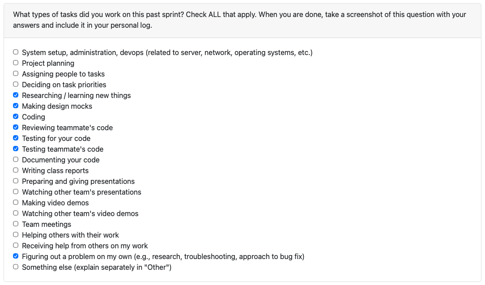
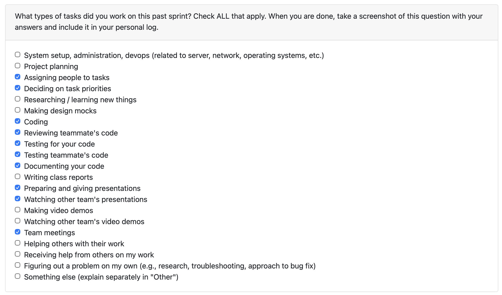
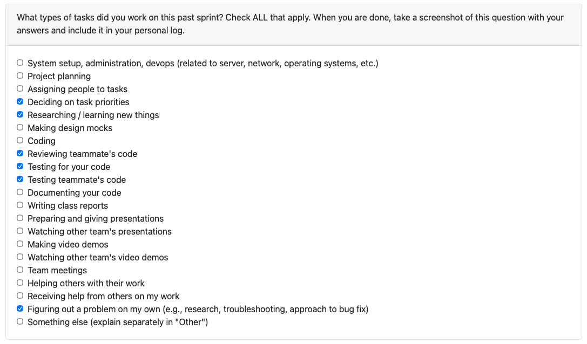
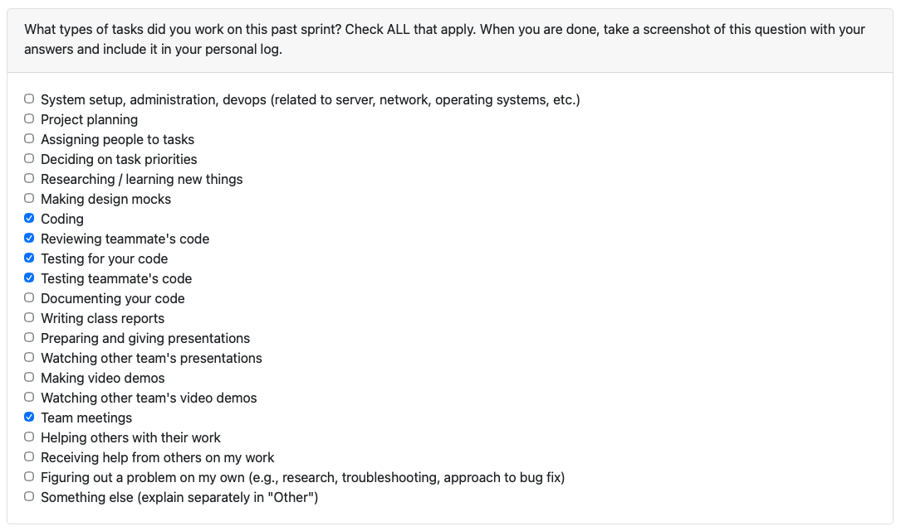
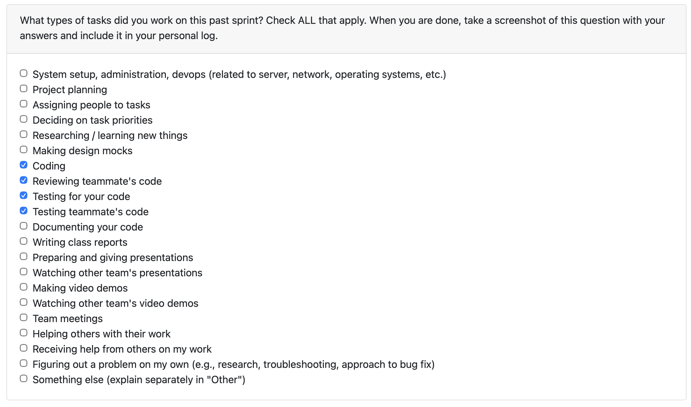
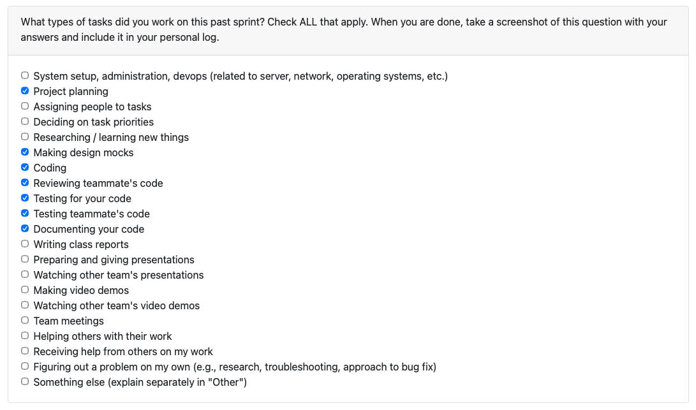
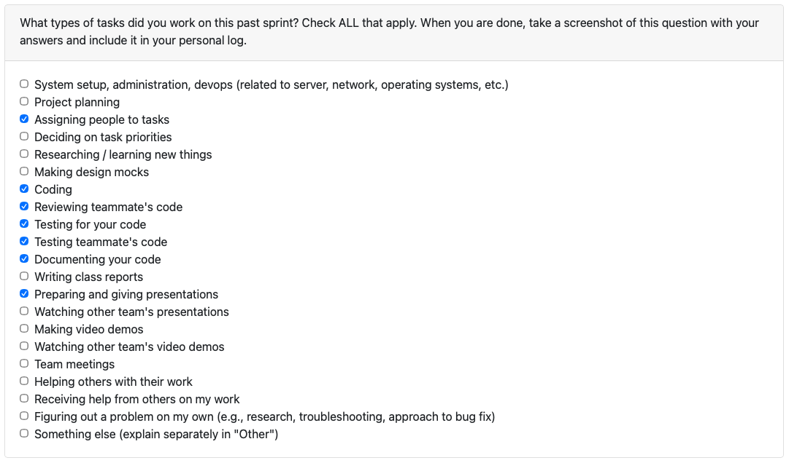
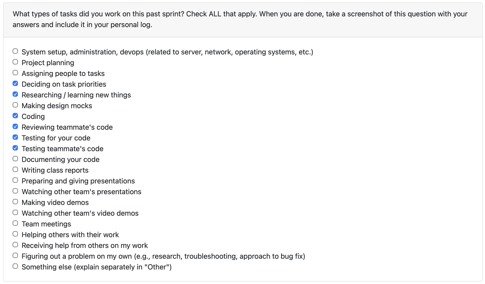
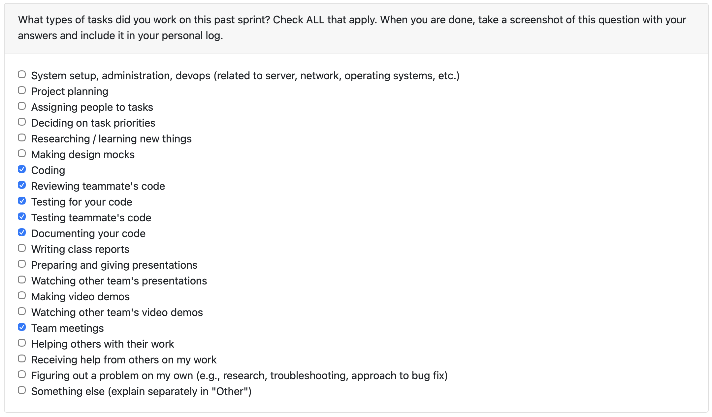

# Individual Log – Abijeet Dhillon

[Semester 2 Week 1 Individual Logs](#semester-2-week-1-individual-logs) 
[Semester 2 Week 2 Individual Logs](#semester-2-week-2-individual-logs) 
[Semester 2 Week 3 Individual Logs](#semester-2-week-3-individual-logs) 
[Semester 2 Week 5 Individual Logs](#semester-2-week-5-individual-logs) 
[Semester 2 Week 8 Individual Logs](#semester-2-week-8-individual-logs) 
[Semester 2 Week 9 Individual Logs](#semester-2-week-9-individual-logs) 
[Week 3 Individual Logs](#week-3) 
[Week 4 Individual Logs](#week-4) 
[Week 5 Individual Logs](#week-5) 
[Week 6 Individual Logs](#week-6) 
[Week 7 Individual Logs](#week-7) 
[Week 8 Individual Logs](#week-8) 
[Week 9 Individual Logs](#week-9) 
[Week 10 Individual Logs](#week-10) 
[Week 12 Individual Logs](#week-12) 
[Week 13 Individual Logs](#week-13) 
[Week 14 Individual Logs](#week-14)

---

## Semester 2 Week 9 Individual Logs

### March 2 2026 to March 8 2026

### 1. Type of Tasks Worked On

---

### 2. Recap of Weekly Goals

During this cycle, my work focused on implementing the initial one-page resume generation feature and the supporting .tex resume template, then refining the upload flow so it surfaces a compiled PDF resume artifact instead of an intermediate LaTeX file. This work covered both the reusable rendering layer and the integration into POST /projects/upload, while keeping router and storage boundaries clean.

I worked on Issue #312 and Issue #313, which were implemented together in PR #315. The result was a reusable resume artifact pipeline that builds context from analyzed report data, renders a Jinja2-enabled LaTeX template, compiles it to PDF, and returns resume_pdf_path from the upload response. I also added the minimal LaTeX class support required for compilation and kept the output behavior clean so new runs produce JSON and PDF artifacts only.

**Pull Request / Issue References**

- Issue: [#312](https://github.com/COSC-499-W2025/capstone-project-team-14/issues/312)
- Issue: [#313](https://github.com/COSC-499-W2025/capstone-project-team-14/issues/313)
- PR: [#315](https://github.com/COSC-499-W2025/capstone-project-team-14/pull/315)

**Issues / Blockers**

No major implementation blockers, but PDF generation depends on pdflatex being installed in the runtime environment because it is a system binary rather than a Python package.

**Coding Recap**

In PR #315, I added a reusable resume artifact module that handles resume context building, LaTeX escaping, template rendering, and artifact generation. I integrated this flow into the upload pipeline so analyzed report data can generate a resume artifact without moving rendering logic into the router or storage layer. I also updated the upload response to return resume_pdf_path, switched artifact output from .tex to .pdf, ensured intermediate .tex files are only created in a temporary build directory, and added a minimal resume.cls file required for LaTeX compilation.

**Testing Recap**

My testing work this cycle focused on artifact generation, upload response coverage, and PDF failure handling. PR #315 added and updated tests for resume artifact rendering, LaTeX escaping, successful PDF generation with mocked compilation, compile-failure behavior, pipeline artifact output, and upload endpoint response fields. The updated tests also verify that new runs leave only JSON and PDF artifacts in reports/, and validation included passing resume tests and py_compile on the changed files.

---

### 3. Features Owned in Project Plan/Tasks from Project Board Associated with These Features

- Implement Functionality To Generate One-Page Resume (rough version) Issue: [#312](https://github.com/COSC-499-W2025/capstone-project-team-14/issues/312)
- Create .tex Resume Template Issue: [#313](https://github.com/COSC-499-W2025/capstone-project-team-14/issues/313)

---

### 4. Tasks Completed / In Progress in the Last 2 Weeks

| Task ID | Issue                                                                                                                                                   | Status    | Notes                                                                                          |
| ------- | ------------------------------------------------------------------------------------------------------------------------------------------------------- | --------- | ---------------------------------------------------------------------------------------------- |
| 283     | [Bug Fix: Fix Failing Tests Milestone 2 Issue #283](https://github.com/COSC-499-W2025/capstone-project-team-14/issues/283)                              | Completed | Completed in [PR #285](https://github.com/COSC-499-W2025/capstone-project-team-14/pull/285)    |
| 284     | [Implement User Choice in Upload Representation Issue #284](https://github.com/COSC-499-W2025/capstone-project-team-14/issues/284)                      | Completed | Completed in PR [PR #289](https://github.com/COSC-499-W2025/capstone-project-team-14/pull/289) |
| 312     | [Implement Functionality To Generate One-Page Resume (rough version) Issue #312](https://github.com/COSC-499-W2025/capstone-project-team-14/issues/312) | Completed | Completed in [PR #315](https://github.com/COSC-499-W2025/capstone-project-team-14/pull/315)    |
| 313     | [Create .tex Resume Template Issue #313](https://github.com/COSC-499-W2025/capstone-project-team-14/issues/313)                                         | Completed | Completed in [PR #315](https://github.com/COSC-499-W2025/capstone-project-team-14/pull/315)    |

---

### 5. Future Cycle Plans & Reflection On This Week

This cycle was productive because it turned the analyzed upload output into a tangible resume artifact that can now be returned directly from the API. I was able to keep the implementation localized to the pipeline, reuse shared rendering logic, and add the supporting test coverage needed to make the change safer. I also refined the original .tex artifact work into a PDF-based output, which made the final behavior more useful and cleaner for users of the upload endpoint.

Next week, I intend on further updating the resume generation so users have the option to add in key contact details in the user configuration db to populate the resume header. I will also start implementing our front-end.

---

## Semester 2 Week 8 Individual Logs

### NOTE: This log covers week 6, 7, and 8 (as stated in the course schedule on Canvas).

### February 9 2026 to March 1 2026

### 1. Type of Tasks Worked On

---

### 2. Recap of Weekly Goals

During these weeks (week 6, week 7, and week 8), my work focused on enhancing the skills api endpoint, implementing user choice in upload representation (milestone 2 requirement 23), and fixing key errors in our implementation that were causing our tests to fail.

I spent week 6 working on implementing [Issue #276](https://github.com/COSC-499-W2025/capstone-project-team-14/issues/276). This issue implemented per-project Skills API add/edit/remove support and timeline filtering, plus documentation on how to use the skills api endpoints and tests in [PR #277](https://github.com/COSC-499-W2025/capstone-project-team-14/pull/277).

I didn't do much work in week 7, this is because it was reading break that week and any work done during this period would have counted as bonus work.

In week 8, I implemented [Issue #284](https://github.com/COSC-499-W2025/capstone-project-team-14/issues/284) and [Issue #283](https://github.com/COSC-499-W2025/capstone-project-team-14/issues/283). Issue #284 was implemented in [PR #289](https://github.com/COSC-499-W2025/capstone-project-team-14/pull/289), where I implemented upload response representation controls for the Projects API so users can choose which analyzed information is returned without changing the underlying analysis pipeline, plus focused test coverage for the new upload behavior. Issue #283 was implemented in [PR #285](https://github.com/COSC-499-W2025/capstone-project-team-14/pull/285), where I fixed 10 failing and 6 erroring tests with comprehensive documentation in the PR description that explained the root causes of why tests were failing and their fixes.

**Pull Request / Issue References**

- PR: [#277](https://github.com/COSC-499-W2025/capstone-project-team-14/pull/277)
- PR: [#285](https://github.com/COSC-499-W2025/capstone-project-team-14/pull/285)
- PR: [#289](https://github.com/COSC-499-W2025/capstone-project-team-14/pull/289)
- Issue: [#276](https://github.com/COSC-499-W2025/capstone-project-team-14/issues/276)
- Issue: [#283](https://github.com/COSC-499-W2025/capstone-project-team-14/issues/283)
- Issue: [#284](https://github.com/COSC-499-W2025/capstone-project-team-14/issues/284)

**Issues / Blockers**

- None this week.

**Coding Recap**

In [PR #277](https://github.com/COSC-499-W2025/capstone-project-team-14/pull/277), I expanded the Skills API with per-project add, edit, remove, and year-filter support, along with persistence updates for project skills. In [PR #289](https://github.com/COSC-499-W2025/capstone-project-team-14/pull/289), I added configurable upload representations and section-specific project routes. [PR #285](https://github.com/COSC-499-W2025/capstone-project-team-14/pull/285) then fixed pipeline, storage, and progress-tracking regressions.

**Testing Recap**

My testing work this cycle focused on API reliability and regression coverage. [PR #277](https://github.com/COSC-499-W2025/capstone-project-team-14/pull/277) added endpoint tests for skill normalization, deduplication, edits, removals, timeline filtering, and validation. [PR #289](https://github.com/COSC-499-W2025/capstone-project-team-14/pull/289) added upload representation tests for section filtering and invalid requests, while [PR #285](https://github.com/COSC-499-W2025/capstone-project-team-14/pull/285) resolved 10 failing and 6 erroring tests.

---

### 3. Features Owned in Project Plan

- Enhance Skills API Endpoint ([Issue #276](https://github.com/COSC-499-W2025/capstone-project-team-14/issues/276), [PR #277](https://github.com/COSC-499-W2025/capstone-project-team-14/pull/277))
- Implement User Choice in Upload Representation ([Issue #284](https://github.com/COSC-499-W2025/capstone-project-team-14/issues/284), [PR #289](https://github.com/COSC-499-W2025/capstone-project-team-14/pull/289))
- Bug Fix: Fix Failing Tests Milestone 2 ([Issue #283](https://github.com/COSC-499-W2025/capstone-project-team-14/issues/283), [PR #285](https://github.com/COSC-499-W2025/capstone-project-team-14/pull/285))

---

### 4. Tasks from Project Board Associated with These Features

- Enhance Skills API Enpoint Issue: [#276](https://github.com/COSC-499-W2025/capstone-project-team-14/issues/276)
- Bug Fix: Fix Failing Tests Milestone 2 Issue: [#283](https://github.com/COSC-499-W2025/capstone-project-team-14/issues/283)
- Implement User Choice in Upload Representation Issue: [#284](https://github.com/COSC-499-W2025/capstone-project-team-14/issues/284)

---

### 5. Tasks Completed / In Progress in the Last 2 Weeks

| Task ID | Issue                                                                                                                              | Status    | Notes                                                                                          |
| ------- | ---------------------------------------------------------------------------------------------------------------------------------- | --------- | ---------------------------------------------------------------------------------------------- |
| 276     | [Enhance Skills API Enpoint Issue #276](https://github.com/COSC-499-W2025/capstone-project-team-14/issues/276)                     | Completed | Completed in [PR #277](https://github.com/COSC-499-W2025/capstone-project-team-14/pull/277)    |
| 283     | [Bug Fix: Fix Failing Tests Milestone 2 Issue #283](https://github.com/COSC-499-W2025/capstone-project-team-14/issues/283)         | Completed | Completed in [PR #285](https://github.com/COSC-499-W2025/capstone-project-team-14/pull/285)    |
| 284     | [Implement User Choice in Upload Representation Issue #284](https://github.com/COSC-499-W2025/capstone-project-team-14/issues/284) | Completed | Completed in PR [PR #289](https://github.com/COSC-499-W2025/capstone-project-team-14/pull/289) |

---

### 6. Future Cycle Plans & Reflection On This Week

This 3 week long sprint was very productive. Our team meet multiple times and we discussed which features we would want implemented and their timelines. I also felt like this longer period between logs was more beneficial for the team since we could all spend our complete effort towards implementing code and working on our presentation (which was last week). At this stage, we have wrapped up our milestone 2 deliverable and more feel confident in our project than we did at the end of milestone 1.

Next week, I intend on studying for the quiz (which is on Wednesday), meeting with my group to hold a sprint planning session for milestone 3, and to work on the front-end of our application.

---

## Semester 2 Week 5 Individual Logs

### January 26 2026 to February 8 2026

### 1. Type of Tasks Worked On

---

### 2. Recap of Weekly Goals

This week (week 4 and week 5) mostly focused on addressing the feedback we received from **Milestone #1** as we’re now over halfway through **Milestone #2** and getting ready for the next deliverable.

I spent most of my time working through [Issue #248](https://github.com/COSC-499-W2025/capstone-project-team-14/issues/248) (users were not being deduplicated in git repos for collaborators, which caused duplicate entries in collaborator data) and [Issue #246](https://github.com/COSC-499-W2025/capstone-project-team-14/issues/246) (deleting stored insights/configurations wasn’t working, which could leave stale data behind).

I finished/merged the corresponding fixes in [PR #251](https://github.com/COSC-499-W2025/capstone-project-team-14/pull/251) and [PR #258](https://github.com/COSC-499-W2025/capstone-project-team-14/pull/258).

**Coding tasks**

- Implemented and refined changes tied to Milestone #1 feedback to improve overall stability and “demo readiness” heading into the next Milestone #2 deliverable.
- Fixed the collaborator user deduplication bug (Issue #248) and the delete insight/config flow (Issue #246), keeping the implementation aligned with our milestone requirements and expected user flows.
- Merged the updates in PRs #251 and #258 and ensured they fit cleanly with the rest of the Milestone #2 work in progress.

**Testing / debugging tasks**

- Did targeted regression testing around the areas touched by Issues #248 and #246 to make sure the fixes didn’t introduce new breakage.
- Verified the updates from PRs #251 and #258 behave as expected when running the app locally, focusing on the main flows we’ll be demonstrating for the next deliverable.

**Reviewing / collaboration tasks**

- Reviewed Milestone #1 feedback items with the team and aligned on which changes were highest priority to complete before the next Milestone #2 checkpoint.

**Pull request / issue references**

- PR: [#251](https://github.com/COSC-499-W2025/capstone-project-team-14/pull/251)
- PR: [#258](https://github.com/COSC-499-W2025/capstone-project-team-14/pull/258)
- Issue: [#248](https://github.com/COSC-499-W2025/capstone-project-team-14/issues/248)
- Issue: [#246](https://github.com/COSC-499-W2025/capstone-project-team-14/issues/246)

**Issues / blockers**

- None this week.

**Plan / goals for next week**

- Test all of our API endpoints end-to-end and confirm they’re working reliably (including validating responses on both success and error cases).
- Fix any regressions or edge cases uncovered during testing so we’re in a strong spot for the next deliverable.
- Continue polishing Milestone #2 work.

---

### 3. Features Owned in Project Plan

- Address Milestone #1 feedback items and stabilize core user flows in preparation for the next Milestone #2 deliverable ([Issue #248](https://github.com/COSC-499-W2025/capstone-project-team-14/issues/248), [Issue #246](https://github.com/COSC-499-W2025/capstone-project-team-14/issues/246))
- Implement and land the corresponding fixes via PRs ([PR #251](https://github.com/COSC-499-W2025/capstone-project-team-14/pull/251), [PR #258](https://github.com/COSC-499-W2025/capstone-project-team-14/pull/258))

---

### 4. Tasks from Project Board Associated with These Features

- [Issue #248](https://github.com/COSC-499-W2025/capstone-project-team-14/issues/248)
- [Issue #246](https://github.com/COSC-499-W2025/capstone-project-team-14/issues/246)
- [PR #251](https://github.com/COSC-499-W2025/capstone-project-team-14/pull/251)
- [PR #258](https://github.com/COSC-499-W2025/capstone-project-team-14/pull/258)

---

### 5. Tasks Completed / In Progress in the Last 2 Weeks

| Task ID | Issue                                                                                                                                   | Status    | Notes                |
| ------- | --------------------------------------------------------------------------------------------------------------------------------------- | --------- | -------------------- |
| 248     | [Bug: Users are not deduplicated in git repos for collaborators](https://github.com/COSC-499-W2025/capstone-project-team-14/issues/248) | Completed | Completed in PR #258 |
| 246     | [Bug: Delete insight/config doesn't work](https://github.com/COSC-499-W2025/capstone-project-team-14/issues/246)                        | Completed | Completed in PR #251 |

---

### 6. Future Cycle Plans & Reflection On This Week

This week was productive, and we fixed some key issues that were present after Milestone #1. Most of the work was driven directly by the feedback we received, which helped us tighten up the parts of the product that matter most for the next Milestone #2 deliverable. There were no issues or blockers this week.

Next week, my main focus is to test all of our API endpoints and ensure they are working reliably end-to-end.

---

## Semester 2 Week 3 Individual Logs

### January 19 2026 to January 25 2026

### 1. Type of Tasks Worked On

---

### 2. Recap of Weekly Goals

This week I focused on tightening the **LLM/data-access consent flow** so it behaves correctly across first-time runs and repeated runs (including re-prompting after a prior denial), while also fixing a small correctness gap in our documentation totals calculation and shoring up test coverage around both areas.

**Coding tasks**

- Reworked `resolve_data_access_consent` to re-prompt when consent was previously denied, update/persist the stored config, keep the “already granted” fast-path, and keep the configured zip path in sync with the latest choice.
- Fixed documentation totals calculation by constructing `TextMetrics` directly so `_analyze_categorized_files` can always compute totals reliably.

**Testing / debugging tasks**

- Added coverage in `test_llm_consent_flow.py` for the first-time prompt + save flow and for the re-prompt path after a prior denial.
- Re-added the LLM consent reuse test to ensure stored consent is honored without prompting.
- Updated `test_orchestrator_coverage.py` stubs to match the current `analyze_file` / `analyze_image` behavior and return valid totals.

**Pull request / issue references**

- PR: [#223](https://github.com/COSC-499-W2025/capstone-project-team-14/pull/223)
- Issue: [#222](https://github.com/COSC-499-W2025/capstone-project-team-14/issues/222)

**Issues / blockers**

- None this week.

**Plan / goals for next week**

- Address any review follow-ups from this PR and continue expanding test coverage around consent/config edge cases.
- Keep improving orchestrator coverage/correctness so totals and outputs stay consistent as we evolve analysis behavior.
- Tighten up the database to ensure no duplicates are being saved.

---

### 3. Features Owned in Project Plan

- Improve LLM data-access consent behavior (re-prompt + persistence + fast-path) ([Issue #222](https://github.com/COSC-499-W2025/capstone-project-team-14/issues/222))
- Validate consent/config + orchestrator totals behavior via tests ([PR #223](https://github.com/COSC-499-W2025/capstone-project-team-14/pull/223))

---

### 4. Tasks from Project Board Associated with These Features

- [Issue #222 — Rework data-access consent flow](https://github.com/COSC-499-W2025/capstone-project-team-14/issues/222)
- [PR #223 — Consent flow updates + tests + orchestrator coverage fixes](https://github.com/COSC-499-W2025/capstone-project-team-14/pull/223)

---

### 5. Tasks Completed / In Progress in the Last 2 Weeks

| Task ID | Issue                                                                                                    | Status    | Notes                               |
| ------- | -------------------------------------------------------------------------------------------------------- | --------- | ----------------------------------- |
| 222     | [Rework data-access consent flow](https://github.com/COSC-499-W2025/capstone-project-team-14/issues/222) | Completed | Implemented + tested in PR #223     |
| 201     | [Persist custom project names](https://github.com/COSC-499-W2025/capstone-project-team-14/issues/201)    | Completed | Landed last week; no follow-ups yet |

---

### 6. Future Cycle Plans & Reflection On This Week

This week was productive because it improved both **user-facing correctness** (consent prompts behaving consistently across runs) and **internal reliability** (totals calculation and coverage stubs staying aligned with current behavior). With the re-prompt logic and tests in place, we’re less likely to regress consent/config handling as we keep iterating on the analysis pipeline.

Next week, I’ll focus on any PR feedback and continue tightening orchestrator/test coverage so edge cases are caught early instead of surfacing during demos or late integration.

---

## Semester 2 Week 2 Individual Logs

### January 12 2026 to January 18 2026

### 1. Type of Tasks Worked On

---

### 2. Recap of Weekly Goals

Building on last week’s database/persistence foundation work, this week I focused on **persisting custom project names** end-to-end so project naming is stable across runs and outputs.

**Coding tasks**

- Updated the schema/migrations to store `project_name` in `project_info` and wired inserts accordingly.
- Extended resume-item persistence to optionally save the project name and adjusted loading logic to prefer the stored override.
- Added an optional CLI prompt before analysis to collect custom project names for persistence.

**Testing / debugging tasks**

- Updated `test_resume_customization.py` to verify the project name update flow (ensuring project name overrides persist and are preferred on load).

**Reviewing / collaboration tasks**

- Documented Docker/SQLite access instructions in the PR to make it easier for PR reviewers to inspect the database state locally.

**Pull request / issue references**

- PR: [#202](https://github.com/COSC-499-W2025/capstone-project-team-14/pull/202)
- Issue: [#201](https://github.com/COSC-499-W2025/capstone-project-team-14/issues/201)

**Issues / blockers**

- The main risk this week was ensuring the new “stored project_name override” behavior didn’t break existing resume customization flows. I addressed this by updating the persistence/loading precedence and adding a targeted test to lock in the expected behavior.

**Plan / goals for next week**

- Continue tightening persistence UX and data correctness around project identity and customization (including follow-ups from this work if any edge cases appear).
- Begin progressing Milestone 2 work that depends on stable project identity (e.g., safer updates/partial changes and other persistence improvements).

---

### 3. Features Owned in Project Plan

- Persist custom project names in project_info + wire persistence/loading precedence ([Issue #201](https://github.com/COSC-499-W2025/capstone-project-team-14/issues/201))
- Implement and validate the project name update flow via tests + documentation ([PR #202](https://github.com/COSC-499-W2025/capstone-project-team-14/pull/202))

---

### 4. Tasks from Project Board Associated with These Features

- [Issue #201 — Persist custom project names](https://github.com/COSC-499-W2025/capstone-project-team-14/issues/201)
- [PR #202 — Project name persistence + CLI prompt + tests](https://github.com/COSC-499-W2025/capstone-project-team-14/pull/202)

---

### 5. Tasks Completed / In Progress in the Last 2 Weeks

| Task ID | Issue                                                                                                            | Status    | Notes |
| ------- | ---------------------------------------------------------------------------------------------------------------- | --------- | ----- |
| 201     | [Persist custom project names](https://github.com/COSC-499-W2025/capstone-project-team-14/issues/201)            | Completed | N/A   |
| 186     | Define normalized SQLite schema for projects, files, and portfolio_insights + document in database_schema.md     | Completed | N/A   |
| 187     | Implement migration/backfill to normalized schema + update storage APIs to use projects/files/portfolio_insights | Completed | N/A   |

---

### 6. Future Cycle Plans & Reflection On This Week

This week was productive because it improved the reliability and usability of our persistence layer by ensuring project names can be saved, overridden, and consistently loaded across runs. With the schema/migrations, CLI prompt, and tests in place, we now have a clearer and more stable customization flow for project identity, which reduces downstream friction when generating portfolio/resume outputs.

Next week, I’ll keep tightening persistence and begin improving the CLI workflow so the tool is easier to use end-to-end from a user perspective.

---

## Semester 2 Week 1 Individual Logs

### January 5 2026 to January 11 2026

### 1. Type of Tasks Worked On

---

### 2. Recap of Weekly Goals

This week I designed and documented a normalized SQLite schema to replace our legacy zipfile/project blob storage with explicit tables (projects, files, portfolio_insights) while keeping room for future upgrades like incremental ingest, file dedupe, and per-project portfolio/resume customization. I updated docs/design/database_schema.md with a clear field mapping that shows how rankings, chronology corrections, skills highlighting, evidence, thumbnails, and portfolio/resume items (resume bullets, skills, keywords, and other analysis outputs) are represented through proper foreign keys and relationships. I implemented a new schema migration that creates the normalized tables based on the documented DDL and refactored the persistence and retrieval code paths to write/read normalized rows rather than blob payloads. I verified that we can still save and pull report information correctly while preserving our existing rendering behavior for both portfolio and resume outputs without relying on the legacy blob fields. I also updated system_demo_walkthrough.md so the end-to-end demo flow works with the new schema and accurately reflects the updated database interactions. Overall, this cycle was focused on stabilizing the database foundation so we can confidently build the Milestone 2 requirements on top of it.

---

### 3. Features Owned in Project Plan

- Define normalized SQLite schema for projects, files, and portfolio_insights + document in database_schema.md (#186)
- Implement migration/backfill to normalized schema + update storage APIs to use projects/files/portfolio_insights (#187)

---

### 4. Tasks from Project Board Associated with These Features

- Define normalized SQLite schema for projects, files, and portfolio_insights + document in database_schema.md (#186)
- Implement migration/backfill to normalized schema + update storage APIs to use projects/files/portfolio_insights (#187)

---

### 5. Tasks Completed / In Progress in the Last 2 Weeks

| Task ID | Issue Title                                                                                                      | Status    | Notes |
| ------- | ---------------------------------------------------------------------------------------------------------------- | --------- | ----- |
| 186     | Define normalized SQLite schema for projects, files, and portfolio_insights + document in database_schema.md     | Completed | N/A   |
| 187     | Implement migration/backfill to normalized schema + update storage APIs to use projects/files/portfolio_insights | Completed | N/A   |

---

### 6. Future Cycle Plans & Reflection On This Week

This week was highly productive because I overhauled the database to align with the Milestone 2 requirements, which removes a major blocker and gives us a stable foundation to keep shipping. Now that the schema, migration, docs, and read/write paths are in place, we can push ahead and start checking off Milestone 2 requirements more quickly. I also plan to start work on Monday so I can finish tasks earlier next week and keep momentum.

For the next cycle, I plan to research and start implementing incremental ingest so we can upload another zipped folder for the same portfolio/resume and merge it safely into the existing project set. The goal is to define a deterministic merge key and strategy so existing projects and files can be updated without duplicating or overwriting data incorrectly. I’ll also look into how we can support dedupe and partial updates (only changed files/analysis) while keeping portfolio/resume outputs consistent.

---

## Week 14

### December 1 2025 to December 7 2025

### 1. Type of Tasks Worked On

---

### 2. Recap of Weekly Goals

This week I focused on closing PR #169 to finish the remaining Milestone 1 requirements across storage/retrieval and consent. On the storage side, I brought the ProjectInsightsStore and orchestrator back in sync by updating the run metadata we persist, refreshing the retrieval CLI to replay stored runs cleanly, and tightening the backup/restore helpers so we can safely move snapshots between environments. I also verified the end-to-end flow in Docker to make sure the pipeline writes into the refreshed schema and that retrieval still works even after reorganizing the data layout. On the consent side, I extended the UserConfigManager to capture a separate “data consent” flag alongside LLM consent, wired both prompts through the pipeline CLI so users can set them once and skip future prompts, and made sure they are persisted and retrievable via the config manager CLI. I updated the docs around configuration and storage so the new consent flag and retrieval steps are clear, and synced with the team to confirm this satisfies Milestone 1 before we pivot to the next set of deliverables.

---

### 3. Features Owned in Project Plan

- Bring Storage & Retrieval Up To Date (#165)
- Add Data Consent To User Configurations (#168)

---

### 4. Tasks from Project Board Associated with These Features

- Bring Storage & Retrieval Up To Date (#165)
- Add Data Consent To User Configurations (#168)

---

### 5. Tasks Completed / In Progress in the Last 2 Weeks

| Task ID | Issue Title                             | Status    | Notes                                                                                                                                                                                                                                  |
| ------- | --------------------------------------- | --------- | -------------------------------------------------------------------------------------------------------------------------------------------------------------------------------------------------------------------------------------- |
| 165     | Bring Storage & Retrieval Up To Date    | Completed | In PR #169 I refreshed the ProjectInsightsStore/orchestrator path to align with the latest schema, ensured runs persist correctly, tightened backup/restore helpers, and verified the retrieval CLI can replay stored runs end to end. |
| 168     | Add Data Consent To User Configurations | Completed | PR #169 also added a persisted “data consent” flag to UserConfigManager, wired it (with LLM consent) into the pipeline CLI prompts, and documented the config manager/CLI paths so users can set or update both consents once.         |

---

### 6. Future Cycle Plans & Reflection On This Week

This week felt good—I wrapped up PR #169 to land the storage/retrieval refresh and data consent work, which means our team has completed all of the Milestone 1 requirements without scrambling at the last minute. The flow feels stable, testing went smoothly, and it was nice to finish the sprint on schedule while already looking forward to a short winter break.

For the next cycle, I plan to shift focus to Milestone 2 by building on the updated storage/retrieval paths so we can showcase richer portfolio/resume artifacts and tightening any consent/documentation gaps that show up during demos. With Milestone 1 behind us, the priority is to keep momentum while pacing myself for the holidays and making sure the next milestone is just as smooth.

---

## Week 13

### November 24 2025 to November 30 2025

### 1. Type of Tasks Worked On

---

### 2. Recap of Weekly Goals

This week, I focused on integrating LLM consent cleanly into the artifact pipeline’s CLI and making sure it’s wired through our existing SQLite-backed user configuration system in a way that feels “one and done” for the user. I updated the orchestrator so it now shows a single y/n consent prompt with a short privacy notice, persists that choice via UserConfigManager (defaulting to --user-id root but supporting per-user IDs), and then branches behavior so that runs with consent enabled execute the LLM summarization step on top of the local analyzers, while opt-out runs stick to local analysis only. I documented this flow end-to-end in docs/config_management.md, including concrete docker-compose commands for running the pipeline with different --user-id values, flipping --llm-consent yes|no via the config manager CLI, and re-running the pipeline to confirm that prompts are skipped once consent is stored. On the testing side, I expanded the pytest suite (e.g., test_llm_consent_flow.py and test_orchestrator_coverage.py) and ran it inside Docker to bring coverage up over the orchestrator and config manager, validating both the CLI behavior and the consent-driven code paths. As a team, we also held a group meeting to walk through the updated pipeline, synced on how we want our presentation slides to clearly explain the pipeline architecture and privacy model, and double-checked the milestone 1 requirements to ensure that our implementation, tests, and documentation are all on track for the upcoming deadline.

---

### 3. Features Owned in Project Plan

- Store Project Insights (#30)
- Connect User Configuration to Pipeline (#148)

---

### 4. Tasks from Project Board Associated with These Features

- Store Project Insights (#30)
- Connect User Configuration to Pipeline (#148)

---

### 5. Tasks Completed / In Progress in the Last 2 Weeks

| Task ID | Issue Title                            | Status    | Notes                                                                                                                                                                                                                               |
| ------- | -------------------------------------- | --------- | ----------------------------------------------------------------------------------------------------------------------------------------------------------------------------------------------------------------------------------- |
| 30      | Store Project Insights                 | Completed | Implemented an **encrypted SQLite-backed ProjectInsightsStore** and wired the pipeline orchestrator to persist each run into `zipfile` and `project` tables in `data/app.db`, including a retrieval CLI and backup/restore helpers. |
| 148     | Connect User Configuration to Pipeline | Completed | Integrated the existing user configuration system into the pipeline's CLI so that the pipeline asks for LLM consent using a simple y/n prompt. The consent is updatable and retrievable as well from our SQLite database.           |

---

### 6. Future Cycle Plans & Reflection On This Week

This week was pretty stressful since all of my courses are starting to wrap up for the end of the semester, and it really felt like time was running out faster than usual. Even with that pressure, I was able to manage my time effectively and get my COSC 499 work done: I integrated LLM consent cleanly into the artifact pipeline’s CLI, wired it through the existing SQLite-backed UserConfigManager, and made sure the orchestrator only prompts once with a clear privacy notice before branching between LLM + local analyzers or local-only runs. I also documented the end-to-end flow in docs/config_management.md, added the necessary Docker/CLI examples for toggling consent, and expanded the pytest coverage around the consent and orchestrator paths, all while syncing with my teammates in our group meeting to review the updated UX and milestone requirements.

For the next cycle, I plan to shift focus toward storing and retrieving the generated portfolio and résumé items, building on the functionality that Tahsin implemented this sprint so that we can plug those outputs cleanly into our database-backed flow. The goal is to close the loop from analyzed projects to reusable, queryable presentation artifacts in time for Milestone 1. Overall, despite the busy week, things went well. I feel confident about our upcoming video demo and presentation, and as a team we’re on track to meet all of the Milestone 1 requirements by the due date.

---

## Week 12

### November 10 2025 to November 23 2025

### 1. Type of Tasks Worked On

---

### 2. Recap of Weekly Goals

This week (and last week since it was reading week/week 11), I focused primarily on database integration, backend improvements, and ensuring strong test coverage across updated components. I continued integrating user configuration persistence into the SQLite database, wiring the config manager so configs can be saved, loaded, and updated through the backend, and verifying behavior with manual SQL checks and schema-focused tests. In parallel, I implemented an encrypted SQLite-backed insights store on top of the artifact pipeline so each orchestrator run now automatically writes its ZIP-level and per-project summaries into the new zipfile and project tables in data/app.db via ProjectInsightsStore. I validated this end-to-end flow by running the pipeline in Docker with INSIGHTS_ENCRYPTION_KEY/DATABASE_URL set, inspecting the written rows with sqlite3, using the example retrieval CLI to replay stored runs without re-running analysis, and exercising the backup/restore helpers to confirm we can safely move DB snapshots between environments. I also updated the database schema and insights docs to explain how to persist, retrieve, and back up results, and reviewed my teammates' PRs (3 of them) and participated in team meetings to plan the next stage of pipeline integration. Overall, my work this week pushed our backend closer to a unified, encrypted, and persistent configuration and insights layer ready for pipeline integration.

---

### 3. Features Owned in Project Plan

- Store Project Insights (#30)
- Integrate User Configs Into SQLite Database (#127)

---

### 4. Tasks from Project Board Associated with These Features

- Store Project Insights (#30)
- Integrate User Configs Into SQLite Database (#127)

---

### 5. Tasks Completed / In Progress in the Last 2 Weeks

| Task ID | Issue Title                                 | Status    | Notes                                                                                                                                                                                                                               |
| ------- | ------------------------------------------- | --------- | ----------------------------------------------------------------------------------------------------------------------------------------------------------------------------------------------------------------------------------- |
| 30      | Store Project Insights                      | Completed | Implemented an **encrypted SQLite-backed ProjectInsightsStore** and wired the pipeline orchestrator to persist each run into `zipfile` and `project` tables in `data/app.db`, including a retrieval CLI and backup/restore helpers. |
| 127     | Integrate User Configs Into SQLite Database | Completed | Integrated full user configuration persistence into SQLite via the config manager, enabling save/load/update operations from the backend/CLI and adding tests to validate schema, migrations, and config loading flows.             |

---

### 6. Future Cycle Plans & Reflection On This Week

Next week, I plan to work closely with my teammates to wrap up all of our components and ensure the system is ready for Milestone 1. This will include tightening the integration points between the pipeline orchestrator, the encrypted insights store, and the user config layer, and doing end-to-end runs to verify everything behaves correctly under Docker. Depending on how similar the data shapes are, I may also start wiring the LLM’s analysis output into the existing “store project insights” path so that both local analyzers and LLM-generated insights are persisted in a consistent way.

This week was good overall—I was able to finish the user config integration work and land the core of the insights storage flow while keeping tests and documentation up to date. Getting these foundational pieces in place makes me feel confident about our architecture, and I’m excited to push through Milestone 1 with a system that already feels robust and extensible.

---

## Week 10

### November 3 2025 to November 9 2025

### 1. Type of Tasks Worked On

---

### 2. Recap of Weekly Goals

This week, I focused on improving backend functionality, testing, and persistence. I updated the parser to include absolute file paths and refined the categorizer to output categorized folder information. I refactored the corresponding unit tests for both components to align with the updated outputs while maintaining high test coverage. I also fixed the Dockerfile so the backend image builds and runs without errors. Additionally, I implemented a persistent SQLite database mounted as a Docker volume, enabling reliable storage and retrieval of user configuration data. To verify this setup, I created tests for the database environment and user configuration handling, ensuring proper integration and functionality. I also participated in weekly team meetings to discuss progress, troubleshoot issues, and plan next steps collaboratively while also reviewing my teammate's PRs.

---

### 3. Features Owned in Project Plan

- Update Parser To Have Absolute Path (#106)
- Setting Up SQL DB (#107)

---

### 4. Tasks from Project Board Associated with These Features

- Update Parser To Have Absolute Path (#106)
- Setting Up SQL DB (#107)

---

### 5. Tasks Completed / In Progress in the Last 2 Weeks

| Task ID | Issue Title                         | Status    | Notes                                                                                                                                                                                                                                                                                                                                     |
| ------- | ----------------------------------- | --------- | ----------------------------------------------------------------------------------------------------------------------------------------------------------------------------------------------------------------------------------------------------------------------------------------------------------------------------------------- |
| 36      | Generate Chronological Skill List   | Completed | Implemented cross-analyzer aggregation, chronological ordering by file mtime, optional date filtering, and export to JSON/CSV/TXT in src/analyze/output/. Added unit tests for ordering, serialization, and format parity; participated in review cycles for related analyzer updates and ensured consistent field naming across outputs. |
| 106     | Update Parser To Have Absolute Path | Completed | Updated parser and categorizer components to output an absolute path in addition to the information it already outputted, while also flattening the categorization output. I also used this PR to update the Dockerfile to fix issues when building the Docker image.                                                                     |
| 107     | Setting Up SQL DB                   | Completed | Implemented a persistent SQLite database into the backend service and mounted it as a Docker volume.                                                                                                                                                                                                                                      |

---

### 6. Future Cycle Plans & Reflection On This Week

In the upcoming cycle, I plan to extend the database functionality to fully support user configurations, including saving, loading, and updating configuration data through the backend. I also plan to integrate this functionality with the existing configuration management system, add corresponding unit tests, and ensure the database interactions are properly validated and persistent across container restarts.

From an individual standpoint, this week was very productive. My time management could've been better, but I had 2 midterms on Thursday, which caused me to work on this project later in the week. Given this, I still completed the issues/work I assigned for myself, with no issues.

---

## Week 9

### October 27 2025 to November 2 2025

### 1. Type of Tasks Worked On

> Not available since peer evaluation for week 9 was closed early.

---

### 2. Recap of Weekly Goals

This week, I implemented the chronological skills list generator that aggregates outputs from code, text, image, and video analyzers. It normalizes fields, orders detections by file modification timestamp, supports optional date filtering, and exports JSON/CSV/TXT to src/analyze/output/.

I also wrote unit tests for ordering, filtering, and cross-format parity (including serialization edge cases). Additionally, I participated in team planning meetings and reviewed teammates’ PRs—code and tests—to ensure consistency and smooth integration.

---

### 3. Features Owned in Project Plan

- Generate Chronological Skill List (#36)

---

### 4. Tasks from Project Board Associated with These Features

- Generate Chronological Skill List (#36)

---

### 5. Tasks Completed / In Progress in the Last 2 Weeks

| Task ID | Issue Title                              | Status    | Notes                                                                                                                                                                                                                                                                                                                                     |
| ------- | ---------------------------------------- | --------- | ----------------------------------------------------------------------------------------------------------------------------------------------------------------------------------------------------------------------------------------------------------------------------------------------------------------------------------------- |
| #75     | Connect Zip Folder Parser to Categorizer | Completed | Implemented unified `categorize_parse_zip()` function in `ingest/zip_parser.py` that chains folder parsing and file categorization. Added structured JSON output and ensured correct handling of nested directories. Included unit tests for validation and coverage tracking.                                                            |
| #22     | Store/Load User Configurations           | Completed | Created `config_manager.py` under `src/config/` to handle saving and loading of user configuration JSON files. Integrated LLM and directory consent settings.                                                                                                                                                                             |
| #36     | Generate Chronological Skill List        | Completed | Implemented cross-analyzer aggregation, chronological ordering by file mtime, optional date filtering, and export to JSON/CSV/TXT in src/analyze/output/. Added unit tests for ordering, serialization, and format parity; participated in review cycles for related analyzer updates and ensured consistent field naming across outputs. |

---

### 6. Future Cycle Plans & Reflection On This Week

In the upcoming cycle, I plan to extend the chronological skills list generator to incorporate new fields and signals from teammates’ analyzer updates, and to research (and potentially implement) a more concrete storage method for user configurations.

Upon reflecting on this week, this week went smooth. Everything is working as intended so far and starting my work on Monday noticeably improved time and stress management.

---

## Week 8

### October 20 2025 to October 26 2025

### 1. Type of Tasks Worked On

---

### 2. Recap of Weekly Goals

This week, I focused on integrating the zip parser and file categorizer components into a unified workflow using the categorize_parse_zip() function. This integration enables uploaded zip files to be automatically parsed, validated, and categorized into structured JSON output for consistent downstream processing.

I also implemented a user configuration management system that saves and loads user preferences — including directory paths and consent settings — in a local JSON format in data/configs/. This ensures persistence across sessions and integrates with the existing consent logic in src/consent/.

Additionally, I developed unit tests and coverage tests for both modules to verify correct behavior under different conditions (e.g., missing files, invalid input, nested folder structures), ensuring robustness and measurable test coverage across the new code.

---

### 3. Features Owned in Project Plan

- Store/Load User Configurations (#22)
- Connect Zip Folder Parser to Categorizer (#75)

---

### 4. Tasks from Project Board Associated with These Features

- Store/Load User Configurations (#22)
- Connect Zip Folder Parser to Categorizer (#75)

---

### 5. Tasks Completed / In Progress in the Last 2 Weeks

| Task ID | Issue Title                              | Status      | Notes                                                                                                                                                                                                                                                                          |
| ------- | ---------------------------------------- | ----------- | ------------------------------------------------------------------------------------------------------------------------------------------------------------------------------------------------------------------------------------------------------------------------------ |
| #75     | Connect Zip Folder Parser to Categorizer | Completed   | Implemented unified `categorize_parse_zip()` function in `ingest/zip_parser.py` that chains folder parsing and file categorization. Added structured JSON output and ensured correct handling of nested directories. Included unit tests for validation and coverage tracking. |
| #22     | Store/Load User Configurations           | Completed   | Created `config_manager.py` under `src/config/` to handle saving and loading of user configuration JSON files. Integrated LLM and directory consent settings.                                                                                                                  |
| #36     | Generate Chronological Skill List        | In Progress | Will implement logic to extract and chronologically order skills based on project data. Includes skill categorization by type, proficiency indicators, and multi-format output support (JSON, CSV, text). Also plans to include time-based filtering and confidence scoring.   |

---

### 6. Future Cycle Plans & Reflection On This Week

In the upcoming cycle, I plan to work on the "Generate Chronological Skill List" (issue #36), which will allow users to view a timeline of skills they've developed through their project work. This feature will expand the system's analtical capabilities by connecting project artifacts to skill progression over time, enhancing interpretability of project data.

Upon reflecting on this week, this cycle went smoothly in terms of feature integration and testing coverage. The connection between the parser and categorizer worked as intended, and I successfully established a pattern for storing persistent user configuration data. One area for improvement is better time management on my end, which I improve in week 9 by starting my weekly work on Monday.

---

## Week 7

### October 13 2025 to October 19 2025

### 1. Type of Tasks Worked On

---

### 2. Recap of Weekly Goals

This week, I extended the backend parsing functionality by implementing a new file categorization component, which categorizes files and saves a structured output for later downstream use. I also participated in team meetings, reviewed pull requests, tested teammates' code on active branches, and wrote test cases for my implementations using TDD principles.

---

### 3. Features Owned in Project Plan

- Categorize Files & Create Structured Representation (#50)
- Store/Load User Configurations (#22)

---

### 4. Tasks from Project Board Associated with These Features

- Categorize Files & Create Structured Representation (#50)
- Store/Load User Configurations (#22)

---

### 5. Tasks Completed / In Progress in the Last 2 Weeks

| Task ID | Issue Title                                         | Status      | Notes                                                                                                                                                                          |
| ------- | --------------------------------------------------- | ----------- | ------------------------------------------------------------------------------------------------------------------------------------------------------------------------------ |
| 50      | Categorize Files & Create Structured Representation | Completed   | Implemented file_categorizer.py to walk through project folders, classify files by type, and store the output in a structured JSON format. Also tested tests cases via pytest. |
| 22      | Store/Load User Configurations                      | In Progress | N/A                                                                                                                                                                            |
| 15      | Project Environment Setup                           | Completed   | N/A                                                                                                                                                                            |

---

### 6. Future Cycle Plans

In the upcoming cycle, I plan to:

- Integrate the file categorization output into the larger data workflow (once it is established).
- Implement a user configuration storage method to allow persistent environment settings for users.
- Collaborate with teammates to potentially connect the parsing component and categorizer component to create a unified backend pipeline.

---

## Week 6

### October 6 to October 12

### 1. Type of Tasks Worked On

---

### 2. Recap of Weekly Goals

This week, I focused on setting up the project environment using docker and ensuring that others can replicate the project environment on their local machines.

---

### 3. Features Owned in Project Plan

- Project Environment Setup

---

### 4. Tasks from Project Board Associated with These Features

- Project Environment Setup

---

### 5. Tasks Completed / In Progress in the Last 2 Weeks

| Task ID | Issue Title               | Status    | Notes |
| ------- | ------------------------- | --------- | ----- |
| 15      | Project Environment Setup | Completed | N/A   |

---

### 6. Additional Context

N/A

---

## Week 5

### September 29 to October 5

### 1. Type of Tasks Worked On

---

### 2. Recap of Weekly Goals

This week focused on a collaborative effort of our team members to understand and create an initial data flow diagram for level 0 and level 1. I assisted in the following:

- creating the project's level 0 data flow diagram
- creating the project's level 1 data flow diagram
- collaborating with other teams to discuss differences in ideas of data flow diagrams

---

### 3. Features Owned in Project Plan

- Data Flow Diagram

---

### 4. Tasks from Project Board Associated with These Features

- Data Flow Diagram

---

### 5. Tasks Completed / In Progress in the Last 2 Weeks

| Task ID | Issue Title       | Status    | Notes |
| ------- | ----------------- | --------- | ----- |
| #9      | Data Flow Diagram | Completed | N/A   |

---

### 6. Additional Context

N/A

---

## Week 4

### September 22 to September 28

### 1. Type of Tasks Worked On

---

### 2. Recap of Weekly Goals

This week focused on understanding the project scope, creating the proposal and drawing the system architecture design diagram. I collaborated with my team members in the following:

- creating the project proposal
- creating the system architecture design diagram

Future weeks will include more detailed documentation of tasks as work progresses.

---

### 3. Features Owned in Project Plan

- System Architecture Diagram
- Project Proposal

---

### 4. Tasks from Project Board Associated with These Features

- System Architecture Diagram
- Project Proposal

---

### 5. Tasks Completed / In Progress in the Last 2 Weeks

| Task ID | Issue Title                 | Status    | Notes |
| ------- | --------------------------- | --------- | ----- |
| #5      | System Architecture Diagram | Completed | N/A   |
| #6      | Project Proposal            | Completed | N/A   |

---

### 6. Additional Context

N/A

---

## Week 3

### September 15 to September 21

### 1. Type of Tasks Worked On

---

### 2. Recap of Weekly Goals

This week focused on foundational project setup work. I assisted in the following:

- creating the project requirements document
- initializing the repository
- setting up the Kanban project board on GitHub

Future weeks will include more detailed documentation of tasks as work progresses.

---

### 3. Features Owned in Project Plan

- Project Requirements

---

### 4. Tasks from Project Board Associated with These Features

- Project Requirements

---

### 5. Tasks Completed / In Progress in the Last 2 Weeks

| Task ID | Issue Title          | Status    | Notes |
| ------- | -------------------- | --------- | ----- |
| 3       | Project Requirements | Completed | N/A   |

---

### 6. Additional Context

N/A

---
