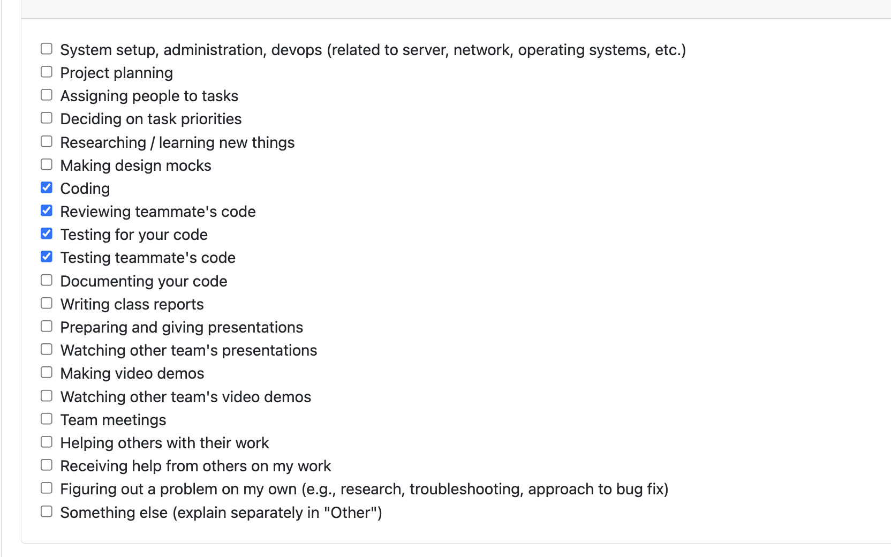
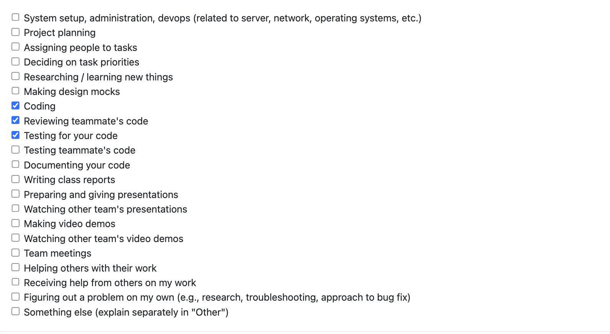
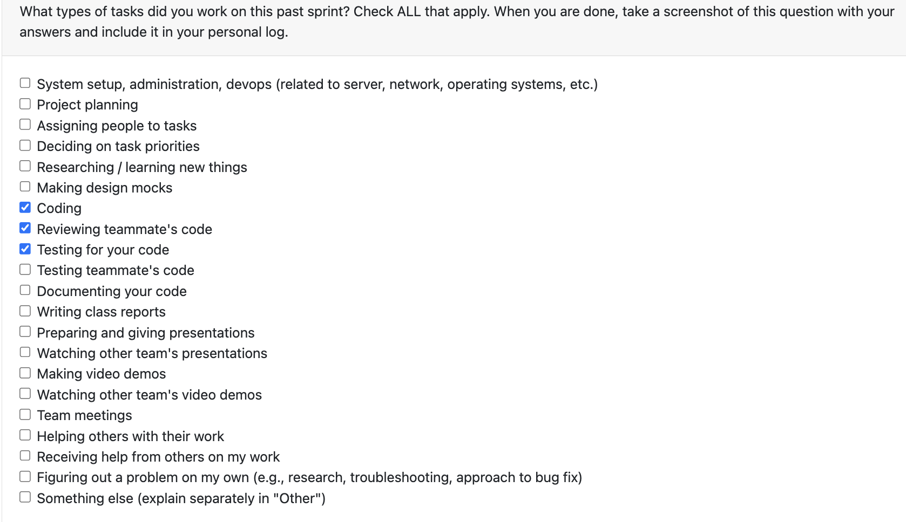
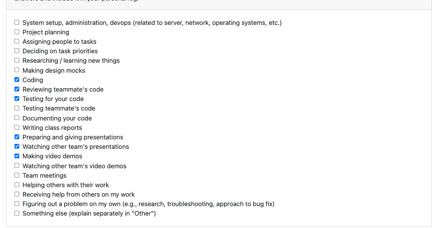
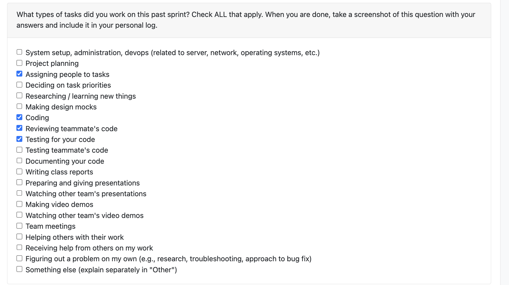
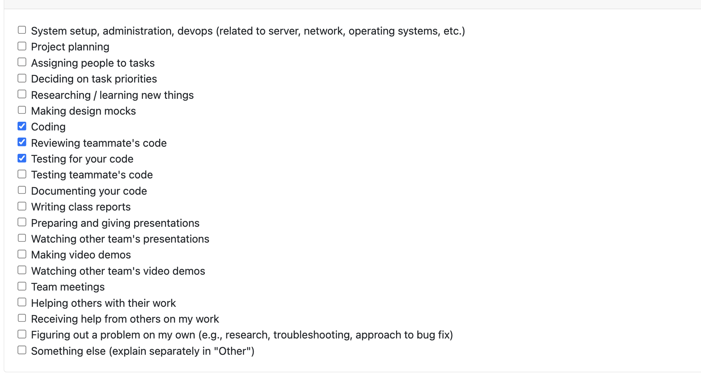
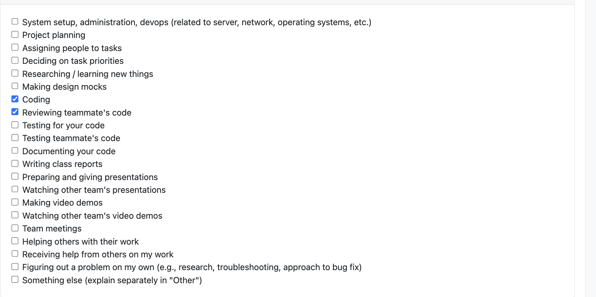
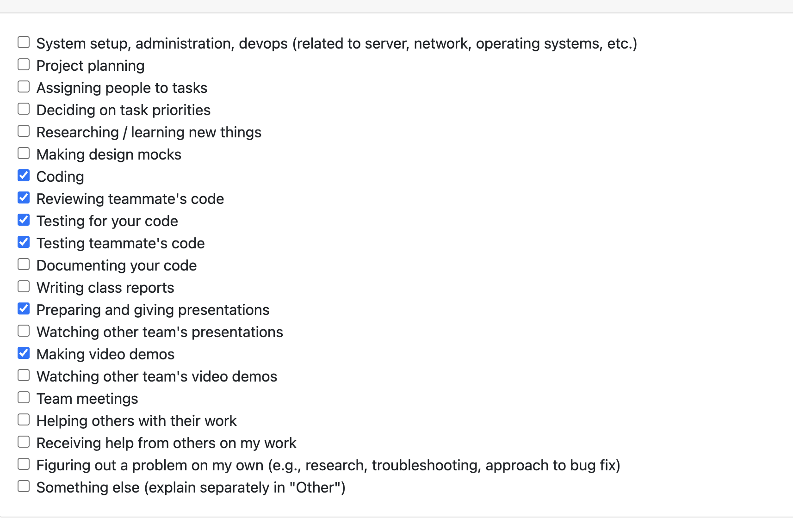
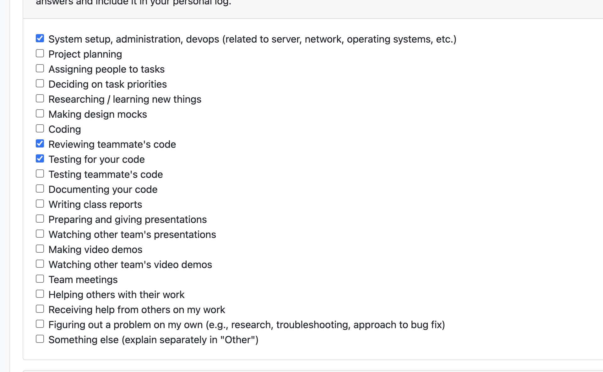

# Individual Log - Kaiden Merchant

## TOC

1. [Week 3](#week-3)
1. [Week 4](#week-4)
1. [Week 5](#week-5)
1. [Week 6](#week-6)
1. [Week 7](#week-7)
1. [Week 8](#week-8)
1. [Week 9](#week-9)
1. [Week 10](#week-10)
1. [Week 12](#week-12)
1. [Week 13](#week-13)
1. [Week 14](#week-14)
1. [Semester 2 - Week 1](#semester-2---week-1)
1. [Semester 2 - Week 2](#semester-2---week-2)
1. [Semester 2 - Week 3](#semester-2---week-3)
1. [Semester 2 - Week 4/5](#semester-2---week-45)
1. [Semester 2 - Week 6/7](#semester-2---week-67)
1. [Semester 2 - Week 9](#semester-2---week-9)

## Week 3
This section outlines the individual log for week 3

### September 15 - September 21

### Tasks


### Weekly Goals

1. My Features: 
    - Discuss the project outline with the team to understand our user base and project's purpose.
    - Develop / refine our project requirements by discussing with other teams and mapping requirements to use cases.

2. Associated Tasks
    - N/A

3. Completed/In-Progress
    - Completed discussions with the team to understand the project.
    - Completed project requirements document.

## Week 4
This section outlines the individual log for week 4

### September 22 - September 28

### Tasks


### Weekly Goals

1. My Features: 
    - Map requirements to system design components.
    - Build system design architecture diagram.
    - Refine requirements for the project proposal

2. Associated Tasks
    - System Architecture Diagram
    - Project Proposal

3. Completed/In-Progress
    - Completed system architecture diagram with updates from the discussion in class.
    - Completed project proposal.

## Week 5
This section outlines the individual log for week 5

### September 29 - October 5

### Tasks


### Weekly Goals

1. My Features: 
    - Create DFD (level 0, level 1) diagrams

2. Associated Tasks
    - Data Flow Diagram

3. Completed/In-Progress
    - Completed level 0 diagram 
    - Completed level 1 diagram
    
## Week 6
This section outlines the individual log for week 6

### October 6 - October 12

### Tasks


### Weekly Goals

1. My Features: 
    - Revise DFD based on new requirements

2. Associated Tasks
    - Data Flow Diagram

3. Completed/In-Progress
    - Completed refactoring of dfd (via new requirements)

## Week 7
This section outlines the individual log for week 7

### October 13 - October 19

### Tasks


### Weekly Goals

1. My Features: 
    - Update README.md with comprehensive project documentation
    - Take on PM/PO role to build out development backlog
    - Create detailed issue descriptions for all team members

2. Associated Tasks
    - README Documentation Updates
    - Backlog Management and Issue Creation
    - Project Milestone Planning

3. Completed/In-Progress
    - Completed comprehensive README.md updates including:
        - Added Project Milestones section with clear goals for Milestone #1, #2, and #3
        - Added Getting Started section with current capabilities and installation instructions
        - Added API Reference section with core endpoints for Milestone #2
        - Improved project structure and documentation organization
    - Completed backlog creation as PM/PO:
        - Created 18 detailed issue descriptions with user stories, acceptance criteria, and technical requirements
        - Established clear dependencies between issues
        - Assigned story points and priorities for sprint planning
        - Created copy-paste ready issue descriptions for GitHub

### Reflection Points

**What went well:**
- Successfully took on the PM/PO role and created a comprehensive backlog that will guide the team's development efforts
- README updates should help users with getting started info and devs with planning.
- Issue descriptions provide clear direction for all team members, reducing ambiguity
- Established a structured approach to project management that will benefit future sprints

**What didn't go well:**
- Initially struggled with the scope of backlog creation - 18 issues was more extensive than anticipated
- Some issue descriptions required talking with a few members to make sure that the issue was on the right track
- Time management could have been better - spent more time on documentation than originally planned

### Planning Activities for Next Cycle

**Week 8 Goals:**
- Most likely will take on more of a dev role next week to start implementing features.
- Review and refine issue descriptions based on team feedback
- Begin sprint planning with team for Milestone #1 deliverables
- Focus on core infrastructure components that other features depend on

## Week 8
This section outlines the individual log for week 8

### October 20 - October 26

### Tasks


### Weekly Goals

1. My Features: 
    - Implement text analyzer component for document analysis (R5: Media Metadata Extraction)
    - Create comprehensive test suite for text analyzer
    - Build CLI interface and example scripts for component usage

2. Associated Tasks
    - Text Analyzer Implementation
    - Test Suite Development
    - Documentation and Examples

3. Completed/In-Progress
    - Completed text analyzer core implementation:
        - Built `TextAnalyzer` class with support for PDF, DOCX, TXT, and MD files
        - Implemented 15+ metric extractions including word count, sentence count, paragraph count, reading time estimation, lexical diversity, and keyword frequency analysis
        - Added batch processing capability with aggregate statistics across multiple files
        - Created structured `TextMetrics` dataclass for clean dictionary output
    - Completed test suite:
        - Wrote 11 comprehensive tests covering all file types, batch analysis, error handling, and metric validation
        - All tests passing with pytest
        - Tests use temporary files with automatic cleanup
    - Completed supporting tools:
        - Built CLI wrapper (`analyze_text.py`) for command-line usage with pure JSON output
        - Created example script (`example_txt_analysis.py`) that generates sample files and demonstrates usage
        - Added robust import handling to work from any directory
    - Documentation:
        - Created comprehensive README for the text analyzer component
        - Wrote PR template with detailed description of changes
        - Documented usage examples for both CLI and Python API

## Week 9
This section outlines the individual log for week 9

### October 27 - November 2

### Tasks


### Weekly Goals

1. My Features:
    - Fix PDF analysis bug in `TextAnalyzer` (initialize `heading_info` for PDF branch)
    - Research and draft the user-facing analysis report structure (brainstormed `REPORT_TEMPLATE.md`)
    - Plan how to connect standalone components into a pipeline (ingest → categorize → analyze)

2. Associated Tasks
    - Bugfix: PDF analyzer UnboundLocalError
    - Report template brainstorming/documentation
    - Pipeline architecture planning

3. Completed/In-Progress
    - Completed PDF bugfix by initializing `heading_info = None` in the PDF path to prevent `UnboundLocalError`
    - Created a markdown report template outlining sections for code, documents, images, videos, activity, insights, and metrics summary
    - Drafted an integration plan to route categorized files to the correct analyzers and aggregate results for API response

### Reflection Points

**What went well:**
- Identified and fixed the PDF-specific error quickly without impacting TXT/DOCX/MD paths
- The report template provides clarity on what the end-user will see and helps guide development
- Clearer vision for the end-to-end pipeline after planning

**What didn't go well:**
- Some churn around script/module import paths when running analyzer from different directories
- Time split across bugfix and documentation limited time for coding the orchestrator

### Planning Activities for Next Cycle

**Week 10 Goals:**
- Look into how we are going to faciliate the pipeline (maybe implement an orchestrator)
- Define endpoint for API call to trigger the pipeline  
- Optional: introduce a `PipelineConfig` to toggle categories (code/docs/media) and LLM usage


## Week 10
This section outlines the individual log for week 10

### November 3 - November 9

### Tasks


### Weekly Goals

1. My Features:
    - Implement the Pipeline Orchestrator to connect the ZIP parser and file categorizer
    - Create comprehensive test suite for the orchestrator component
    - Set up Docker container for interactive development and testing
    - Document orchestrator usage and prepare for API integration

2. Associated Tasks
    - Build `src/pipeline/orchestrator.py` with `ArtifactPipeline` class
    - Create `tests/pipeline/test_orchestrator.py` with 18+ test cases
    - Update Docker configuration to keep container running for exec access
    - Write documentation for running orchestrator locally and in Docker

3. Completed/In-Progress
    - ✅ Implemented `ArtifactPipeline` orchestrator with `start()` method that accepts ZIP file path
    - ✅ Orchestrator successfully connects parser → categorizer and returns structured output
    - ✅ Created comprehensive test suite covering:
      - Basic functionality (initialization, valid/invalid inputs)
      - ZIP metadata extraction and validation
      - File info extraction (paths, sizes, hashes)
      - File categorization by type (code, docs, images, other)
      - Language detection and grouping for code files
      - Edge cases (empty ZIPs, nested directories)
      - Full integration and JSON serialization
    - ✅ All 18 tests passing
    - ✅ Updated Dockerfile CMD to `tail -f /dev/null` to keep container running
    - ✅ Verified orchestrator works both locally and inside Docker container
    - ✅ Created documentation (`src/pipeline/README.md`) with usage examples

### Reflection Points

**What went well:**
- The orchestrator design is clean and extensible - easy to add analyzer routing in the next phase
- Test suite is comprehensive and caught issues early (e.g., JSON files categorized as code, not other)
- Docker setup now supports interactive development - can exec in and run scripts easily
- Output format is well-structured and JSON-serializable, ready for API responses
- Good separation of concerns: orchestrator delegates to existing parser/categorizer without duplicating logic

**What didn't go well:**
- Initial confusion about Docker container lifecycle (container was exiting immediately)
- Python path issues with pytest imports required adding `sys.path` fix to test file
- Some back-and-forth on test expectations (e.g., where JSON files should be categorized)

**Technical Decisions:**
- Chose to keep orchestrator simple for now - just connects parser + categorizer
- Analyzer routing will be added in next phase to avoid scope creep
- Used `tail -f /dev/null` pattern to keep Docker container alive for interactive use
- Decided to filter macOS metadata files (`__MACOSX`, `.DS_Store`, `._*`) at categorization level

### Planning Activities for Next Cycle

**Week 11 Goals:**
- Connect analyzer components (CodeAnalyzer, TextAnalyzer, ImageProcessor, VideoAnalyzer) to orchestrator
- Implement analyzer routing logic based on file categories
- Aggregate analysis results into unified output structure
- (if time permits) Set up FastAPI endpoints to expose the pipeline via REST API
- (if time permits) Add port mapping to docker-compose and test API calls from host machine

## Week 12
This section outlines the individual log for week 12

### November 17 - November 23

### Tasks


### Weekly Goals

1. My Features: 
    - Refactor pipeline architecture to be "project-centric" (handling multiple projects within a single ZIP)
    - Integrate Git repository detection and analysis into the pipeline
    - Connect all local analyzer components (Text, Code, Image, Video) to the orchestrator
    - Implement handling for miscellaneous/loose files outside project directories

2. Associated Tasks
    - Orchestrator Refactoring & Project Detection Logic
    - Git Analyzer Integration
    - Analyzer Component Connection (4 analyzers)
    - Docker Dependency Management (Tesseract, Git, FFmpeg)
    - Error Handling & Edge Case Testing

3. Completed/In-Progress
    - ✅ Refactored `ArtifactPipeline` to identify top-level directories as individual projects and process them independently
    - ✅ Integrated `individual_contrib_analyzer` to automatically run on detected Git repositories
    - ✅ Connected all 4 local analyzers to pipeline flow:
      - `TextAnalyzer` for documentation (PDF, DOCX, TXT, MD)
      - `CodeAnalyzer` for code files with language/framework detection
      - `ImageProcessor` for image analysis (resolution, content, OCR)
      - `VideoAnalyzer` for video metadata and transcription
    - ✅ Implemented "Miscellaneous Files" section to capture and analyze root-level files
    - ✅ Updated `Dockerfile` to include system dependencies: `git`, `tesseract-ocr`, `tesseract-ocr-eng`, `ffmpeg`
    - ✅ Restructured output format: Project → Git Analysis → File Analysis (by type)
    - ✅ Added graceful error handling for empty Git repositories and missing dependencies
    - ✅ Updated `src/pipeline/README.md` with new architecture documentation

### Reflection Points

**What went well:**
- The project-centric architecture provides much better data organization, especially for multi-project submissions
- Git integration adds significant value by surfacing contributor metrics alongside code analysis
- All analyzer components now work together seamlessly through the orchestrator
- Output structure is consistent and well-organized, making downstream consumption easier
- Docker setup ensures all system dependencies are portable and reproducible

**What didn't go well:**
- Debugging Docker dependency issues took time (e.g., `tesseract` binary missing despite Python package being installed)
- Handling Git edge cases (empty repos, no commits) required multiple iterations to get messaging right
- Initial confusion about how to handle wrapper folders in ZIP extraction vs actual projects

**Technical Decisions:**
- Chose to detect projects at the top-level directory after unwrapping any single wrapper folder
- Git analysis runs automatically if `.git` directory is detected, with graceful fallback if repo is empty
- Loose files get their own "Miscellaneous Files" section rather than being ignored
- Error handling is defensive - one analyzer failure doesn't break the entire pipeline

### Planning Activities for Next Cycle

**Week 13 Goals:**
- Connect pipeline output to database for persistence
- Prepare for final integration testing and demo


## Week 13
This section outlines the individual log for week 13

### November 24 - November 30

### Tasks


### Weekly Goals

1. My Features:
    - Integrate advanced skill extraction component into pipeline for all code files
    - integrate project ranking and summary generation system
    - integrate chronological skills timeline 
    - Fix JSON serialization issues for database persistence

2. Associated Tasks
    - Advanced Skill Extractor Integration
    - Project Ranking System Integration
    - Chronological Skills Timeline Integration
    - JSON Serialization Bug Fixes
    - Console Output Enhancement

3. Completed/In-Progress
    - ✅ Integrated `AdvancedSkillExtractor` into orchestrator:
      - Added per-file skill analysis for all code files
      - Implemented aggregate skill metrics across entire project
      - Detects 50+ advanced skills, design patterns, and CS concepts
      - Results stored in `code.skill_analysis` section
    - ✅ Integrated project ranking and summary generation:
      - Built `_convert_to_project_info()` to transform orchestrator results to `ProjectInfo` objects
      - Implemented `_rank_and_summarize_projects()` using existing ranking components
      - Ranks projects by score (LOC, commits, recency, skills breadth)
      - Generates human-readable summaries for top 5 projects
      - Results stored in `project_ranking` section
    - ✅ Integrated chronological skills timeline:
      - Built `_build_chronological_skills()` to track skills over time
      - Analyzes code, documentation, images, and videos chronologically
      - Captures timestamps, categories, and metadata for each event
      - Results stored in `chronological_skills` section
    - ✅ Fixed JSON serialization issues:
      - Created `_make_json_serializable()` helper to convert non-serializable types
      - Handles NumPy types (uint8, int32, float64, ndarray, etc.)
      - Handles PIL/Pillow types (IFDRational from EXIF data)
      - Handles datetime objects, bytes, and custom classes
      - Applied to entire result before database persistence
    - ✅ Enhanced console output in `main()`:
      - Added "Advanced Skill Analysis" subsection in CODE ANALYSIS
      - Added "PROJECT RANKING & SUMMARIES" dedicated section
      - Added "CHRONOLOGICAL SKILLS TIMELINE" dedicated section with full JSON
      - All new components now printed to console for manual testing
    - ✅ Updated pipeline flow:
      - Expanded from 6 steps to 9 steps
      - Step 7: Rank projects and generate summaries
      - Step 8: Build chronological skills timeline
      - Step 9: Persist to database (moved after ranking/skills to include them)
    - ✅ Database persistence verified:
      - All new components included in encrypted blob
      - `project_ranking`, `chronological_skills`, and `skill_analysis` all stored
      - No schema changes required - uses existing JSON blob approach

### Reflection Points

**What went well:**
- Successfully integrated three major milestone components into the pipeline without breaking existing functionality
- Clean separation of concerns - each component has its own helper method in orchestrator
- JSON serialization fix was comprehensive and handles all edge cases (NumPy, PIL, datetime, etc.)
- Database persistence works seamlessly - all new data automatically included in encrypted blob
- Console output is clear and informative, making manual testing straightforward

**What didn't go well:**
- Initial JSON serialization issues required multiple iterations to catch all non-serializable types
- Had to debug PIL's IFDRational type specifically after fixing NumPy types

**Milestone Requirements Addressed:**
- ✅ Extract key skills from a given project (advanced skill extractor)
- ✅ Rank importance of each project based on user's contributions (project ranking)
- ✅ Summarize the top ranked projects (summary generation)
- ✅ Produce a chronological list of skills exercised (skills timeline)
- ✅ Store all results into database for retrieval (persistence verified)

### Planning Activities for Next Cycle

**Future Weeks:**
- Research and preparation for Milestone 2 deliverables
- Planning for next phase of development

## Week 14
This section outlines the individual log for week 14

### December 1 - December 7

### Tasks


### Weekly Goals

1. My Features:
    - Add JSON report generation functionality to pipeline for demo purposes
    - Create structured output files in `reports/` directory with timestamp-based naming
    - Develop comprehensive test suite for JSON report generation
    - Ensure report structure is organized by project and file type for easy demonstration

2. Associated Tasks
    - JSON Report Generation Implementation
    - Test Suite Development
    - Report Structure Validation
    - Documentation Updates

3. Completed/In-Progress
    - ✅ Implemented JSON report generation in orchestrator:
      - Added `_save_json_report()` method to `ArtifactPipeline` class
      - Creates `reports/` directory automatically if it doesn't exist
      - Generates timestamped report files: `report_YYYYMMDD_HHMMSS.json`
      - Leverages existing `_make_json_serializable()` for data preparation
      - Outputs nicely formatted JSON with 2-space indentation
      - Added datetime import for timestamp generation
    - ✅ Integrated report generation into pipeline flow:
      - Modified `start()` method to call `_save_json_report()` after all analysis
      - Report saved after database persistence but before returning result
      - Added console output showing report file location
      - No breaking changes to existing functionality
    - ✅ Created comprehensive test suite (`tests/pipeline/test_json_report.py`):
      - 8 test cases covering all aspects of JSON report generation
      - `test_json_report_is_created` - Verifies report file creation
      - `test_json_report_is_valid_json` - Validates JSON format
      - `test_json_report_has_required_structure` - Checks schema structure
      - `test_json_report_organizes_by_project` - Validates project organization
      - `test_json_report_organizes_by_file_type` - Validates file type grouping
      - `test_json_report_filename_format` - Checks timestamp format
      - `test_json_report_is_serializable` - Ensures no serialization errors
      - Automatic cleanup of test reports via fixture
    - ✅ Report structure maintains organization:
      - Top-level: `zip_metadata`, `projects`, `project_ranking`, `chronological_skills`
      - Per-project: `categorized_contents`, `analysis_results` (by file type)
      - Per-file-type: `code`, `documentation`, `images`, `videos`
      - Easy to navigate for demo presentation

### Reflection Points

**What went well:**
- JSON report generation integrates seamlessly with existing pipeline architecture
- Leveraging `_make_json_serializable()` eliminated need for duplicate serialization logic
- Test suite is comprehensive and caught potential issues early
- Report format is clean and well-structured for demo purposes
- Timestamp-based naming prevents overwriting and allows tracking of multiple runs

**What didn't go well:**
- Initial filename included ZIP name but switched to timestamp-only for cleaner output
- Had to ensure reports directory is created relative to execution path
- Minor iteration on test fixture cleanup to avoid test pollution

**Technical Decisions:**
- Chose timestamp-only naming (`report_YYYYMMDD_HHMMSS.json`) for simplicity
- Report saved after database persistence to ensure all data is included
- Used `Path.mkdir(exist_ok=True)` for safe directory creation
- Maintained same structure as in-memory result for consistency

### Planning Activities for Next Cycle

**Week 15 Goals:**
- Research service API call architecture for external integrations
- Investigate how to expose pipeline configuration options to users
- Design user preference system for customizing pipeline flow:
  - Toggle individual analyzers (code, text, image, video)
  - Enable/disable Git analysis
  - Control LLM summarization settings
  - Configure ranking criteria and output formats
- Explore configuration file formats (JSON, YAML, TOML) for user preferences
- Plan API endpoint structure for triggering customized pipeline runs

## Semester 2 - Week 1
This section outlines the individual log for Semester 2 - Week 1

### January 6 - January 11

### Tasks


### Weekly Goals

1. My Features:
    - Implement evidence of success metrics system for projects
    - Create comprehensive success scoring algorithm with 8 different metrics
    - Integrate success metrics into pipeline orchestrator and outputs
    - Build test suite for success metrics analyzer

2. Associated Tasks
    - Success Metrics Component Implementation
    - Pipeline Integration
    - Console Output Enhancement
    - Test Suite Development

3. Completed/In-Progress
    - ✅ Created `SuccessMetricsAnalyzer` component (`src/analyze/success_metrics.py`):
        - Implemented 8 metric calculations:
            - Code Quality Score (based on languages, frameworks, advanced skills)
            - Test Coverage Indicator (estimated from test file patterns)
            - Documentation Score (README presence, word count, file count)
            - Activity Score (based on commit count)
            - Commit Frequency Score (commits per week)
            - Collaboration Score (based on contributor count)
            - Complexity Score (based on lines of code)
            - Scale Score (based on file count and commits)
        - Calculated weighted overall score (0-100)
        - Implemented badge extraction from README files (build, coverage, license, etc.)
        - Implemented feedback keyword detection ("excellent", "outstanding", "award", etc.)
        - Implemented evaluation notes extraction from feedback files
    - ✅ Integrated success metrics into pipeline orchestrator:
        - Added `SuccessMetricsAnalyzer` initialization
        - Called analyzer in `_process_project()` after all other analysis
        - Success metrics included in project results dictionary
        - Metrics persisted to database blob via `ProjectInsightsStore`
        - Metrics saved to JSON reports in `reports/` directory
    - ✅ Created comprehensive test suite (`tests/analyze/test_success_metrics.py`):
        - 18 tests covering all metric calculations
        - Tests for badge and feedback extraction
        - Edge case handling (non-Git repos, empty projects, missing data)
        - JSON serialization validation
        - All tests passing

### Reflection Points

**What went well:**
- Success metrics analyzer is modular and self-contained (~450 lines)
- Scoring algorithms are simple but effective for initial implementation
- Integration into pipeline was seamless with no breaking changes
- Test coverage is comprehensive with good edge case handling


**What didn't go well:**
- Test coverage estimation is basic (just ratio of test files to code files)
- Badge extraction relies on regex patterns that may miss some formats
- Feedback keyword detection is simplistic (just keyword matching)

### Planning Activities for Next Cycle

**Semester 2 - Week 2 Goals:**
- Collaborate with Abhijeet on database schema overhaul and optimization
- Expand success metrics generation with more sophisticated algorithms:
  - Integrate actual code coverage reports if available
  - Add sentiment analysis for feedback evaluation
  - Implement project-type-aware scoring normalization
- Implement duplicate file detection and prevention system:
  - Hash-based duplicate detection across projects
  - File similarity analysis for near-duplicates
  - Deduplication strategy in pipeline processing
- Research and plan for service API integration architecture

## Semester 2 - Week 2
This section outlines the individual log for Semester 2 - Week 2

### January 13 - January 18

### Tasks


### Weekly Goals

1. My Features:
    - Implement database caching system for file analysis results
    - Add duplicate file detection based on SHA256 hash comparison
    - Integrate cache checking and reuse mechanism into pipeline
    - Create comprehensive test suite for file analysis caching

2. Associated Tasks
    - File Analysis Cache Table Implementation
    - Cache Storage and Retrieval Methods
    - Pipeline Integration for Cache Checking
    - Database Inspection Documentation
    - Test Suite Development

3. Completed/In-Progress
    - ✅ Created `file_analysis_cache` table in database schema:`ProjectInsightsStore`:
    - ✅ Integrated cache checking into pipeline orchestrator:
        - Added `_build_sha256_lookup()` helper to map file paths to SHA256 hashes
    - ✅ Created comprehensive test suite (`tests/insights/test_file_analysis_cache.py`):
        - All tests passing

### Key Implementation Details

**Cache Workflow:**
1. **First pipeline run**: Files analyzed normally, results cached by SHA256 hash
2. **Subsequent runs**: Pipeline checks cache before analyzing each file
3. **Cache hit**: Reuse stored result, increment `access_count`, update `last_accessed`
4. **Cache miss**: Analyze file normally, store result in cache for future use
5. **Console feedback**: Display cache hit rate per file type for user visibility

### Reflection Points

**What went well:**
- Cache integration into pipeline was seamless with no breaking changes
- Performance improvement is immediately visible through console output
- Test coverage is comprehensive with 27 tests covering all scenarios

**What didn't go well:**
- Initial implementation had schema migration issues (old database needed deletion)

**Technical Decisions:**
- Created last_accessed column so we can check when the file was last used
- Separated cache storage from file_info table for cleaner schema
- Added access tracking (count + timestamp) for future cache eviction strategies
- Made cache checking optional (gracefully handles missing insights_store)
- Displayed cache statistics per file type for transparency

### Planning Activities for Next Cycle

**Semester 2 - Week 3 Goals:**
- Begin API design exploration using FastAPI framework
- Research RESTful API best practices for pipeline orchestration
- Investigate async processing patterns for long-running pipeline operations
- Explore file upload handling and temporary storage strategies
- Plan error handling and response formatting standards
- Research Docker containerization best practices for FastAPI services

## Semester 2 - Week 3
This section outlines the individual log for Semester 2 - Week 3

### January 19 - January 25

### Tasks


### Weekly Goals

1. My Features:
    - Implement real-time progress tracking system for pipeline operations
    - Add cancellation capabilities for long-running analyses
    - Create thread-safe progress state management
    - Integrate progress tracking into orchestrator at key checkpoints
    - Build comprehensive test suite with thread safety validation

2. Associated Tasks
    - Progress Tracker Module Implementation
    - Pipeline Integration for Progress Updates
    - Cancellation Mechanism
    - Thread Safety Testing
    - Documentation and PR Preparation

3. Completed/In-Progress
    - ✅ Created `ProgressTracker` class with thread-safe state management:
        - `ProgressState` dataclass for immutable progress snapshots
        - Callback registration system for real-time notifications
        - Thread-safe update and increment methods using `threading.Lock`
        - Cancellation request and checking mechanisms
    - ✅ Integrated progress tracking into pipeline orchestrator:
        - Progress updates at all major pipeline stages (parsing → extracting → categorizing → analyzing → compiling → complete)
        - Cancellation checks before project processing and in file analysis loops
        - File-level progress updates with `increment_processed()` calls
        - Graceful cancellation with cleanup and status reporting
    - ✅ Created comprehensive test suite (`tests/pipeline/test_progress_tracker.py`):
        - 27 test cases covering unit, thread safety, and integration scenarios
        - Thread safety validated with concurrent readers/writers (1000+ operations)
        - All tests passing

### Key Implementation Details

**Progress Tracking Workflow:**
1. **Initialization**: Tracker reset at pipeline start with stage set to `'initializing'`
2. **Stage progression**: Updates at each major step (parsing, extracting, categorizing, analyzing, compiling, complete)
3. **File-level tracking**: Progress incremented after each file analysis with current filename
4. **Project tracking**: Current project name updated when switching between projects
5. **Completion**: Final update marks stage as `'complete'` with full file count

**Cancellation Mechanism:**
1. **Request**: External thread calls `request_cancel()` to set flag
2. **Check points**: Pipeline checks `should_cancel()` at strategic locations:
   - Before processing each project
   - In documentation, image, and code analysis loops
3. **Graceful exit**: Returns status dictionary, cleanup happens in `finally` block

**Thread Safety Design:**
- All state mutations protected by `threading.Lock`
- Immutable `ProgressState` copies returned to prevent race conditions
- Callbacks execute outside lock to prevent deadlocks
- Validated with 10 concurrent threads performing 1000 updates

### Reflection Points

**What went well:**
- Clean separation of concerns with `ProgressState` (data) and `ProgressTracker` (logic)
- Non-breaking integration - progress tracking is opt-in and doesn't affect existing functionality
- Comprehensive test coverage including edge cases and thread safety scenarios
- Callback system enables future enhancements (WebSocket streaming, UI progress bars)

**What didn't go well:**
- Initial integration attempts needed refactoring to find optimal checkpoint locations
- Had to ensure progress updates don't significantly impact performance

**Technical Decisions:**
- Used immutable `ProgressState` dataclass to prevent accidental state mutations
- Separated callback notification from state update to avoid deadlock scenarios
- Added convenience method `increment_processed()` for common single-file increment case
- Made callbacks silently ignore exceptions to prevent bad callbacks from breaking tracking
- Included elapsed time tracking for future performance monitoring features

### Planning Activities for Next Cycle

**Semester 2 - Week 4 Goals:**
- Add progress tracking API endpoints to expose real-time status via REST API
- Implement cache expiration system with TTL (time-to-live) management
- Create batch analysis endpoint for processing multiple ZIP files
- Explore file diff analysis for incremental scans (detect what changed between runs)
- Implement enhanced error recovery with retry logic and partial success handling
- Research WebSocket integration for real-time progress streaming to clients

## Semester 2 - Week 4/5
This section outlines the individual log for Semester 2, Week 4/5

### February 1 - February 8

### Tasks


### Weekly Goals

1. My Features: 
    - Design and implement pipeline cancellation mechanism
    - Add POST /insights/cancel/{zip_hash} API endpoint
    - Ensure thread-safe tracker registry with proper locking
    - Integrate cancellation detection into pipeline flow
    - Implement automatic cleanup of partial database records
    - Build comprehensive test suite with thread safety validation

2. Associated Tasks
    - Cancellation Endpoint Implementation
    - Progress Tracker Thread-Safety Fixes
    - Pipeline Orchestrator Integration
    - Tracker Registry Development
    - Database Cleanup Logic
    - Testing and Documentation

3. Completed/In-Progress
    - ✅ Fixed thread-safety deadlock in `ProgressTracker`:
        - Resolved issue where `update()` called `get_state()` while holding lock
        - Moved callback notification outside lock to prevent deadlock scenarios
        - Created `_notify_callbacks_direct()` to avoid re-acquiring lock
        - All state copies now created within lock, callbacks invoked outside
    - ✅ Implemented cancellation endpoint in `src/insights/api.py`:
        - `POST /insights/cancel/{zip_hash}` - triggers cancellation and schedules cleanup
        - Global tracker registry with thread-safe register/unregister/get functions
        - Background cleanup task using FastAPI's `BackgroundTasks`
        - Proper error handling for missing trackers and orphaned records
    - ✅ Integrated cancellation into pipeline orchestrator:
        - Added `_get_zip_hash()` method to calculate SHA256 of ZIP files
        - Tracker registration at pipeline start with `register_tracker(zip_hash, tracker)`
        - Cancellation checkpoints at 3 strategic locations:
            * After ZIP parsing (line 141)
            * After extraction (line 178)
            * Before processing each project (line 214)
        - `_cleanup_on_cancel()` method to delete partial database records
        - Tracker unregistration in `finally` block to ensure cleanup
    - ✅ Created comprehensive test suite (`tests/test_cancellation.py`):
        - 8 test cases covering registry, cleanup, and integration scenarios
        - Thread safety validated with concurrent operations
        - All tests passing (8/8)
        - Tests cover: tracker registry, database cleanup, cancellation flow, pipeline integration

### Key Implementation Details

**Cancellation Workflow:**
1. **Pipeline Start**: Calculate SHA256 hash of ZIP file to uniquely identify the run
2. **Registration**: Register `ProgressTracker` in global registry with `zip_hash` as key
3. **Processing**: Pipeline runs normally, checking `should_cancel()` at checkpoints
4. **Cancel Request**: External caller (API endpoint) retrieves tracker and calls `request_cancel()`
5. **Detection**: Pipeline detects flag at next checkpoint (parsing/extraction/project loop)
6. **Cleanup**: `_cleanup_on_cancel(zip_hash)` deletes all database records for that ZIP
7. **Exit**: Pipeline returns `{"status": "cancelled"}` and unregisters tracker in `finally` block

**Thread-Safety Improvements:**
- **Problem**: Original implementation acquired lock in `update()`, then called `get_state()` which tried to acquire lock again, then `_notify_callbacks()` acquired lock a third time
- **Solution**: Create state copy and callback list while holding lock once, then notify outside lock
- **Result**: No deadlocks, callbacks can safely call other tracker methods if needed

**Tracker Registry Design:**
```python
_active_trackers: Dict[str, Any] = {}  # Maps zip_hash -> ProgressTracker
_tracker_lock = threading.Lock()       # Thread-safe access

register_tracker(zip_hash, tracker)    # Called at pipeline start
get_tracker(zip_hash)                  # Called by cancel endpoint
unregister_tracker(zip_hash)           # Called in finally block
```

**Database Cleanup:**
- Uses existing `store.delete_zip(zip_hash)` method to remove all records
- Returns count of deleted projects and zips
- Runs in FastAPI background task to not block response
- Also called directly in pipeline for immediate cleanup

### Reflection Points

**What went well:**
- Clean separation of concerns - cancellation logic isolated in API layer
- Non-breaking changes - existing pipeline functionality unchanged
- Comprehensive test coverage caught the deadlock issue early
- Strategic checkpoint placement allows cancellation without losing much work
- Background cleanup ensures API remains responsive

**What didn't go well:**
- Initial implementation had subtle deadlock that only appeared under specific conditions
- Took several iterations to find optimal checkpoint locations in pipeline
- Had to refactor progress tracker callback mechanism to fix threading issues

**Technical Decisions:**
- Used SHA256 of entire ZIP file (not just filename) to uniquely identify runs
- Chose to delete all records on cancel rather than marking as "partial" or "cancelled"
- Implemented cleanup in both API endpoint (background) and pipeline (immediate) for safety
- Decided to defer API server setup to next week - focused on core logic first
- Made tracker registry global with explicit lock rather than thread-local storage

**Testing Strategy:**
- Unit tests for tracker registry operations (register/get/unregister)
- Thread-safety tests with concurrent access (tested with multiple threads)
- Integration tests for full cancellation flow (tracker + pipeline + cleanup)
- Database cleanup verification (insert records, cancel, verify deletion)
- Manual testing script for end-to-end validation without HTTP layer

### Planning Activities for Next Cycle

**Semester 2 - Week 6 Goals:**
- Set up FastAPI server with proper entry point (`src/main.py`)
- Update `docker-compose.yml` with uvicorn command to run API server
- Test cancel endpoint with actual HTTP requests (cURL/Postman)
- Implement health check endpoints for API monitoring

## Semester 2 - Week 6/7/8
This section outlines the individual log for Semester 2, Week 6/7

### February 9 - March 1

### Tasks



### Weekly Goals

1. My Features:
    - Implement incremental ZIP update feature to allow users to update an existing analyzed portfolio without full re-analysis
    - Add new storage methods to support merge logic between old and new ZIP analysis results
    - Implement `incremental_update()` method on pipeline orchestrator
    - Add `POST /projects/update/{old_zip_hash}` API endpoint
    - Create comprehensive test suite for incremental update feature
    - Test all Milestone 2 requirements end-to-end and record demo video

2. Associated Tasks
    - Incremental Update Endpoint Implementation
    - Storage Layer Methods
    - Orchestrator Integration
    - Test Suite Development
    - Milestone 2 Requirements Testing
    - Demo Video Recording

3. Completed/In-Progress
    - ✅ Added 4 new storage methods to `ProjectInsightsStore` (`src/insights/storage.py`):
        - `list_projects_for_zip_detailed()` — retrieves all project records (id, name, zip hash) for a given zip hash
        - `reassign_projects_to_zip_hash()` — moves retained old-only projects from old zip hash to new zip hash
        - `delete_projects_by_names()` — removes old duplicate project records that have been replaced by new versions
        - `delete_zip_if_empty()` — cleans up the old zip ingest record if no projects remain under it
    - ✅ Implemented `incremental_update()` method on `ArtifactPipeline` (`src/pipeline/orchestrator.py`):
        - Snapshots old project names before running new pipeline
        - Runs standard pipeline on new ZIP to produce new analysis
        - Computes set difference between old and new project names:
            - Old-only projects → reassigned to new zip hash (retained)
            - New-only projects → added as new records under new zip hash
            - Duplicate projects (same name in both) → old record deleted, new record kept
        - Cleans up old zip record if empty after reassignment and deletion
        - Returns summary: `retained_projects`, `updated_projects`, `new_only_projects`, `total_projects`
    - ✅ Added `POST /projects/update/{old_zip_hash}` endpoint (`src/api/routers/projects.py`):
        - Accepts `user_id`, `old_zip_hash`, and `new_zip_path` in request body
        - Returns 404 if old zip hash does not exist in database
        - Returns 404 if user config not found
        - Returns 403 if user has not given data access consent
        - Delegates to `pipeline.incremental_update()` and returns merge summary
    - ✅ Created comprehensive test suite (`tests/test_incremental_update.py`):
        - 22 tests across 3 layers: storage methods, orchestrator logic, and API endpoint
        - All 22 tests passing in 2.68s
        - Coverage includes: merge set logic, 404 handling, consent enforcement, storage method correctness, cascade deletes, and regression checks
    - ✅ Manually tested full incremental update workflow end-to-end:
        - Uploaded initial ZIP (`test_incremental_OG.zip`) and confirmed projects stored under correct zip hash
        - Ran incremental update with new ZIP (`test_incremental_NEW.zip`) containing overlapping and new projects
        - Verified new-only projects added under new zip hash
        - Verified old-only projects reassigned from old zip hash to new zip hash
        - Verified duplicate projects replaced — old records deleted, new records kept
        - Verified old zip hash record cleaned up after all projects reassigned or deleted
        - Verified 404 response for non-existent old zip hash
        - Confirmed no regressions on existing `/projects/upload` endpoint
    - ✅ Tested all Milestone 2 requirements end-to-end and recorded demo video

### Reflection Points

**What went well:**
- Merge logic using Python set operations (old & new, old - new, new - old) is clean and easy to reason about
- Non-breaking implementation — existing `/projects/upload` endpoint completely unaffected
- Test suite caught several edge cases during development (empty zip records, cascade deletes)
- Manual testing with SQLite queries gave high confidence in correctness of database state after each operation
- 22/22 tests passing

**What didn't go well:**
- Initial patch target for mocking `ArtifactPipeline` in tests was wrong due to lazy import inside the endpoint function — had to change patch target to `src.pipeline.orchestrator.ArtifactPipeline`
- `UserConfigManager` constructor kwarg was `db_path=` not `config_dir=` — caused a round of test failures before fixing
- Video took a while to complete because of a couple change I h ad to make

**Technical Decisions:**
- Used lazy import of `ArtifactPipeline` inside the endpoint function to avoid circular imports
- Chose set-based merge logic for simplicity and clarity over row-level diffing
- Implemented `delete_zip_if_empty()` as a separate method to keep deletion logic composable
- Stored `old_zip_hash` in the request body as well as the path parameter for explicit validation

### Planning Activities for Next Cycle

**Semester 2 - Week 8 Goals:**
- Begin Electron.js setup and scaffolding for the desktop frontend application
- Research Electron + React or Electron + Vue architecture for the frontend
- Connect frontend upload form to `POST /projects/upload` API endpoint
- Plan frontend component structure to map to existing API endpoints

## Semester 2 - Week 9
This section outlines the individual log for Semester 2 - Week 9

### March 2 - March 8

### Tasks



### Weekly Goals

1. My Features:
    - Set up Electron + React + TypeScript desktop application scaffold
    - Establish project structure, build pipeline, and dev/test workflows for the frontend
    - Create a default homepage with app branding and placeholder navigation
    - Build a component test suite for the renderer layer
    - Plan frontend portfolio generation UI for future work

2. Associated Tasks
    - Electron + Vite + React scaffolding
    - Homepage Component Implementation
    - Build Pipeline Configuration (tsc + Vite + electron-builder)
    - Test Suite Development (Vitest + React Testing Library)
    - `.gitignore` Updates

3. Completed/In-Progress
    - ✅ Created `frontend/` directory at repo root with full Electron + React + TypeScript project:
        - `src/main/index.ts` — Electron main process: creates `BrowserWindow`, loads dev server or production build
        - `src/preload/index.ts` — Preload bridge using `contextBridge` to safely expose Node.js APIs to the renderer
        - `src/renderer/index.html` — HTML shell with Content Security Policy headers
        - `src/renderer/src/main.tsx` — React entry point
        - `src/renderer/src/App.tsx` — Default homepage with app title, welcome card, and placeholder action buttons
        - `src/renderer/src/assets/styles.css` — Dark theme styling
    - ✅ Configured multi-target build pipeline:
        - `tsconfig.node.json` — compiles main and preload to CommonJS for Electron
        - `vite.config.ts` — builds React renderer with `@vitejs/plugin-react`
        - `electron-builder` config in `package.json` for producing `.dmg` (macOS), `.exe` (Windows), `.AppImage` (Linux)
    - ✅ Set up npm scripts:
        - `npm run dev` — starts Vite dev server + Electron with hot reload via `concurrently` and `wait-on`
        - `npm start` — full production build then launch
        - `npm run build` — compiles renderer (Vite) and main/preload (tsc)
        - `npm run dist` — produces distributable package
    - ✅ Created test suite (`tests/App.test.tsx`) with Vitest + React Testing Library:
        - 6 tests covering: title, subtitle, welcome card, action buttons present, buttons disabled by default, footer
        - All 6 tests passing
    - ✅ Updated root `.gitignore` to exclude `frontend/node_modules/`, `frontend/dist/`, `frontend/out/`
    - ✅ Verified full workflow: `npm run build` compiles cleanly, `electron .` opens desktop window with homepage

### Reflection Points

**What went well:**
- Electron + Vite build pipeline is clean and well-separated: main process, preload, and renderer are clearly isolated
- Hot reload in dev mode works well — changes to React components reflect in the window without restarting Electron
- Test suite integrates naturally with the renderer layer — no Electron mocking needed for component tests
- The `contextIsolation: true` / `nodeIntegration: false` preload approach follows current Electron security best practices
- `electron-builder` config is in place so producing a distributable is a single command (`npm run dist`)

**What didn't go well:**
- The `npm create electron-vite` scaffold tool is interactive and doesn't support fully non-interactive setup — had to manually create the project structure instead
- Required careful separation of `tsconfig.json` (renderer, bundler module resolution) vs `tsconfig.node.json` (main/preload, CommonJS) to avoid type resolution conflicts

**Technical Decisions:**
- Used Vite as the renderer bundler (over webpack) for speed and simpler config
- Chose TypeScript throughout for consistency with the team's existing codebase conventions
- Kept homepage minimal and placeholder-driven — action buttons are present but disabled, ready to be wired up to API endpoints in future PRs
- Used `contextBridge` in preload to expose a typed `window.electronAPI` object rather than enabling `nodeIntegration`, which would be a security risk

### Planning Activities for Next Cycle

**Semester 2 - Week 10 Goals:**
- Design and implement the portfolio generation UI — upload form wired to `POST /projects/upload`
- Add routing (React Router) to support multiple pages: Home, Projects, Report
- Display project list by fetching from `GET /projects`
- Display per-project analysis results from `GET /projects/{id}`
- Plan report viewer UI for browsing generated JSON reports in a readable layout

