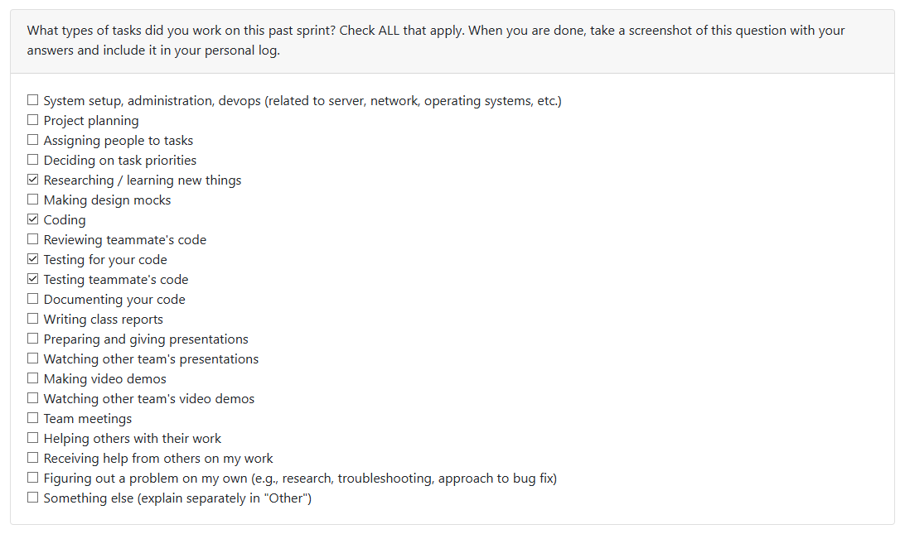
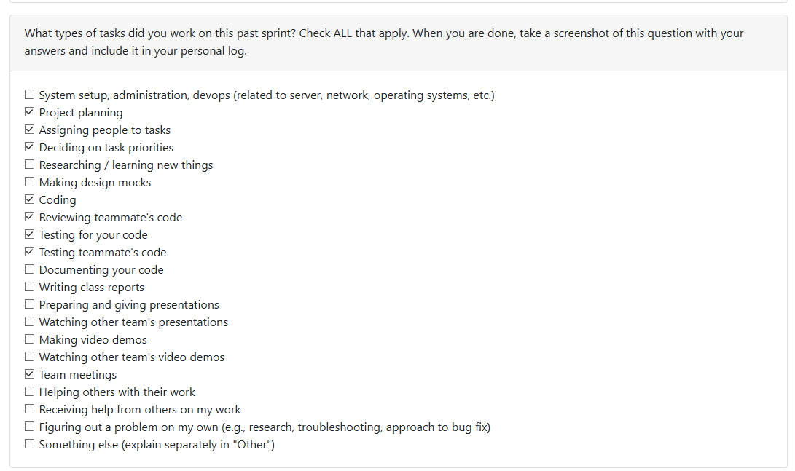
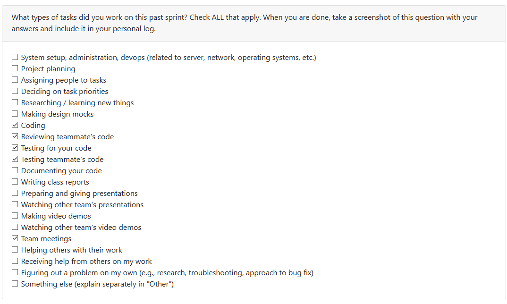
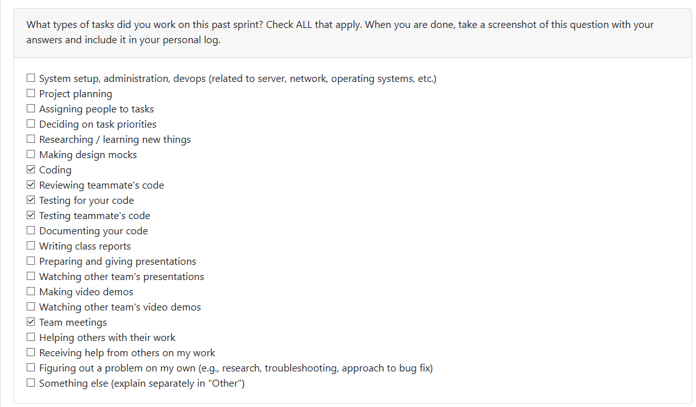
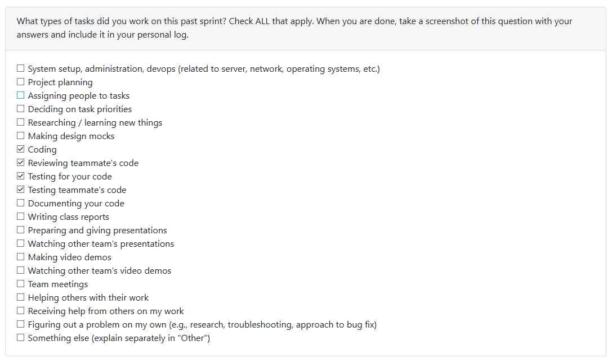
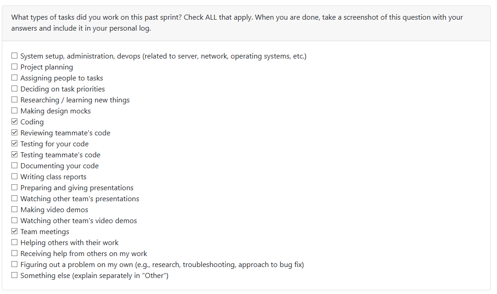

# Personal Log

[T2 Week 1 Personal Logs](#term-2-week-1)
[T2 Week 2 Personal Logs](#term-2-week-2)
[T2 Week 3 Personal Logs](#term-2-week-3)
[T2 Week 4-5 Personal Logs](#term-2-week-4-5)
[T2 Week 6-8 Personal Logs](#term-2-week-6-8)
[T2 Week 9 Personal Logs](#term-2-week-9)

[Week 3 Personal Logs](#week-3)
[Week 4 Personal Logs](#week-4)
[Week 5 Personal Logs](#week-5)
[Week 6 Personal Logs](#week-6)
[Week 7 Personal Logs](#week-7)
[Week 8 Personal Logs](#week-8)
[Week 9 Personal Logs](#week-9)
[Week 10 Personal Logs](#week-10)
[Week 11 Personal Logs](#week-11)
[Week 12 Personal Logs](#week-12)
[Week 13 Personal Logs](#week-13)
[Week 14 Personal Logs](#week-14)

## Week 3
### Date Range 
15th September 2025 - 21st September 2025

### Type of tasks worked on

### Weekly Goals
**My features**:
* The goal was to understand the project theme and contribute to the requirements document
* Created requirements document and drafted functional requirements
* Talked with other groups in class to refine our requirements

**Task from project board**:
* "Project Requirements"

**Completed/In-progress tasks**: 
* "Project Requirements"

---
## Week 4
### Date Range 
22nd September 2025 - 28th September 2025

### Type of tasks worked on

### Weekly Goals
**My features**:
* Collaborate on creating the system architecture diagram
* Collaborate on drafting and completing the project proposal

**Task from project board**:
* System Architecture Diagram
* Project Proposal

**Completed/In-progress tasks**: 
* System Architecture Diagram
* Project Proposal

## Week 5
### Date Range 
29th September 2025 - 5th October 2025

### Type of tasks worked on

### Weekly Goals
**My features**:
* Collaborated on creating Level 0 and Level 1 Data Flow Diagrams and discussion with other groups on differences in DFDs

**Task from project board**:
* Data Flow Diagram

**Completed/In-progress tasks**: 
* Data Flow Diagram (Completed)

## Week 6
### Date Range 
6th October 2025 - 12th October 2025

### Type of tasks worked on

### Weekly Goals
**My features**:
* Worked on revising the Data Flow Diagram based on the Milestone #1 requirements
* Setup tasks in the Kanban Board based on Milestone #1 requirements and assigned some people to tasks

**Task from project board**:
* DFD Revision

**Completed/In-progress tasks**: 
* DFD Revision (Completed)

## Week 7
### Date Range 
13th October 2025 - 19th October 2025

### Type of tasks worked on

### Weekly Goals
**My features**:
* Started researching on an parsing a specified zip folder using Python and useful libraries.
* Wrote initial test code to ensure that initially fails but ensures eventually that my feature works as intended.
* Implemented the parser and useful json utility and tested against the written code to ensure it works.

**Task from project board**:
* ZIP Folder Validation and Basic Parser

**Completed/In-progress tasks**: 
* ZIP Folder Validation and Basic Parser (Completed)

**Future cycle plans**:
* The next step will involve storage of the data generated from this sprint (e.g. user configs, folders structure/metadata) and possibly start looking into ways of analyzing this data.

## Week 8
### Date Range 
20th October 2025 - 26th October 2025

### Type of tasks worked on

### Weekly Goals
**My features**:
* Implemented a local code analyzer for the artifact mining system
* The analyzer performs local analysis without external APIs, supporting Python, JavaScript, Java, and C++
* Developed a test-driven approach with 24 unit tests achieving 87% code coverage
* Created working examples to demonstrate the analyzer's capabilities
* Researched on libraries and ways to extend the local code analyzer to be more general (perceval, pydriller, gitpython)

**Task from project board**:
* Local Analysis Pipeline - Code Analyzer

**Completed/In-progress tasks**: 
* Local Analysis Pipeline - Code Analyzer (Completed)

**Future cycle plans**:
- Integrate the code analyzer with git repository scanning using python libraries
- Build aggregation logic for multi-project portfolio statistics
- Storage and evaluation of the extracted contribution metrics for resume items

## Week 9
### Date Range 
27th October 2025 - 2nd November 2025

### Type of tasks worked on

### Weekly Goals
**My features**:
* Generalized and refactored the language and framework detection system into a dedicated module
* Implemented improved parsing using optional libraries (Pygments, tomllib, requirements-parser) with fallbacks
* Extended language support to 17 programming languages
* Created comprehensive test suite for new changes with 71 tests
* Integrated content-based language detection using Pygments as a fallback mechanism
* Implemented robust manifest parsing for pyproject.toml and requirements.txt
* Maintained full backward compatibility with existing code analyzer functionality

**Task from project board**:
* Identify Programming Languages and Framework

**Completed/In-progress tasks**: 
* Identify Programming Languages and Framework (Completed)

**Future cycle plans**:
- Integrate the enhanced code analyzer with git repository scanning (which can help with extracting individual contributions in collaboration projects)
- Build the aggregation layer for multi-repository portfolio analysis

## Week 10
### Date Range 
3rd November 2025 - 9th November 2025

### Type of tasks worked on

### Weekly Goals
**My features**:
* Implemented Git repository analytics with support for both PyDriller and GitPython libraries
* Created project-level analyzer to assess repository scope, collaboration patterns, and development activity
* Developed individual contributor analyzer with fuzzy author matching and detailed per-author metrics
* Built comprehensive test suite with 22 tests achieving 80-90% code coverage across modules
* Implemented activity classification system for commits (feature/bugfix/refactor/docs/test/other)
* Created week-based activity aggregation for trend analysis

**Task from project board**:
* Detect Individual/Collaboration Projects and Git Repository Analysis
* Extrapolate Individual Contributions

**Completed/In-progress tasks**: 
* Detect Individual/Collaboration Projects and Git Repository Analysis (Completed)
* Extrapolate Individual Contributions (Completed)

**Future cycle plans**:
- Wire git analytics into the main analysis pipeline
- Use database persistence for storing repository metrics
- Create visualization layer for contributor graphs and activity trends

## Week 11
### Date Range 
10th November 2025 - 16th November 2025

### Type of tasks worked on
Since there are no peer evaluations, here is a list of tasks worked on:
- Coding
- Testing my own features
- Testing other's features

### Weekly Goals
**My features**:
* Implemented canonical rank-aware ProjectInfo aggregator for merging local and git analyzer metrics
* Created unified data model with standardized fields for source identification, duration tracking, and collaboration detection
* Implemented rank-aware computation system calculating LOC, commits, skills breadth, recency, collaboration flag, and code fraction
* Built preliminary scoring formula using weighted log-scaled metrics for immediate demo capability
* Created comprehensive test suite with 11 tests achieving 75% code coverage 
* Developed CLI interface supporting local/git/merge modes with JSON input/output
* Implemented case-insensitive unions for languages/frameworks/skills with first-occurrence casing preservation
* Added extension-to-language mapping for git metrics normalization

**Task from project board**:
* Extract Key Contribution Metrics

**Completed/In-progress tasks**: 
* Extract Key Contribution Metrics (Completed)

**Future cycle plans**:
- Integrate aggregator with main pipeline to combine local and git analysis results
- Build ranking engine using rank_inputs for project significance scoring
- Implement persistence layer for storing aggregated ProjectInfo objects
- Create API endpoints for retrieving ranked project portfolios

## Week 12
### Date Range 
17th November 2025 - 23rd November 2025

### Type of tasks worked on

### Weekly Goals
**My features**:
* Implemented automatic portfolio and resume item generation for each analyzed project
* Developed PortfolioItem dataclass with structured fields: tagline, description, languages, frameworks, skills, collaboration status, and metrics
* Developed ResumeItem dataclass generating 2-3 professional bullet points tailored to individual vs. collaborative projects
* Integrated presentation generators into main pipeline orchestrator in _process_project() method
* Enhanced console output to display portfolio taglines and resume bullets in pipeline summary
* Created comprehensive test suite with 33 tests (27 unit tests, 5 integration tests, 1 demonstration test) achieving full coverage
* Implemented intelligent tagline generation distinguishing individual vs. collaborative projects with language/framework detection
* Built resume bullet generation with structured format: project scope, version control discipline, and skills application
* Added automatic list truncation (10 languages, 10 frameworks, 15 skills) to prevent overwhelming output

**Task from project board**:
* Generate Portfolio and Resume Data

**Completed/In-progress tasks**: 
* Generate Portfolio and Resume Data (Completed)

**Future cycle plans**:
- Integrate presentation items with database persistence layer for storage and retrieval
- Implement ranking/filtering system to highlight most significant projects in portfolio summaries

## Week 13
### Date Range 
24th November 2025 - 30th November 2025

### Type of tasks worked on

### Weekly Goals
**My features**:
* Enhanced portfolio and resume generation system with comprehensive metrics extraction
* Extended ProjectMetrics dataclass with additional fields: documentation metrics (doc_files, doc_words), media metrics (image_files, video_files), test metrics (test_files), and boolean flags for quick reference
* Enhanced PortfolioItem dataclass with new fields: project_type (auto-detected category), complexity (calculated level), key_features (extracted characteristics), and quality indicators (has_documentation, has_tests)
* Improved extract_project_metrics() to extract metrics from documentation analysis, categorized contents, and test files for more comprehensive data
* Improved description generation with engaging multi-sentence descriptions that mention quality indicators (tests, documentation, collaboration)
* Enhanced resume bullet generation with more action-oriented language, varied verbs, and more professional phrasing
* Added load_project_insight_by_id() method to ProjectInsightsStore for direct project lookup by database ID
* Created comprehensive test suite with 46 tests total (40 unit tests, 5 integration tests, 1 demo test) covering all new functionality
* Updated integration tests to work with improved output format while maintaining backwards compatibility

**Task from project board**:
* Generate Portfolio/Resume Item using Database #31

**Completed/In-progress tasks**: 
* Generate Portfolio/Resume Item using Database #31 (Completed)

**Future cycle plans**:
- Add export functionality for portfolio items (JSON, Markdown, HTML formats)

## Week 14
### Date Range 
1st December 2025 - 7th December 2025

### Type of tasks worked on

Also worked on creating/contributing towards Team Contract and Presentation Slides (Week 13/14)

### Weekly Goals
**My features**:
* Implemented PresentationPipeline for generating portfolio and resume items from stored project insights
* Created PresentationResult and BatchPresentationResult dataclasses for structured result handling
* Developed multiple generation methods: by project ID, by project name, by zip file, and batch generation for all projects
* Implemented list_available_projects() method to display all projects with metadata from the database
* Built comprehensive CLI interface with argparse supporting single/batch generation modes and JSON output options
* Added internal helper methods for database queries: _get_project_id(), _get_project_metadata(), _get_projects_for_zip(), _get_all_project_ids()
* Implemented error handling with graceful failure reporting for missing projects and generation failures
* Created comprehensive test suite covering all pipeline functionality: initialization, generation methods, batch processing, listing, and dataclass operations
* Achieved full test coverage for success cases, error handling, empty databases, and data serialization

**Task from project board**:
* Portfolio and Resume Generation Pipeline #166

**Completed/In-progress tasks**: 
* Portfolio and Resume Generation Pipeline #166 (Completed)

**Future cycle plans**:
- Add filtering and sorting options to generation pipeline
- Implement caching mechanism to avoid regenerating unchanged projects

## Term 2 Week 1
### Date Range 
5th January 2026 - 11th January 2026

### Type of tasks worked on

### Weekly Goals
**My features**:
* Implemented non-persistent resume item customization functionality for runtime editing of resume bullet wording
* Created apply_resume_item_customization() pure function supporting three customization modes: full bullets override, index-based edits, and project name override
* Implemented comprehensive input validation with clear error messages for all edge cases (invalid indices, empty bullets, type errors)
* Extended generate_resume_item() with optional customization parameter maintaining full backward compatibility
* Extended generate_items_from_project_id() to thread customization through to resume generation for stored projects
* Designed customization schema with clear precedence rules (bullets override > index edits > original content)
* Built whitespace handling and text normalization (strip and validate all inputs)
* Implemented max_bullets enforcement (default: 6) with configurable limit
* Created comprehensive test suite with 11 unit tests achieving 100% coverage of customization logic
* Verified all 40 existing presentation tests still pass (no breaking changes)
* Verified all 21 pipeline tests still pass (backward compatible)
* Developed working example demonstrating all customization modes
* Explicitly avoided database persistence per requirements (non-persistent, runtime-only customization)

**Task from project board**:
* Resume Item Customization #191

**Completed/In-progress tasks**: 
* Resume Item Customization #191 (Completed)

**Future cycle plans**:
- Add database schema for persisting resume customizations
- Implement persistence layer (save/load/update/delete operations)
- Create UI components for resume editing interface
- Add bulk customization operations for multiple projects

## Term 2 Week 2
### Date Range 
12th January 2026 - 18th January 2026

### Connection to Previous Week
Building on last week's resume customization feature (#191), this week focused on creating a unified CLI interface to make all pipeline functionality accessible from the command line. This provides the foundation for future UI/API development and makes the system more user-friendly for testing and demonstrations.

### Type of Tasks Worked On

**Coding Tasks:**
* Implemented unified CLI interface in `src/pipeline/cli.py`
* Created five subcommands: `analyze`, `present`, `show-portfolio`, `show-resume`, and `list`
* Developed module entry point `src/pipeline/__main__.py` enabling `python -m src.pipeline` usage
* Implemented lazy imports to avoid loading heavy dependencies at module import time
* Added comprehensive error handling with user-friendly messages and proper exit codes
* Integrated consent management (data access + LLM) with orchestrator for `analyze` command
* Built database encryption key support via environment variables
* Implemented batch operations with optional limits for `present --all` command
* Created human-readable output formatters for portfolio and resume display

**Testing Tasks:**
* Created comprehensive test suite in `tests/pipeline/test_pipeline_cli.py` 
* Wrote 11 unit tests covering all CLI subcommands and main function behavior
* Used mocking strategy to avoid heavy imports and ensure fast test execution 
* Patched PresentationPipeline and orchestrator modules at appropriate levels
* Captured stdout/stderr for output verification in formatting tests
* Verified error handling paths and exit code correctness
* Ensured no database or file system dependencies in tests
* All tests passing with 100% success rate

**Reviewing/Collaboration Tasks:**
* Cleaned up comments while preserving functionality
* Cherry-picked LOC reduction commit to `tests/cli-ui/tj` branch for clean PR workflow
* Prepared two separate PRs: one for implementation, one for tests
* Ensured backward compatibility with existing pipeline functionality

### Pull Request Reviews 
* **Add Resume Name Persistence, CLI Prompt, and Tests #202**: [Link](https://github.com/COSC-499-W2025/capstone-project-team-14/pull/202)
  - `src/pipeline/cli.py` 
  - `src/pipeline/__main__.py` 
  - `src/pipeline/cli_formatters.py` 

* This is the only PR reviewed at the time of logs. As more PRs come out, I will have reviewed more of them.

### Task from Project Board
* Initial CLI UI #204

### Completed/In-progress Tasks
* Initial CLI UI #204 (Completed)

### Goals for Next Week
* Begin work on web UI components that will consume the CLI/pipeline functionality
* Begin working on FastAPI endpoints
* Implement caching mechanism to avoid regenerating unchanged projects

### Additional Notes
* All existing tests remain passing 
* CLI provides foundation for future API/UI development
* Separation of concerns: formatting logic extracted for maintainability

## Term 2 Week 3
### Date Range 
19th January 2026 - 25th January 2026

### Connection to Previous Week
Building on last week's CLI interface (#204), this week focused on implementing project filtering functionality to help users narrow down their portfolio by tech stack. Additionally, created a comprehensive demo project to showcase all system capabilities for milestone demonstrations and peer testing.

### Type of Tasks Worked On

**Coding Tasks:**
* Enhanced `src/pipeline/cli.py` with `--language` and `--framework` filter arguments for the `list` command
* Modified `src/pipeline/presentation_pipeline.py` to implement filtering logic in `list_available_projects()` method
* Implemented case-insensitive filtering with OR logic within filter types and AND logic across filter types
* Added filter information display in CLI output headers and empty result messages
* Retrieved language/framework data from `languages_json` and `frameworks_json` database columns
* Maintained full backward compatibility (no filters returns all projects)
* Created comprehensive demo project structure in `tests/demo_capstone_project/` with 5 sub-projects
* Developed realistic demo files showcasing diverse tech stacks: Python (Django, Flask, Scikit-learn, TensorFlow), TypeScript (React Native), HTML/CSS/JavaScript, Terraform
* Compressed demo project into `tests/demo_capstone_project.zip` for pipeline testing

**Testing Tasks:**
* Created comprehensive test suite in `tests/pipeline/test_list_filtering.py`
* Wrote 15 unit and integration tests covering all filtering scenarios
* Tested single/multiple language filtering with OR logic
* Tested single/multiple framework filtering with OR logic
* Tested combined language AND framework filtering
* Verified case-insensitive matching for both filter types
* Tested empty result handling and unfiltered list behavior
* Implemented proper Windows file locking cleanup in test fixtures
* All tests passing with 100% success rate

**Other Tasks:**
* Created demo project for testing and peer feedback

### Pull Request Reviews 
* Reviewing **Data Access Consent Re-Prompt and Analyzer/Test Alignment #223**: [Link](https://github.com/COSC-499-W2025/capstone-project-team-14/pull/223)
* As more PRs come out, I will review them throughout the week

### Task from Project Board
* Project and Framework filters for Project List #225
* Create Demo Project and User Tasks for Peer Feedback #227

### Completed/In-progress Tasks
* Project and Framework filters for Project List #225 (Completed)
* Create Demo Project and User Tasks for Peer Feedback #227 (Completed)

### Goals for Next Week
* Continue work on Milestone #2 requirements
* Work on FastAPI endpoints for project management

## Term 2 Week 4-5
### Date Range 
26th January 2026 - 8th February 2026

### Connection to Previous Week
Building on last week's project filtering functionality (#225), these two weeks focused on two critical improvements: (1) implementing Git user identification to extract individual contributions from collaborative repositories, and (2) fixing a Windows ZIP path separator bug that prevented proper multi-project detection.

### Type of Tasks Worked On

**Coding Tasks:**

*Git User Identification Feature:*
* Added `git_identifier` field to `UserConfig` dataclass with automatic database migration
* Created new API endpoints in `src/api/routers/privacy.py` for setting/retrieving Git identifiers
* Enhanced `src/pipeline/orchestrator.py` to accept and process `git_identifier` parameter throughout the analysis flow
* Created `_extract_user_contribution()` helper method with case-insensitive substring matching for emails, partial emails, and names
* Integrated git_identifier flow in project upload endpoint with user-specific contribution extraction
* Implemented flexible matching supporting multiple identifier formats

*Windows ZIP Path Separator Bug Fix:*
* Fixed critical bug in `src/pipeline/orchestrator.py` where Windows-style backslash paths (`\`) in ZIP files caused improper extraction on Linux (Docker)
* Replaced `zipfile.extractall()` with custom extraction logic that normalizes path separators (converts `\` to `/`)
* Added proper directory creation with `mkdir(parents=True)` for nested structures
* Implemented filtering for directory entries and macOS metadata files (`__MACOSX`, `.` files)
* Ensured cross-platform compatibility for ZIP files created on Windows and extracted on Linux
* Bug caused detection of only 1 "root" project instead of multiple distinct projects (e.g., 5 separate projects in demo ZIP)

*LinkedIn Portfolio Sharing Feature:*
* Implemented `LinkedInFormatter` class for converting portfolio items into LinkedIn-ready post text
* Created configurable formatting with emoji/hashtag toggling and 3000-character limit enforcement
* Developed professional post structure with header, tech stack, skills, metrics, and call-to-action sections
* Implemented smart hashtag generation from languages/frameworks with case-insensitive normalization
* Added different CTAs for collaborative vs individual projects
* Implemented intelligent text truncation with sentence/word boundary awareness

**Testing Tasks:**

*Git User Identification Tests (7 total):*
* Added 2 tests to `tests/config/test_config_manager.py` for database persistence and backward compatibility
* Added 1 test to `tests/api/test_privacy_consent.py` for API endpoint validation
* Created `tests/pipeline/test_git_identifier.py` with 4 tests covering email matching, partial matching, name matching, and not-found cases

*Windows ZIP Bug Fix Tests (1 new + 19 regression):*
* Added `test_zip_with_windows_style_backslash_paths` to `tests/pipeline/test_orchestrator.py` as regression test
* Test creates ZIP with Windows backslash paths and verifies multiple projects are correctly detected
* All 19 existing orchestrator tests still passing (100% backward compatibility)
* Verified with actual `tests/demo_capstone_project.zip` showing 5 projects detected instead of 1

*LinkedIn Formatter Tests (8 comprehensive tests):*
* Created `tests/integrations/test_linkedin_formatter.py` with TDD approach
* Tested basic formatting, content inclusion, and all required field generation
* Verified hashtag/emoji inclusion and exclusion modes
* Tested edge cases: long content truncation, minimal data, None values, special characters
* Verified collaborative vs individual project CTA differences

**Other Tasks:**
* Populated project board with bugs and issues found during Peer Review

### Pull Request Reviews 
* Reviewed **Fixed Insight/Configuration Deletion #251**: [Link](https://github.com/COSC-499-W2025/capstone-project-team-14/pull/223)
* Reviewed **Fixed chronological skills timestamps #252**: [Link](https://github.com/COSC-499-W2025/capstone-project-team-14/pull/223)
* Reviewing **added a fix to detect a detection of the .git repo #253**: [Link](https://github.com/COSC-499-W2025/capstone-project-team-14/pull/253)
* Will review additional PRs as they come in throughout the week

### Task from Project Board
* Implement GitHub username + email checking for user #249
* Bug: List projects shows root project only #243
* LinkedIn Post Integration #255

### Completed/In-progress Tasks
* GImplement GitHub username + email checking for user #249 (Completed)
* Wug: List projects shows root project only (Completed)
* LinkedIn Post Integration (Completed)

### Goals for Next Week
* Implement frontend UI for Git identifier input during user onboarding
* Add validation and error handling for email format
* Continue work on Milestone #2 requirements
* Support multiple Git identifiers per user for different Git configurations
* Add LinkedIn API endpoints for portfolio sharing (Phase 2 of LinkedIn feature)

### Additional Notes
* Git identifier feature maintains full backward compatibility (defaults to None)
* ZIP fix ensures proper multi-project detection regardless of OS where ZIP was created
* Database migration handled automatically for existing installations
* Flexible matching algorithm supports various user input formats
* Foundation laid for future enhancements: multiple identifiers, advanced fuzzy matching, privacy options
* LinkedIn formatter core functionality complete at 255 LOC; API endpoints deferred to stay under 500 LOC limit
* LinkedIn feature produces professional, copy-paste ready posts with configurable formatting

## Term 2 Week 6-8
### Date Range 
9th February 2026 - 2nd March 2026

### Connection to Previous Week
Building on last week's LinkedIn formatter core (#255), these weeks involved implementing REST API endpoints for LinkedIn sharing, developing an intelligent project comparison engine with job matching, and extending the unified CLI with incremental ZIP update support, and a representation view.

### Type of Tasks Worked On

**Coding Tasks:**

*Week 6 - LinkedIn API Endpoints:*
* Created `src/api/routers/linkedin.py` with FastAPI router
* Implemented 2 endpoints: `GET /linkedin/preview/{project_id}` and `POST /linkedin/preview/{project_id}/custom`
* Created Pydantic models for validation with comprehensive error handling

*Week 7 - Intelligent Project Comparison Engine:*
* Created `src/insights/comparison.py` core engine using algorithmic analysis and pattern matching
* Implemented skill evolution tracking, quality progression analysis, testing maturity scoring
* Built growth score calculation (0-100 scale) with multi-factor weighted formula
* Developed job matching algorithm with keyword extraction and relevance scoring
* Created `src/api/routers/comparison.py` with 5 REST endpoints:
  - `GET /compare/projects` - Compare all projects with comprehensive analysis
  - `POST /compare/projects/{id1}/vs/{id2}` - Head-to-head comparison with winner
  - `POST /compare/match-job` - Match projects to job descriptions (unique feature)
  - `GET /compare/growth` - Growth trajectory data for charts
  - `GET /compare/recommendations` - Strategic portfolio advice

*Week 8 - CLI Incremental Update & Representation View:*
* Updated menu item 2 (`_iact_incremental`) to use `ArtifactPipeline.incremental_update()` properly: lists existing ZIP analyses from the store, prompts the user to pick one as the base, then merges the new ZIP (old-only projects retained, duplicates replaced, new-only added)
* Added `handle_incremental` handler and `incremental` argparse subcommand (`new_zip_path`, `old_zip_hash`) for non-interactive use
* Replaced stub menu item 14 with `_iact_representation`: interactive builder for ranking (criteria, top-N, manual order), chronology toggle, skills (highlight/suppress), and showcase (selected projects); renders a formatted preview reusing `_build_ranking_output`, `_build_skills_output`, `_build_showcase_output` from the API router
* Refactored `src/pipeline/cli.py` to reduce LOC by ~65 lines without losing functionality:
  - Extracted `_split_csv`, `_inp_zip_path`, `_load_project_payload`, `_iact_show` helpers
  - Added `_LIST_ARGS` shared constant to eliminate repeated `argparse.Namespace` construction
  - Collapsed `_iact_delete` branches to a single `handle_delete` call
  - Simplified `_iact_generate`, `_iact_analyze`, `_iact_incremental`, `_iact_list`, `_iact_view_portfolio`, `_iact_view_resume`

**Testing Tasks:**

*LinkedIn API Tests (10 tests):*
* Created `tests/api/test_linkedin_endpoints.py`
* Achieved 96% code coverage with comprehensive endpoint validation

*Project Filtering Tests (38 tests):*
* Created `tests/insights/test_project_filter.py`
* Tested all filtering dimensions, sorting, pagination, presets, SQL injection protection
* All tests passing with 100% success rate

*Comparison Engine Tests (8 tests):*
* Created `tests/insights/test_comparison.py`
* Tests: error handling, summary generation, skill evolution, quality improvement, testing maturity, growth score, head-to-head comparison, job matching
* All tests passing in 0.21 seconds with isolated database testing

*CLI Tests (13 new tests, 34 total):*
* Added `TestIncrementalCommand` (5 tests): missing args, new ZIP not found, old hash not in DB, success path, cancellation
* Added `TestRepresentationInteractiveAction` (6 tests): no runs in DB, report not loadable, ranking displayed, skills displayed, invalid criteria fallback, chronology opt-out
* All 34 tests passing in ~6 s

### Pull Request Reviews 
* Reviewed **Fix orchestrator and filter noreply contributors errors #272**: [Link](https://github.com/COSC-499-W2025/capstone-project-team-14/pull/272)
* Reviewed **added a new feature: filtering #268**: [Link](https://github.com/COSC-499-W2025/capstone-project-team-14/pull/268)
* Reviewed **Enhance Skills API Endpoint #277**: [Link](https://github.com/COSC-499-W2025/capstone-project-team-14/pull/277)
* Reviewed **Add project role management and thumbnail upload persistence in main workflow #291**: [Link](https://github.com/COSC-499-W2025/capstone-project-team-14/pull/291)
* Reviewed **Implement User Choice In Upload Representation #289**: [Link](https://github.com/COSC-499-W2025/capstone-project-team-14/pull/289)
* Reviewed **new test suite for the incremental update feature #288**: [Link](https://github.com/COSC-499-W2025/capstone-project-team-14/pull/288)
* Reviewed **Bug Fix: Fix Failing Tests Milestone 2 #285**: [Link](https://github.com/COSC-499-W2025/capstone-project-team-14/pull/285)
* Reviewed **Filtering tests #281**: [Link](https://github.com/COSC-499-W2025/capstone-project-team-14/pull/281)

### Task from Project Board
* LinkedIn API Endpoints #273 (Week 6)
* Intelligent Project Comparison #278 (Week 7)
* Demo CLI Milestone #2 #294 (Week 8)

### Completed/In-progress Tasks
* LinkedIn API Endpoints #273 (Completed)
* Intelligent Project Comparison #278 (Completed)
* Demo CLI Milestone #2 (Completed)

### Challenges & Solutions
**Week 6**: Implementing secure SQL query builder → Solution: Parameterized queries with proper escaping
**Week 7**: Balancing sophistication with simplicity → Solution: Pattern-based analysis instead of ML models
**Week 8**: Wiring incremental update into interactive CLI without duplicating orchestrator logic → Solution: Delegated entirely to `ArtifactPipeline.incremental_update()` and reused existing API router helpers for representation preview

### What I Learned
* SQL injection protection requires careful parameterization in dynamic query builders
* Code density vs readability tradeoff: heavily refactored code is more compact but harder to maintain
* Job matching provides unique competitive advantage - no other portfolio tools offer this feature
* Algorithmic analysis can deliver AI-like insights without ML overhead or API costs
* Extracting small single-purpose helpers (`_split_csv`, `_inp_zip_path`, `_load_project_payload`) pays off quickly when the same pattern appears more than twice

### Goals for Next Week
* Begin frontend development for Milestone 3 (One-Page Resume and Web Portfolio)
* Implement project comparison visualization with charts
* Create job matching UI component
* Deploy comparison feature for team testing

## Term 2 Week 9
### Date Range
3rd March 2026 - 8th March 2026

### Connection to Previous Week
Building on the CLI and comparison engine work from the previous sprint, this week focused on extending the portfolio API with two new data-rich endpoints: a weekly activity heatmap for visualizing development cadence, and a top-N projects showcase for surfacing the most significant work.

### Type of Tasks Worked On

**Coding Tasks:**

*Heatmap Endpoint (`feature/heatmap/tj`):*
* Added `GET /portfolio/heatmap` endpoint to `src/api/routers/portfolio.py`
* Implemented `_iso_week_key()` helper to normalize any ISO date or datetime string to its ISO week Monday
* Implemented `_weeks_from_range()` to generate all Monday keys spanning a date range
* Implemented `_heatmap_from_timeline()` to count per-file activity events from chronological skills timeline data (uses actual timestamps when available)
* Implemented `_heatmap_from_range()` as a fallback: distributes total commits evenly across the project's active date range when no per-event timeline exists
* Implemented `_merge_heatmaps()` to aggregate heatmaps across multiple projects into a single dict
* Endpoint returns `weeks` (ISO-date → count, sorted chronologically), `total_weeks`, `total_activity`, and `date_range`; returns 404 when store is empty

*Top Projects Endpoint (`feature/top-3-project-endpoint/tj`):*
* Added `GET /portfolio/top` endpoint to `src/api/routers/portfolio.py`
* Implemented `_score_project()` helper: composite ranking score using `0.5 × commits + 0.4 × √LOC + 0.1 × (code_fraction × 100)`
* Implemented `_build_evolution()` helper: extracts first/last commit dates, duration, total commits, contributors, and activity mix to illustrate project progression
* Endpoint supports `limit` query param (default 3, max 10) and `mode` query param (`public` strips editable customization fields; `private` includes all fields)
* Returns projects in descending score order with sequential ranks starting at 1; returns 404 when store is empty

**Testing Tasks:**

*Heatmap Tests (15 tests — `tests/api/test_heatmap.py`):*
* 11 unit tests for pure helper functions: ISO week key normalization, range generation, timeline counting, range-based distribution, and heatmap merging
* 4 integration tests via HTTP client: response shape, chronological sort order, `total_activity` consistency, and 404 on empty store
* Used dependency injection overrides for isolated database testing

*Top Projects Tests (6 tests — `tests/api/test_top_projects.py`):*
* `test_top_projects_returns_ranked_list_with_evolution`: full response shape including all `evolution` sub-fields
* `test_top_projects_limit_param_respected`: `limit=1` returns exactly one project
* `test_top_projects_public_mode_omits_customization_fields`: public mode strips tagline, key_features, is_collaborative but keeps summary
* `test_top_projects_private_mode_includes_customization_fields`: private mode includes all editable fields
* `test_top_projects_returns_404_when_no_projects`: 404 on empty store
* `test_top_projects_ordered_highest_score_first`: descending score order, sequential ranks
* Seeded deterministic test data with distinct commit counts to make ranking predictable

### Pull Request Reviews
* Reviewing **Generate Resume When Running Upload #315**: [Link](https://github.com/COSC-499-W2025/capstone-project-team-14/pull/315)
* Will review incoming PRs as they are raised this week

### Task from Project Board
* Heatmap API Endpoint #320 
* Top 3 Project Endpoint #319

### Completed/In-progress Tasks
* Heatmap API Endpoint #320 (Completed)
* Top 3 Project Endpoint #319 (Completed)

### Challenges & Solutions
* **Dual data strategy for heatmap**: Projects analyzed before chronological skills tracking was introduced have no per-event timestamps. Solution: implemented a two-tier approach — use actual event timestamps when present, otherwise fall back to evenly distributing total commits across the active date range.
* **Deterministic test ranking**: Without controlled commit counts, ranking order in tests would be non-deterministic. Solution: seeded each synthetic project with distinct `total_commits` values so score ordering is always predictable.

### What I Learned
* A two-tier fallback strategy (precise data → estimated data) is a clean pattern for endpoints that must remain useful even when richer data isn't available
* Composite scoring formulas benefit from a square-root transform on large raw values (like LOC) to prevent a single metric from dominating
* Keeping helper functions pure (no side effects, no I/O) makes them trivially unit-testable without any database or HTTP setup

### Goals for Next Week
* Begin frontend integration for heatmap visualization component
* Connect top projects endpoint to portfolio showcase UI
* Explore chart library options for rendering the weekly activity heatmap