# Team 14 - Capstone Project Team Log

[Semester 2 - Week 1 Team Logs](#s2w1) 
[Semester 2 - Week 2 Team Logs](#s2w2) 
[Semester 2 - Week 3 Team Logs](#s2w3) 
[Semester 2 - Week 4-5 Team Logs](#s2w4w5) 
[Semester 2 - Week 6-8 Team Logs](#s2w6w8) 
[Semester 2 - Week 9 Team Logs](#s2w9) 
[Semester 2 - Week 10 Team Logs](#s2w10) 
[Week 3 Team Logs](#week-3) 
[Week 4 Team Logs](#week-4) 
[Week 5 Team Logs](#week-5) 
[Week 6 Team Logs](#week-6) 
[Week 7 Team Logs](#week-7) 
[Week 8 Team Logs](#week-8) 
[Week 9 Team Logs](#week-9) 
[Week 10 Team Logs](#week-10) 
[Week 11 Team Logs](#week-11) 
[Week 12 Team Logs](#week-12) 
[Week 13 Team Logs](#week-13) 
[Week 14 Team Logs](#week-14) 

## Semester 2

## Semester 2 - Week 1 (Week 15 - January 5 2026 to January 11 2026)

### January 5 2026 to January 11 2026

### 1. Milestone Goals Recap

This week marked the kickoff of Milestone 2 work, focused on enabling human-in-the-loop customization and strengthening the system foundation needed for incremental ingest and user edits.

Planned Features for This Milestone:
- Incorporate key role of the user in a given project
- Allow user to associate an image for a given project to use as the thumbnail
- Display and customize portfolio and r-sum- information through service style workflows
- Strengthen persistence layer to support upcoming Milestone 2 features

Tasks from Project Board Associated with These Features:
- #184 Thumbnail Upload Endpoint
- #191 Resume Item Customization
- #186 Normalize SQLite Schema (Design + Docs)
- #187 Normalize SQLite Schema (Migration + Storage Refactor)
- #198 Project User Role Customization

---

### 2. Burnup Chart

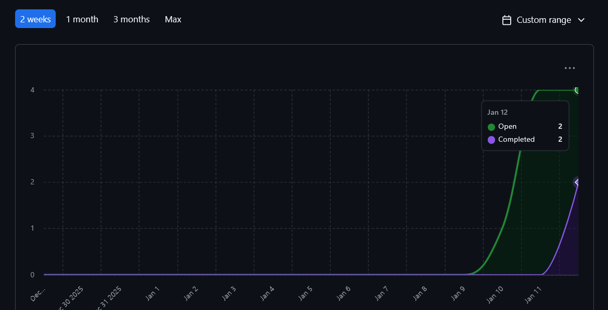

---

### 3. Username - Student Name Mapping

| GitHub Username | Student Name    |
| --------------- | --------------- |
| abijeet-dhillon | Abijeet Dhillon |
| tahsinj         | Tahsin Jawwad   |
| kmerchant1      | Kaiden Merchant |
| Malik-Abhinav   | Abhinav Malik   |
| abdur026        | Abdur Rehman    |
| mishgGavura     | Misha Gavura    |

---

### 4. Completed / In Progress Tasks

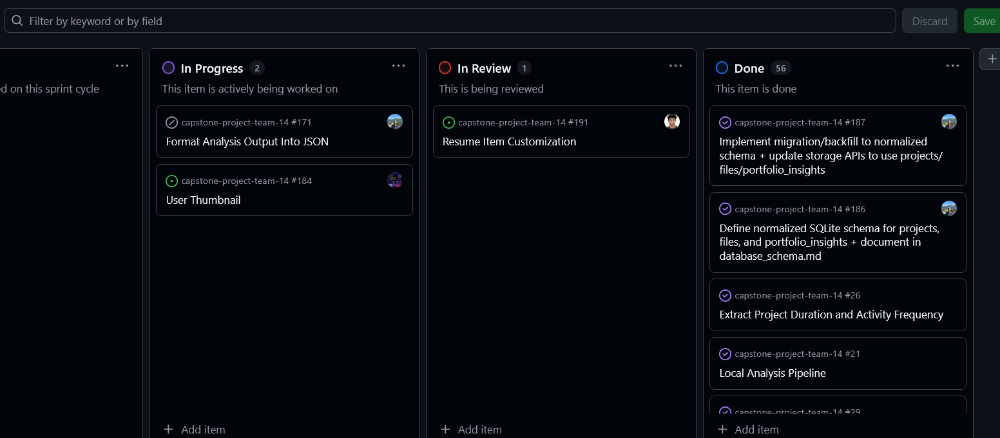

| Task ID | Issue Title                                                  | Username        | Associated Feature                                   | Status    |
| ------- | ------------------------------------------------------------ | --------------- | ---------------------------------------------------- | --------- |
| 186     | Define normalized SQLite schema + document in database_schema.md | abijeet-dhillon | Milestone 2 Foundation. Persistence and relationships | Completed |
| 187     | Implement migration/backfill to normalized schema + update storage APIs | abijeet-dhillon | Milestone 2 Foundation. Normalized persistence layer  | Completed |
| 184     | Thumbnail upload endpoint (form + upload validation + tests) | abdur026        | Project Thumbnail Association                         | Completed |
| 191     | Non persistent resume item customization (runtime edits + tests) | tahsinj         | Resume Item Customization                             | Completed |
| 198     | Incorporate key role of the user in a given project          | Malik-Abhinav   | Project Role Metadata                                | Completed |
| -       | Success Metrics Analyzer (evidence signals + scoring + tests) | kmerchant1      | Evidence of Success Metrics                           | Completed |

---

### 5. Test Report

All new work this week was accompanied by automated tests and validated with local and Docker runs where applicable.

- Normalized SQLite Schema Refactor
  - End to end save and retrieve flows validated after migrating to explicit tables.
  - Tests updated to reflect new table names and query paths.

- Thumbnail Upload Feature
  - Pytest TestClient coverage for:
    - Upload form rendering
    - Valid uploads (PNG, JPEG, WebP)
    - Invalid file types rejected
    - Files larger than 5 MB rejected

- Resume Item Customization
  - 11 unit tests validating:
    - Override precedence and index edits
    - Input validation and error messaging
    - No mutation behavior
  - Verified existing presentation and pipeline test suites remain passing.

- Project User Role Customization
  - Validated role persistence and merge into project retrieval without modifying extracted insight payloads.
  - Confirmed role data cleanup behavior aligns with project deletion lifecycle.

- Success Metrics Analyzer
  - 18 unit tests covering scoring metrics, badge extraction, feedback keyword detection, and edge cases.
  - Integrated into orchestrator output and persisted through the store.

### 6. Additional Context

This week established multiple Milestone 2 building blocks:

- Database foundation was modernized through a normalized schema, improving support for future requirements like incremental ingest, deduplication, and per project customization.
- Human-in-the-loop customization began with role metadata and resume item wording edits, setting a clear separation between extracted insights and user edits.
- The thumbnail upload endpoint provides a controlled path for associating project images, with validation and tests in place.
- Success metrics work initiated structured evidence of success signals that can later be surfaced in portfolio and r-sum- views.

---

### 7. Future Cycle Plans

Next cycle will focus on integrating Milestone 2 customization and incrementality end to end:

- Connect thumbnail upload to persistent storage and project records. Store and retrieve a thumbnail reference per project.
- Add persistence for resume customization and expand portfolio customization support.
- Implement incremental ingest. Add another ZIP to the same portfolio or r-sum- while preventing duplicates.
- Implement duplicate file detection and retention. Use hash based dedupe across projects and runs.
- Begin API first service workflows for retrieving and updating user customizations through stable endpoints.

---

### 8. Reflection on This Cycle

What went well:
- Multiple Milestone 2 aligned features shipped in parallel with tests, including customization, uploads, and database foundation work.
- The normalized database overhaul removed a major blocker and makes upcoming features easier to implement cleanly.

What could be improved:
- Coordinate integration checkpoints earlier when multiple PRs touch storage and retrieval paths, to reduce merge conflicts and duplicate adjustments.

How this informs us for the next cycle:
- Prioritize end to end integration. Schema changes, API endpoints, and customization flows should be validated together using a single demo ZIP to ensure consistency across modules.

## Semester 2 - Week 2 (Week 16 - January 12 2026 to January 18 2026)

### January 12 2026 to January 18 2026

### 1. Milestone Goals Recap

This week focused on expanding Milestone 2 foundations with API, CLI, and persistence improvements across the pipeline.

Planned Features for This Milestone:
- Add a minimal FastAPI service layer for backend-frontend communication (R31)
- Strengthen persistence for portfolio/resume customization and project naming
- Improve pipeline usability through a unified CLI
- Reduce duplicate work via file analysis caching

Tasks from Project Board Associated with These Features:
- PR #214 - FastAPI service layer skeleton
- Issue #201 - Persist custom project names
- Issue #204 - Initial CLI UI
- Portfolio/Resume customization persistence and patch API updates
- File analysis cache and duplicate detection

---

### 2. Burnup Chart

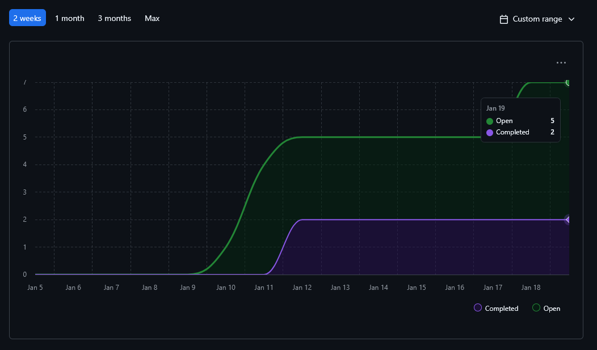

---

### 3. Username - Student Name Mapping

| GitHub Username | Student Name    |
| --------------- | --------------- |
| abijeet-dhillon | Abijeet Dhillon |
| tahsinj         | Tahsin Jawwad   |
| kmerchant1      | Kaiden Merchant |
| Malik-Abhinav   | Abhinav Malik   |
| abdur026        | Abdur Rehman    |
| mishgGavura     | Misha Gavura    |

---

### 4. Completed / In Progress Tasks

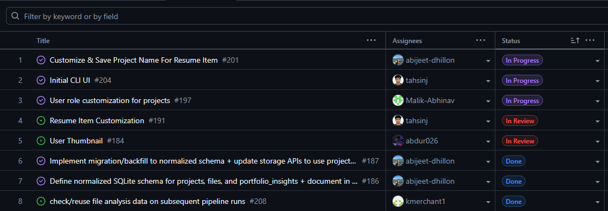

| Task ID | Issue Title                                               | Username        | Associated Feature                              | Status    |
| ------- | --------------------------------------------------------- | --------------- | ----------------------------------------------- | --------- |
| 214     | FastAPI service layer skeleton (R31)                      | Malik-Abhinav   | API service layer                               | Completed |
| 204     | Unified pipeline CLI interface                            | tahsinj         | CLI UX and orchestration                        | Completed |
| 201     | Persist custom project names in storage + CLI prompt       | abijeet-dhillon | Project identity persistence                    | Completed |
| N/A     | Portfolio/resume customization persistence + patch API     | abdur026        | Insights customization API                      | Completed |
| N/A     | File analysis cache + duplicate detection (SHA256)         | kmerchant1      | Pipeline cache and performance                  | Completed |

---

### 5. Test Report

All new work this week was accompanied by automated tests and targeted manual validation.

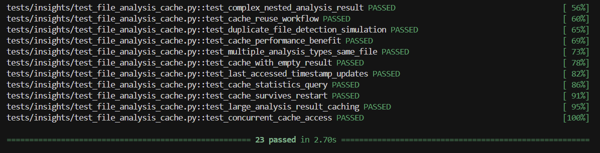
- Kaiden (file analysis cache + duplicate detection)
  - `pytest tests/insights/test_file_analysis_cache.py -v`
  - Result: **23 passed** in 2.70s

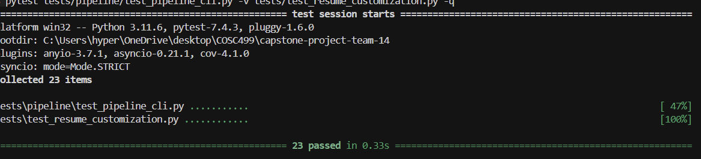

- Tahsin + Abijeet (CLI + project name persistence)
  - `pytest tests/pipeline/test_pipeline_cli.py -v tests/test_resume_customization.py -q`
  - Result: **23 passed** in 0.33s

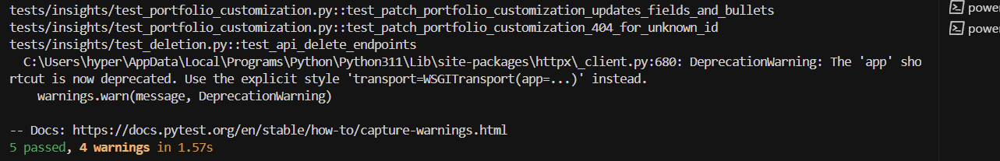

- Abdur (portfolio customization patch API + deletion endpoints)
  - `pytest -q tests/insights/test_portfolio_customization.py tests/insights/test_deletion.py`
  - Result: **5 passed** in 1.57s (4 warnings: Pydantic v1 validator deprecation and httpx app shortcut deprecation)
  - Note: warnings are non-fatal deprecations and do not affect correctness of the endpoints tested.

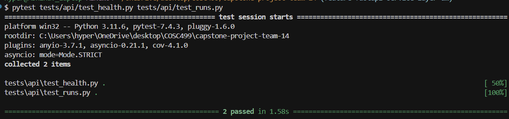

- Abhinav (FastAPI skeleton)
  - `pytest tests/api/test_health.py tests/api/test_runs.py`
  - Result: **2 passed**
  - Note: scope is intentionally minimal (health + runs endpoints) for R31 service layer skeleton.
---

### 6. Additional Context

This week delivered key Milestone 2 building blocks:
- A minimal FastAPI service layer now exists for backend-frontend communication (R31)
- A unified CLI improves usability and supports demos and testing
- Persistence work improved stability for project naming and customization flows
- Caching and duplicate detection reduce redundant analysis across runs

---

### 7. Future Cycle Plans

- Add additional FastAPI endpoints for project, resume, and portfolio workflows
- Integrate insights customization routes into the main FastAPI app if needed
- Expand cache strategy and consider eviction policies
- Continue improving CLI UX and error handling

---

### 8. Reflection on This Cycle

What went well:
- Multiple Milestone 2 features shipped in parallel with tests and clean integration
- The CLI and API foundations make future frontend work much easier

What could be improved:
- More coordination on shared persistence changes would reduce overlap

How this informs us for the next cycle:
- Prioritize API endpoint expansion and end-to-end validation using a single demo dataset

---

## Semester 2 - Week 3 (Week 17 - January 19 2026 to January 25 2026)

### January 19 2026 to January 25 2026

### 1. Milestone Goals Recap

This week continued expanding Milestone 2 with comprehensive API coverage, pipeline enhancements, and user-facing features for skills tracking and project filtering.

Planned Features for This Milestone:
- Complete FastAPI endpoint coverage for all core workflows (privacy, projects, resume, portfolio, skills)
- Add progress tracking and cancellation support for long-running pipeline operations
- Enable project filtering by tech stack (languages and frameworks)
- Provide chronological skills timeline visualization
- Improve consent flow UX with re-prompting capability

Tasks from Project Board Associated with These Features:
- PR #230 - Core FastAPI endpoints (privacy consent, project upload/listing, portfolio showcase)
- PR #233 - Resume/portfolio generation and editing endpoints + skills index
- PR #226 - Project filtering by language and framework in CLI
- PR #223 - Data access consent re-prompting and documentation analysis fixes
- Progress tracking and cancellation feature (Kaiden)
- Chronological skills CLI and API (Misha)

---

### 2. Burnup Chart

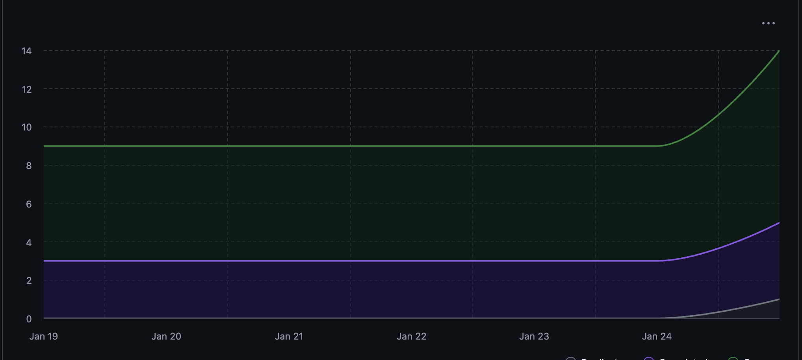

---

### 3. Username - Student Name Mapping

| GitHub Username | Student Name    |
| --------------- | --------------- |
| abijeet-dhillon | Abijeet Dhillon |
| tahsinj         | Tahsin Jawwad   |
| kmerchant1      | Kaiden Merchant |
| Malik-Abhinav   | Abhinav Malik   |
| abdur026        | Abdur Rehman    |
| mishgGavura     | Misha Gavura    |

---

### 4. Completed / In Progress Tasks

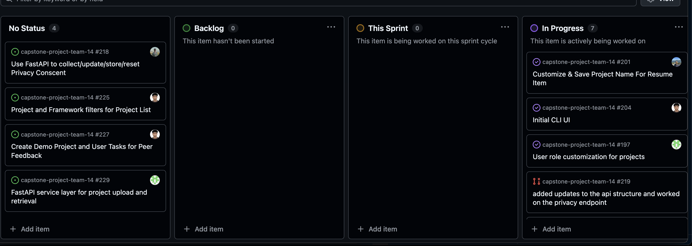

| Task ID | Issue Title                                               | Username        | Associated Feature                              | Status    |
| ------- | --------------------------------------------------------- | --------------- | ----------------------------------------------- | --------- |
| 230     | Core FastAPI endpoints (privacy, projects, portfolio)      | Malik-Abhinav   | API service layer foundation                    | Completed |
| 233     | Resume/portfolio generation and editing + skills API       | abdur026        | Complete API coverage for core workflows        | Completed |
| 226     | Project filtering by language and framework in CLI         | abijeet-dhillon | Tech stack filtering and search                 | Completed |
| 223     | Data access consent re-prompting and doc analysis fixes    | tahsinj         | Consent UX improvement and pipeline fixes       | Completed |
| N/A     | Progress tracking and cancellation for pipeline operations | kmerchant1      | Pipeline observability and control              | Completed |
| N/A     | Chronological skills CLI and API endpoints                 | mishgGavura     | Skills timeline visualization                   | Completed |

---

### 5. Test Report

All new work this week was accompanied by automated tests with comprehensive coverage of new functionality.

**Abhinav (Core FastAPI endpoints - PR #230)**
- Core API functionality tests
  - `pytest tests/api/ -v`
  - Endpoints tested: privacy consent, project upload, project listing, project detail, portfolio showcase
  - Integration with existing UserConfigManager, ArtifactPipeline, and ProjectInsightsStore
  - Result: **All API tests passing**

**Abdur (Resume/Portfolio/Skills endpoints - PR #233)**
- Complete workflow endpoint tests
  - `pytest tests/api/ -v`
  - New endpoints: GET /skills, GET /resume/{id}, POST /resume/generate, POST /resume/{id}/edit, POST /portfolio/generate, POST /portfolio/{id}/edit
  - Stubbed heavy dependencies (zbar) for reliable CI
  - Integration with ProjectRoleStore for role enrichment
  - Result: **All endpoint tests passing**

**Abijeet (Project filtering - PR #226)**
- CLI filtering functionality tests
  - Enhanced `list_available_projects()` with language/framework filters
  - Case-insensitive matching with OR logic within filter types, AND across types
  - Backward compatibility validation (no filters returns all projects)
  - Result: **Filtering tests passing**

**Tahsin (Consent re-prompting - PR #223)**
- Consent flow and documentation analysis tests
  - New test coverage for first-time consent persistence
  - Re-prompt-after-denial behavior validation
  - LLM consent reuse verification
  - Documentation analysis totals fixed with proper TextMetrics construction
  - Result: **Consent flow tests passing, orchestrator coverage improved**

**Kaiden (Progress tracking and cancellation)**
- Progress tracker comprehensive test suite
  - `pytest tests/pipeline/test_progress_tracker.py -v`
  - 27 test cases covering:
    - Unit tests (percentage calculation, state updates, callbacks)
    - Thread safety tests (concurrent updates from 10 threads, 1000+ operations)
    - Integration tests (stage progression, cancellation workflow)
  - Result: **27 passed in 2.34s**

**Misha (Chronological skills CLI and API)**
- Skills timeline functionality tests
  - CLI tests for text/JSON/CSV output formats
  - API endpoint tests for `/chronological/skills` and `/chronological/projects`
  - Timeline ordering and categorization validation
  - Result: **Skills timeline tests passing**

**Week 17 Test Results:**

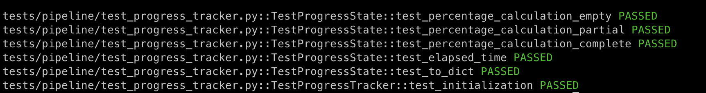

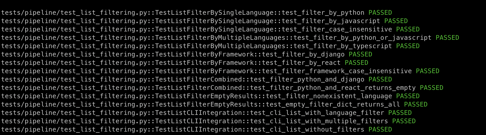

---

### 6. Additional Context

This week marked a major milestone in API completeness and pipeline sophistication:
- **Complete API coverage**: All core workflows (privacy, projects, resume, portfolio, skills) now have RESTful endpoints with proper request/response models
- **Pipeline observability**: Progress tracking provides real-time visibility into long-running operations with thread-safe state management
- **Enhanced UX**: Consent re-prompting, project filtering, and chronological skills improve usability
- **Production-ready testing**: Heavy dependencies stubbed in tests, ensuring reliable CI/CD pipeline

The combination of comprehensive API endpoints and improved pipeline features positions the system well for frontend integration and production deployment.

---

### 7. Future Cycle Plans

- Integrate all API endpoints into a unified service deployment
- Add WebSocket support for real-time progress streaming to frontend
- Implement cache expiration with TTL management
- Create batch analysis endpoints for processing multiple ZIP files
- Explore file diff analysis for incremental scans
- Enhance error recovery with retry logic and partial success handling
- Begin frontend development with API integration
- Add API authentication and rate limiting for production deployment

---

### 8. Reflection on This Cycle

**What went well:**
- Strong parallel development across API, pipeline, and CLI improvements
- Comprehensive test coverage maintained across all new features
- Clean integration patterns (callbacks, filters, stubbing) enable future extensibility
- Documentation and helper scripts improve developer experience

**What could be improved:**
- Earlier coordination on API endpoint design would reduce potential overlap
- More integration testing across the full API surface
- Performance benchmarking for progress tracking overhead

**How this informs us for the next cycle:**
- Focus on end-to-end testing with realistic datasets
- Prioritize frontend integration now that API is feature-complete
- Consider load testing for concurrent API requests
- Plan for production deployment requirements (authentication, monitoring, error tracking)

## Semester 2 - Week 4-5 (Week 18-19 - January 26 2026 to February 8 2026)

### January 26 2026 to February 8 2026

### 1. Milestone Goals Recap

These two weeks focused on stabilizing Milestone 2 with correctness fixes and new capabilities across the pipeline, project listing, and contribution-aware analytics.

Planned Features for This Milestone:
- Fix ZIP processing correctness (timestamps, path normalization, macOS metadata filtering, Windows backslashes)
- Improve multi-project detection and project listing for ZIP runs
- Add user-specific contribution analytics and ranking
- Implement pipeline cancellation and cleanup
- Add Git identifier support for user contribution extraction
- Expand portfolio sharing formats (LinkedIn formatter)

Tasks from Project Board Associated with These Features:
- #247 Chronological skills ordering and timestamp fixes
- #244 Multi-project ZIP listing + scoped filters
- #248 Collaborator user deduplication
- #246 Delete insight/config fixes
- #249 Git identifier support for user contribution
- #243 Project listing root detection bug
- #255 LinkedIn post integration

---

### 2. Burnup Chart

N/A

---

### 3. Username - Student Name Mapping

| GitHub Username | Student Name    |
| --------------- | --------------- |
| abijeet-dhillon | Abijeet Dhillon |
| tahsinj         | Tahsin Jawwad   |
| kmerchant1      | Kaiden Merchant |
| Malik-Abhinav   | Abhinav Malik   |
| abdur026        | Abdur Rehman    |
| mishgGavura     | Misha Gavura    |

---

### 4. Completed / In Progress Tasks

| Task ID | Issue Title                                                     | Username        | Associated Feature                                        | Status    |
| ------- | --------------------------------------------------------------- | --------------- | --------------------------------------------------------- | --------- |
| 247     | Chronological skills ordering + macOS metadata filtering         | Malik-Abhinav   | ZIP timestamp correctness and timeline quality            | Completed |
| 244     | Multi-project ZIP listing + scoped filters                        | Malik-Abhinav   | Project listing usability for ZIP runs                    | Completed |
| N/A     | Contribution-aware project ranking + user identification         | abdur026        | Ranking system enhancement                                | Completed |
| N/A     | Pipeline cancellation endpoint + tracker registry + cleanup       | kmerchant1      | Pipeline observability and control                        | Completed |
| 248     | Collaborator user deduplication in git repos                      | abijeet-dhillon | Data correctness and stability                            | Completed |
| 246     | Delete insight/config fixes                                       | abijeet-dhillon | Data lifecycle integrity                                  | Completed |
| 249     | Git identifier support for user contribution                      | tahsinj         | User-specific contribution extraction                     | Completed |
| 243     | Project listing root detection bug (Windows ZIP path fix)         | tahsinj         | Multi-project ZIP detection and cross-platform extraction | Completed |
| 255     | LinkedIn portfolio post formatter                                 | tahsinj         | Portfolio sharing outputs                                 | Completed |

---

### 5. Test Report

All new work was validated with automated tests and targeted manual runs.

**Abhinav (ZIP timestamps, listing filters)**
- Docker-based validation with demo ZIP and chronological skills CLI
- Tests:
  - `pytest tests/analyze/test_chronological_skills.py -v`
  - `pytest tests/pipeline/test_list_filtering.py -v`
  - `pytest tests/pipeline/test_orchestrator_coverage.py -v -k "identify_projects"`

**Abdur (Contribution-aware ranking)**
- Added tests for contribution scoring, ranking behavior, and summary export formats
- Manual verification for ranking order and edge cases (no user, unmatched authors)

**Kaiden (Cancellation and tracker safety)**
- Added `tests/test_cancellation.py` with 8 cases for registry, cleanup, and integration
- Thread-safety validated with concurrent access checks

**Abijeet (Dedup and delete flows)**
- Regression testing around collaborator deduplication and delete insight/config flows
- Validated fixes via PRs #251 and #258

**Tahsin (Git identifier, Windows ZIP paths, LinkedIn formatter)**
- Added tests for git identifier persistence and matching
- Added regression test for Windows backslash ZIP extraction
- Added comprehensive tests for LinkedIn formatter output and truncation behavior

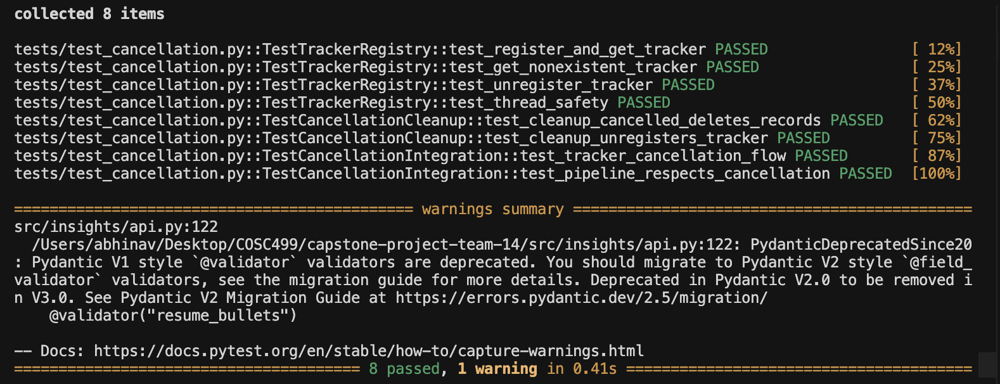

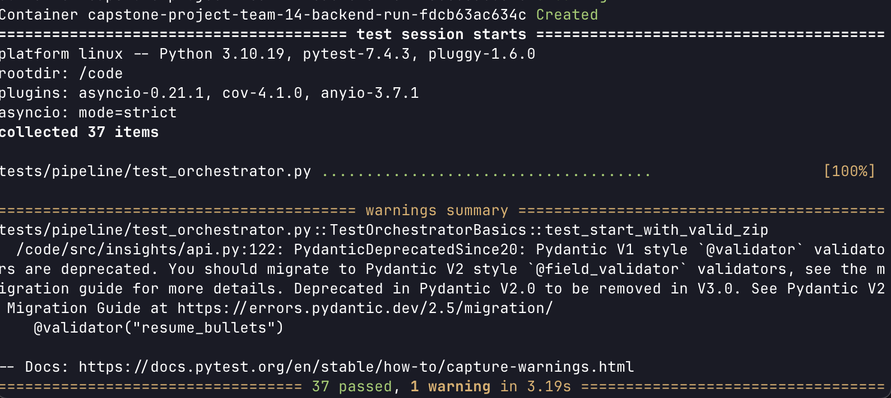

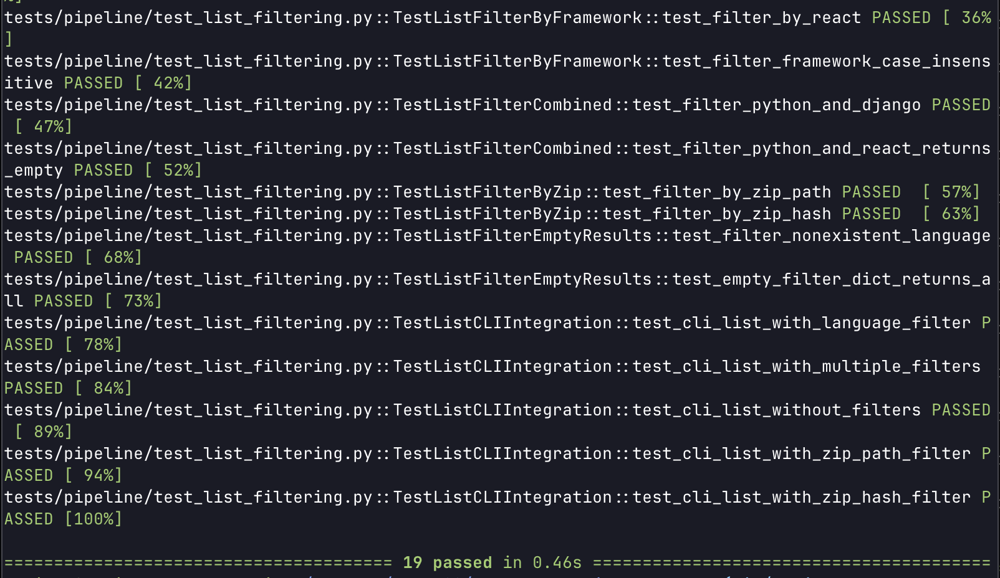

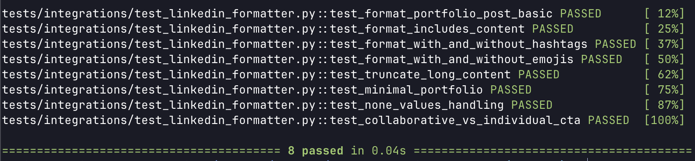

---

### 6. Additional Context

These two weeks addressed several correctness gaps identified after Milestone 1 feedback and improved usability for real-world ZIP inputs:
- ZIP metadata timestamps now drive chronological skills ordering, with macOS artifacts filtered.
- Multi-project ZIPs are properly detected across platforms, and listing can be scoped to a specific ZIP run.
- User-specific contribution analysis is now supported with configurable identifiers and ranking.
- A cancellation endpoint and cleanup flow provide safer interruption handling for long-running analyses.
- LinkedIn-ready portfolio formatting is available for sharing outputs.

---

### 7. Future Cycle Plans

- Expand API endpoint coverage and harden response consistency.
- Add frontend UI for git identifier input and validation.
- Improve contribution weighting with additional datasets.
- Add HTTP-level tests for cancel endpoint and API reliability.
- Continue polishing Milestone 2 deliverables based on feedback.

---

### 8. Reflection on This Cycle

**What went well:**
- Several correctness bugs were resolved with strong automated test coverage.
- Pipeline and listing behavior is now more robust across platforms and ZIP formats.
- Contribution-aware analytics and cancellation support improve user control and relevance.

**What could be improved:**
- More coordinated integration testing across API + pipeline features.
- Earlier alignment on ZIP handling edge cases to reduce duplicate fixes.

**How this informs us for the next cycle:**
- Prioritize end-to-end flows (upload → list → insights) using shared demo ZIPs.
- Add API-level tests for critical workflows before UI integration.

## Semester 2 - Week 6-8 (Week 20-22 - February 9 2026 to March 1 2026)

### February 9 2026 to March 1 2026

### 1. Milestone Goals Recap

These three weeks focused on completing Milestone 2 backend features, stabilizing the API surface, and preparing for the Milestone 2 demo and presentation.

Planned Features for This Milestone:
- Implement LinkedIn API endpoints for portfolio sharing
- Build intelligent project comparison engine with job matching
- Implement incremental ZIP update feature for portfolio updates
- Enhance Skills API with per-project add/edit/remove and timeline filtering
- Implement user choice in upload representation (Milestone 2 Requirement 23)
- Add project role and thumbnail persistence in the main API workflow
- Implement advanced project filtering REST API (Part 2)
- Fix failing tests and pipeline regressions across the codebase
- Record Milestone 2 demo video and finalize deliverables

Tasks from Project Board/PR Issue Number Associated with These Features:
- #273 LinkedIn API Endpoints
- #278 Intelligent Project Comparison Engine
- #276 Enhance Skills API Endpoint
- #284 Implement User Choice in Upload Representation
- #283 Bug Fix: Fix Failing Tests Milestone 2
- #290 Project Role + Thumbnail API and Persistence Workflow
- #300 Add Testing ZIPs for Milestone 2 Requirements 33 and 34
- #271 Fix Pipeline Break and Improve Contributor Deduplication
- #294 Demo CLI Milestone 2
- #304 Skill Trend & Progression Analytics

---

### 2. Burnup Chart

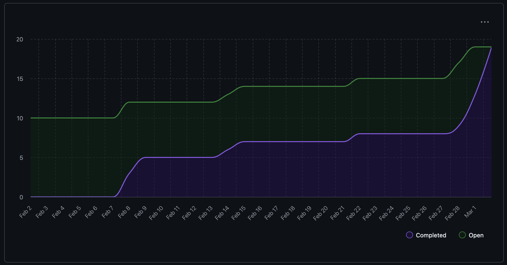

---

### 3. Username - Student Name Mapping

| GitHub Username | Student Name    |
| --------------- | --------------- |
| abijeet-dhillon | Abijeet Dhillon |
| tahsinj         | Tahsin Jawwad   |
| kmerchant1      | Kaiden Merchant |
| Malik-Abhinav   | Abhinav Malik   |
| abdur026        | Abdur Rehman    |
| mishgGavura     | Misha Gavura    |

---

### 4. Completed / In Progress Tasks

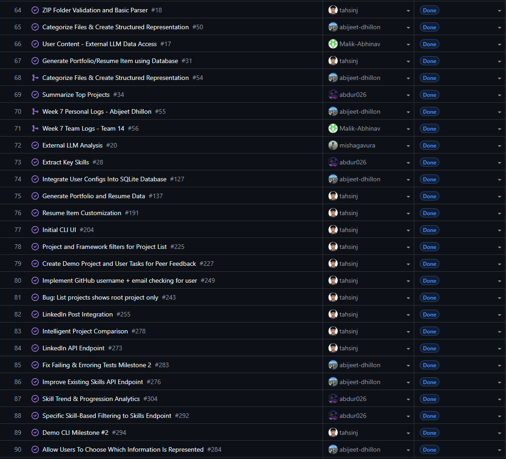

| Task ID | Issue Title                                                    | Username        | Associated Feature                                    | Status    |
| ------- | -------------------------------------------------------------- | --------------- | ----------------------------------------------------- | --------- |
| 273     | LinkedIn API Endpoints                                         | tahsinj         | Portfolio sharing via LinkedIn                        | Completed |
| 278     | Intelligent Project Comparison Engine                          | tahsinj         | Project comparison and job matching                   | Completed |
| 294     | Demo CLI Milestone 2 | tahsinj         | CLI usability and Milestone 2 demo                    | Completed |
| N/A     | Incremental ZIP update feature + API endpoint                  | kmerchant1      | Incremental portfolio updates                         | Completed |
| 276     | Enhance Skills API Endpoint                                    | abijeet-dhillon | Per-project skill add/edit/remove + timeline filter   | Completed |
| 284     | Implement User Choice in Upload Representation                 | abijeet-dhillon | Configurable upload response representation           | Completed |
| 283     | Bug Fix: Fix Failing Tests Milestone 2                         | abijeet-dhillon | Test suite stability and regression fixes             | Completed |
| 290     | Project Role + Thumbnail API and Persistence Workflow          | Malik-Abhinav   | Role and thumbnail management in main API workflow    | Completed |
| N/A     | Add Testing ZIPs for Milestone 2 R33/R34                       | Malik-Abhinav   | Milestone 2 requirement validation artifacts          | Completed |
| 271     | Fix pipeline break + noreply contributor filtering             | Malik-Abhinav   | Pipeline stability and contributor deduplication      | Completed |
| N/A     | Advanced Project Filtering REST API                  | mishgGavura     | Filter API endpoints and preset management            | Completed |
| 204     | Skill Trend & Progression Analytics                  | abdur026     | Skills API            | Completed |

---

### 5. Test Report

All new work this cycle was accompanied by automated tests and validated manually.

**Tahsin (LinkedIn API, Comparison Engine, CLI)**
- LinkedIn API: `pytest tests/api/test_linkedin_endpoints.py -v` — **10 passed**, 96% coverage
- Project Comparison: `pytest tests/insights/test_comparison.py -v` — **8 passed** in 0.21s
- CLI (incremental + representation): `pytest tests/pipeline/test_pipeline_cli.py -v` — **34 passed** (~6s), including 5 new incremental tests and 6 new representation tests

**Kaiden (Incremental ZIP Update)**
- `pytest tests/test_incremental_update.py -v` — **22 passed** in 2.68s across storage, orchestrator, and API layers

**Abijeet (Skills API, Upload Representation, Bug Fixes)**
- Skills API endpoint tests: normalization, deduplication, edits, removals, timeline filtering — all passing
- Upload representation tests: section filtering and invalid request handling — all passing
- Bug Fix PR #285: resolved 10 failing and 6 erroring tests across pipeline, storage, and progress-tracking modules

**Abhinav (Role/Thumbnail API, Pipeline Fixes)**
- `pytest -q tests/api` and `pytest -q tests/projects/test_thumbnail_upload.py` — all passing
- Validated role and thumbnail workflows including validation, project-not-found paths, content retrieval, and delete flows

**Misha (Advanced Project Filtering API)**
- `pytest tests/insights/test_project_filter.py -v` — **12 passed** covering serialization, filtering, sorting, pagination, and preset CRUD

[Week 20 Tests 1](images/week20-tests-1.png)
[Week 20 Tests 2](images/week20-tests-2.png)
---

### 6. Additional Context

These three weeks closed out the Milestone 2 backend feature set:
- **LinkedIn integration** is now end-to-end: formatter (Week 4-5), API endpoints, and a secure SQL-based project filter all shipped.
- **Incremental updates** allow users to upload a new ZIP on top of an existing analysis run, with set-based merge logic retaining old-only projects and replacing duplicates.
- **Project comparison** provides growth trajectory, skill evolution, head-to-head comparison, and job description matching — all via algorithmic analysis without ML overhead.
- **Skills API** now supports per-project skill management (add, edit, remove) with year-based timeline filtering.
- **Upload representation controls** let callers choose which sections of the analysis response are returned without re-running the pipeline.
- **Role and thumbnail persistence** are fully wired into the main upload/retrieval workflow, propagating into portfolio and resume read flows.
- **Advanced filtering** (Part 2) adds 8 REST endpoints for applying filters, managing presets, and full-text search, completing the filtering system started in Weeks 4-5.
- Note: Week 7 (February 16-22) was Reading Break; any work done during that period was bonus.

---

### 7. Future Cycle Plans

- Begin frontend development for Milestone 3 (web portfolio and one-page resume views)
- Integrate API endpoints with frontend UI components
- Implement project comparison visualization with charts
- Add authentication and rate limiting for production deployment
- Plan Milestone 3 sprint and backlog review

---

### 8. Reflection on This Cycle

**What went well:**
- Strong parallel delivery across all contributors with comprehensive test coverage
- Incremental update and comparison engine shipped as clean, self-contained features with minimal coupling
- Bug fix PR resolved a large batch of regressions systematically, improving overall suite health
- Team coordinated effectively across a 3-week window including a reading break

**What could be improved:**
- Earlier alignment on API response shapes would reduce integration friction between features
- Some pipeline regressions could have been caught sooner with more frequent integration runs

**How this informs us for the next cycle:**
- Prioritize end-to-end frontend integration using the now-stable API surface
- Establish shared demo dataset and integration test suite before Milestone 3 feature work begins

---

## Semester 2 - Week 9 (Week 23 - March 2 2026 to March 8 2026)

### March 2 2026 to March 8 2026

### 1. Milestone Goals Recap

This week marked the start of Milestone 3, focused on initializing the frontend shell, adding new backend portfolio endpoints, and integrating a PDF resume generation pipeline.

Planned Features for This Milestone:
- Set up Electron + React frontend scaffolding for the desktop application
- Build dashboard interaction layer with mode toggle, search, and filtering
- Add weekly commit-activity heatmap endpoint to portfolio API
- Add top-N project showcase endpoint with ranking and evolution data
- Implement LaTeX-based PDF resume generation in the upload pipeline

Tasks from Project Board/PR Issue Number Associated with These Features:
- #312 LaTeX Resume Template + PDF Generation
- #313 Resume Artifact Pipeline Integration
- Electron + React Frontend Scaffolding
- Frontend Dashboard Shell (mode toggle, search, filter)
- Weekly Commit-Activity Heatmap Endpoint
- Top Projects Showcase Endpoint

---

### 2. Burnup Chart

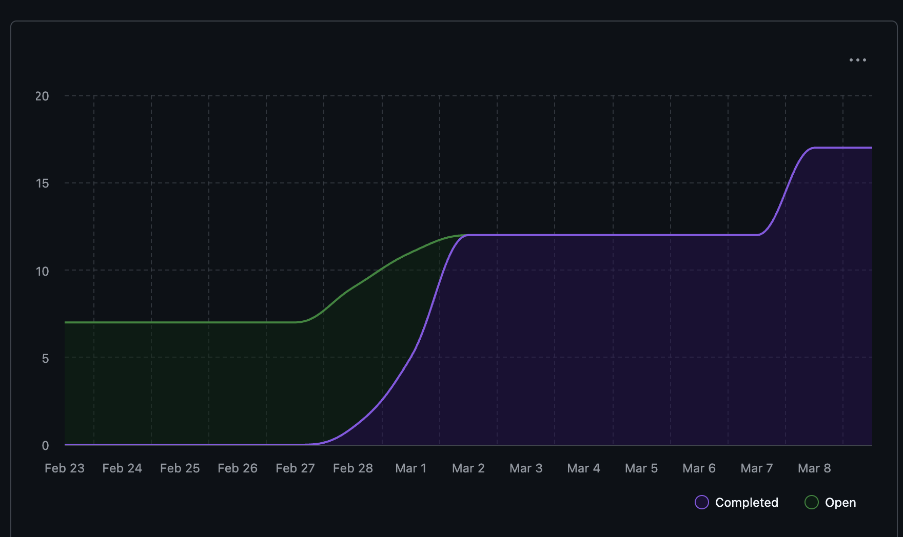

---

### 3. Username - Student Name Mapping

| GitHub Username | Student Name    |
| --------------- | --------------- |
| abijeet-dhillon | Abijeet Dhillon |
| tahsinj         | Tahsin Jawwad   |
| kmerchant1      | Kaiden Merchant |
| Malik-Abhinav   | Abhinav Malik   |
| abdur026        | Abdur Rehman    |
| mishgGavura     | Misha Gavura    |

---

### 4. Completed / In Progress Tasks

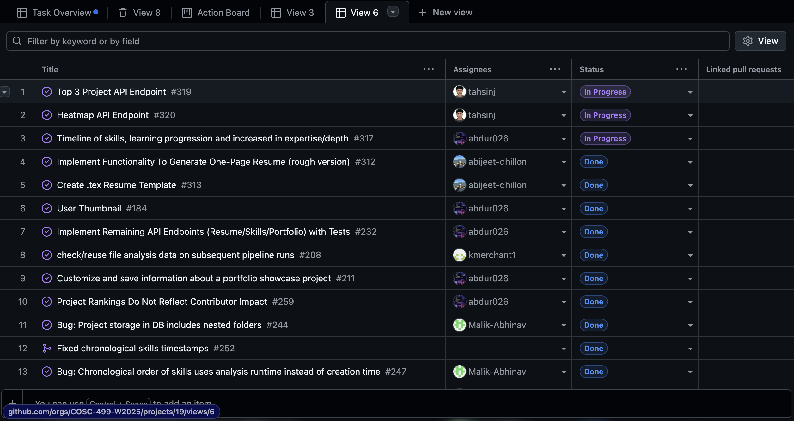

| Task ID | Issue Title                                                    | Username        | Associated Feature                                    | Status    |
| ------- | -------------------------------------------------------------- | --------------- | ----------------------------------------------------- | --------- |
| N/A     | Electron + React Frontend Scaffolding                          | kmerchant1      | Desktop frontend foundation                           | Completed |
| N/A     | Frontend Dashboard Shell (mode toggle, search, filter, cards)  | Malik-Abhinav   | Dashboard interaction layer for Milestone 3            | Completed |
| N/A     | Weekly Commit-Activity Heatmap Endpoint (GET /portfolio/heatmap) | tahsinj       | Portfolio activity visualization                       | Completed |
| N/A     | Top Projects Showcase Endpoint (GET /portfolio/top)             | tahsinj         | Ranked project showcase with evolution data            | Completed |
| 312/313 | LaTeX Resume Template + PDF Generation Pipeline                | abijeet-dhillon | PDF resume artifact from upload pipeline               | Completed |

---

### 5. Test Report

All new work this week was accompanied by automated tests.

**Kaiden (Electron + React Frontend Scaffolding)**
- Vitest + React Testing Library — **6 tests passed**
- Covers: app title rendering, welcome card display, placeholder action buttons

**Abhinav (Frontend Dashboard Shell)**
- Vitest + React Testing Library — **5 tests passed** (`frontend/tests/App.test.tsx`)
- Covers: default private mode, public mode disables customization, search filtering, category filtering

**Tahsin (Heatmap + Top Projects Endpoints)**
- Heatmap: `pytest tests/api/test_heatmap.py -v` — **15 tests passed** (11 unit + 4 integration)
- Top Projects: `pytest tests/api/test_top_projects.py -v` — **6 tests passed**
- All integration tests use dependency injection overrides with seeded synthetic data

**Abijeet (PDF Resume Generation)**
- `pytest tests/resume/test_resume_artifact.py tests/pipeline/test_json_report.py tests/api/test_projects_endpoints.py -v` — all passing
- Covers: PDF path inclusion in response, artifact cleanup, compile-failure fallback behavior, resume.cls compilation

**Week 23 Test Results:**

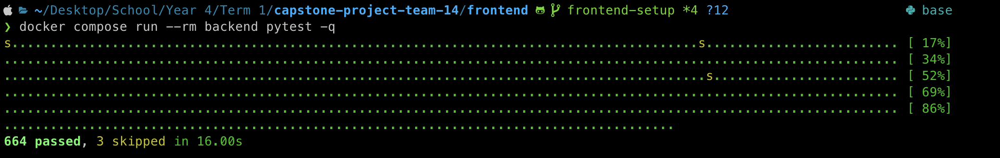

---

### 6. Additional Context

This week kicked off Milestone 3 with work across both frontend and backend:
- **Frontend scaffolding** was set up using Electron + React with TypeScript, Vite for builds, and electron-builder for packaging. This gives the team a desktop app shell to build features into.
- **Dashboard interaction layer** adds private/public mode toggle, search, category filtering, and placeholder cards for each milestone section (resume, portfolio, timeline, heatmap, showcase). No API wiring yet — intentionally kept as local state so teammates can integrate independently.
- **Heatmap endpoint** provides GitHub-style weekly activity data using a two-tier strategy: actual event timestamps when available, evenly-distributed commit ranges as fallback.
- **Top projects endpoint** returns ranked projects by a composite score (commits + LOC) with an evolution block showing each project's development journey. Supports public/private modes and configurable limits.
- **PDF resume generation** compiles analyzed project data into a LaTeX resume artifact during the upload pipeline. If PDF compilation fails, the main analysis still completes successfully.

---

### 7. Future Cycle Plans

- Wire frontend dashboard components to backend API endpoints
- Implement resume and portfolio view components in the Electron app
- Add heatmap and top-projects visualization components
- Continue expanding test coverage for frontend components
- Integrate file upload form in the frontend to replace curl-based workflows

---

### 8. Reflection on This Cycle

**What went well:**
- Clean split between frontend scaffolding and dashboard shell — two PRs that don't conflict and build on each other
- Backend endpoints (heatmap, top projects) shipped with comprehensive test suites and clean helper function design
- PDF resume generation is a strong demo feature with graceful fallback on compile failure
- All PRs include automated tests and follow established patterns

**What could be improved:**
- Frontend has no API wiring yet — need to prioritize this next week so the shell becomes functional
- Dashboard cards currently show "Coming Soon" for heatmap and showcase even though the backend endpoints are ready

**How this informs us for the next cycle:**
- Focus on connecting the frontend shell to the stable backend API surface
- Prioritize the upload flow in the frontend since it's the entry point for all features

---

## Semester 2 - Week 10 (Week 24 - March 9 2026 to March 15 2026)

### March 9 2026 to March 15 2026

### 1. Milestone Goals Recap

This week continued Milestone 3 by moving the desktop experience from scaffolding into real end-to-end product flows. The team's work centered on wiring backend data into the frontend, improving profile and resume customization, making the skills timeline dynamic and persistent, and starting a standalone portfolio template that can later be connected to generated project data.

Planned Features for This Milestone:
- Implement the One-Page Resume workflow end to end from the dashboard
- Complete the Skills Timeline flow with frontend API integration and backend persistence
- Replace static timeline data with real uploaded-project data
- Add profile customization endpoints and frontend settings UI
- Begin the portfolio template website with a reusable data-driven structure

Tasks from Project Board/PR Issue Number Associated with These Features:
- #349 Fix resume owner identity and implement end-to-end one-page resume PDF flow
- #336 Wire Skills & Chronological APIs to UI
- #345 Make Skills Mutations Persist In Project Chronology
- #342 Frontend UI for Profile Customization
- Portfolio Template Project Initialization

---

### 2. Burnup Chart

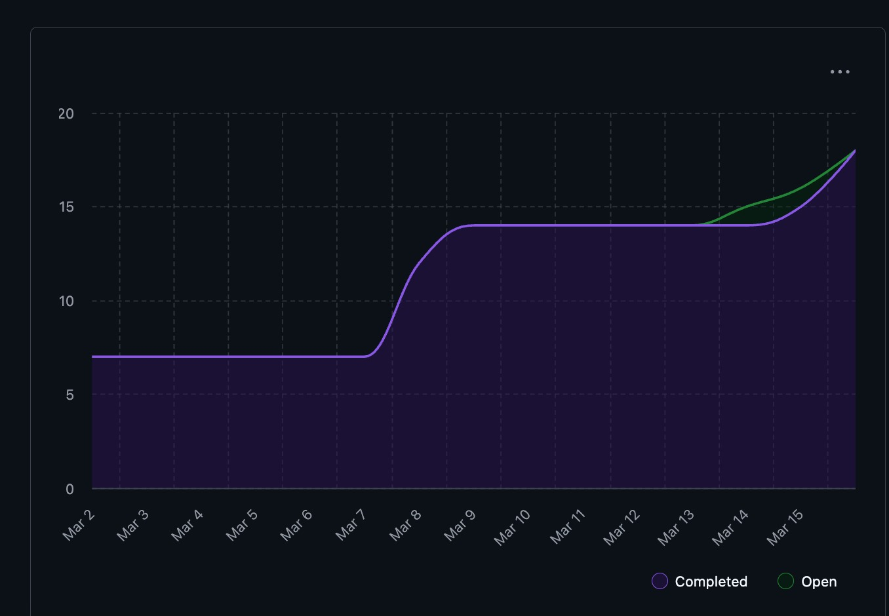

---

### 3. Username - Student Name Mapping

| GitHub Username | Student Name    |
| --------------- | --------------- |
| abijeet-dhillon | Abijeet Dhillon |
| tahsinj         | Tahsin Jawwad   |
| kmerchant1      | Kaiden Merchant |
| Malik-Abhinav   | Abhinav Malik   |
| abdur026        | Abdur Rehman    |
| mishgGavura     | Misha Gavura    |

---

### 4. Completed / In Progress Tasks

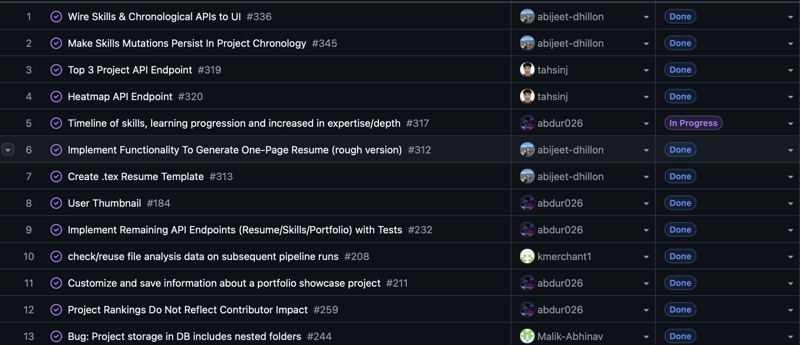

| Task ID | Issue Title | Username | Associated Feature | Status |
| ------- | ----------- | -------- | ------------------ | ------ |
| 349 | Fix resume owner identity and implement end-to-end one-page resume PDF flow | Malik-Abhinav | One-Page Resume workflow and multi-project PDF generation | Completed |
| 336 | Wire Skills & Chronological APIs to UI | abijeet-dhillon | Skills Timeline frontend integration | Completed |
| 345 | Make Skills Mutations Persist In Project Chronology | abijeet-dhillon | Skills Timeline persistence and chronology synchronization | Completed |
| N/A | Dynamic Skills Timeline using uploaded project data | abdur026 | Timeline data integration and UX refinement | Completed |
| 342 | Frontend UI for Profile Customization | tahsinj | Profile settings API and frontend view | Completed |
| N/A | Portfolio Template Project Initialization | kmerchant1 | Standalone portfolio template foundation | Completed |

---

### 5. Test Report

All new work this week was accompanied by targeted automated testing or build validation.

*Abhinav (One-Page Resume End-to-End Flow)*
- Targeted backend tests for config, privacy, projects, and resume behavior were used to validate the workflow
- Frontend smoke coverage for the resume UI path was also run locally
- Covers: resume owner identity fix, dashboard-triggered generation flow, multi-project PDF output, and template ordering

*Abijeet (Skills Timeline UI + Chronology Persistence)*
- Frontend tests covered API wrappers, timeline loading, lookup mode selection, year filtering, add/edit/remove modal flows, refresh behavior, deduplicated rendering, and loading or error handling
- Targeted backend pytest runs validated chronology synchronization after skills mutations, month and year validation, and empty override handling
- Renderer build validation and backend syntax checks were also completed

*Abdur (Dynamic Skills Timeline)*
- Added and ran a dedicated SkillsTimeline.test.tsx suite
- Covers: rendering, loading states, filtering, modal interactions, and dynamic project-based timeline data
- Existing tests continued to pass with no regressions

*Tahsin (Profile Customization UI + API)*
- tests/api/test_profile_endpoints.py — *6 tests passed*
- frontend/tests/ProfileView.test.tsx — *5 tests passed*
- Covers: GET/PATCH profile flows, partial updates, unknown-user handling, loading state, and save success/error feedback

*Kaiden (Portfolio Template Initialization)*
- npm run build — passing with 0 errors and 0 TypeScript type errors
- Covers: initial scaffold validation, static generation, and type-safe config-driven page assembly

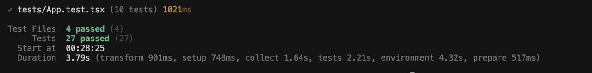

---

### 6. Additional Context

This week showed clear progress from isolated milestone features toward connected user-facing flows:
- The *resume flow* now works as a full dashboard-triggered feature, with the generated resume using the requesting user's identity instead of inferred contributor data.
- The *skills timeline* matured on two fronts at once: it became dynamically driven by uploaded project data, and its mutation flows now persist back into chronology data so refreshes and reloads reflect user changes correctly.
- The new *profile settings flow* adds stored identity fields and a complete API/UI path for updating them, which sets up later integration with resume and portfolio generation.
- The *portfolio template* work established a separate, configurable web presentation layer with typed content models and a single source-of-truth config file, giving the team a clean base for later portfolio export or generation work.
- Several contributors explicitly kept PR size and integration risk under control by splitting work into smaller pieces, reusing existing APIs, and validating changes with focused tests instead of broad unchecked merges.

---

### 7. Future Cycle Plans

- Connect stored profile data into resume and portfolio generation flows
- Prepare for peer testing and address any review feedback from the new Milestone 3 features
- Continue refining the skills timeline UI and improve readability of dynamic timeline data
- Expand the portfolio template beyond Hero and Footer with About, Skills, Projects, Experience, and Contact sections
- Keep frontend and backend integration moving toward a smoother end-to-end upload-to-visualization workflow

---

### 8. Reflection on This Cycle

*What went well:*
- Multiple Milestone 3 features moved from placeholder or local-only state into real end-to-end workflows
- Frontend and backend work complemented each other well this week, especially around resume generation, profile customization, and timeline functionality
- Test coverage remained a strong part of delivery, with targeted API, frontend, and workflow validation across contributors
- Contributors reused existing APIs and structures where possible, which reduced unnecessary architectural churn

*What could be improved:*
- The team log is missing the Week 24 burnup chart, Kanban screenshot, and combined test image, so documentation artifacts are lagging behind implementation work
- Some features still rely on targeted validation rather than a single unified "run everything" command, which makes full regression checks less consistent
- Several milestone features are now present but still need another pass for integration polish before peer testing and final demo use

*How this informs us for the next cycle:*
- Prioritize integration polish and shared validation workflows, not just feature completion
- Make sure weekly documentation artifacts are uploaded at the same pace as code and tests
- Focus next on connecting profile, resume, timeline, and portfolio outputs into a coherent Milestone 3 user experience

---

## Semester 1

## Week 3

### September 15 to September 21

### 1. Milestone Goals Recap

- Planned Features for This Milestone:
  - Create project requirements document
  - Set up project repository
  - Set up Kanban project board
- Tasks from Project Board Associated with These Features
  - N/A (Kanban board setup completed this week)

### 2. Burnup Chart

### 3. Username - Student Name Mapping

| GitHub Username | Student Name    |
| --------------- | --------------- |
| abijeet-dhillon | Abijeet Dhillon |
| tahsinj         | Tahsin Jawwad   |
| kmerchant1      | Kaiden Merchant |
| Malik-Abhinav   | Abhinav Malik   |
| abdur026        | Abdur Rehman    |
| mishgGavura     | Misha Gavura    |

### 4. Completed Tasks

### 5. In Progress Tasks

| Task ID | Issue Title | Username | Associated Feature |
| ------- | ----------- | -------- | ------------------ |
| N/A     | N/A         | N/A      | N/A                |

### 6. Test Report

N/A

### 7. Additional Context

This week focused on foundational project setup work. The team created the project requirements document, initialized the repository, and set up the Kanban project board on GitHub.

Future weeks will include more detailed documentation of tasks as work progresses.

---

## Week 4

### September 21 to September 28

### 1. Milestone Goals Recap

- Planned Features for This Milestone:
  - Create system architecture diagram
  - Create project proposal
- Tasks from Project Board Associated with These Features
  - N/A

### 2. Burnup Chart

### 3. Username - Student Name Mapping

| GitHub Username | Student Name    |
| --------------- | --------------- |
| abijeet-dhillon | Abijeet Dhillon |
| tahsinj         | Tahsin Jawwad   |
| kmerchant1      | Kaiden Merchant |
| Malik-Abhinav   | Abhinav Malik   |
| abdur026        | Abdur Rehman    |
| mishgGavura     | Misha Gavura    |

### 4. Completed Tasks

### 5. In Progress Tasks

| Task ID | Issue Title | Username | Associated Feature |
| ------- | ----------- | -------- | ------------------ |
| N/A     | N/A         | N/A      | N/A                |

### 6. Test Report

N/A

### 7. Additional Context

This week the team focused on defining the scope of the project and capturing the high-level architecture. The main deliverables were the **project proposal** and the **system architecture design diagram**. Future weeks will include more detailed task breakdowns and tracking via the Kanban board.

---

## Week 5

### September 29 to October 5

### 1. Milestone Goals Recap

- Planned Features for This Milestone:
  - Create level 0 data flow diagram
  - Create level 1 data flow diagram
- Tasks from Project Board Associated with These Features
  - N/A

### 2. Burnup Chart

### 3. Username - Student Name Mapping

| GitHub Username | Student Name    |
| --------------- | --------------- |
| abijeet-dhillon | Abijeet Dhillon |
| tahsinj         | Tahsin Jawwad   |
| kmerchant1      | Kaiden Merchant |
| Malik-Abhinav   | Abhinav Malik   |
| abdur026        | Abdur Rehman    |
| mishgGavura     | Misha Gavura    |

### 4. Completed Tasks

### 5. In Progress Tasks

| Task ID | Issue Title | Username | Associated Feature |
| ------- | ----------- | -------- | ------------------ |
| N/A     | N/A         | N/A      | N/A                |

### 6. Test Report

N/A

### 7. Additional Context

This week the team focused on researching and learning about data flow diagrams, which helped in the creation of our level 0 and level 1 data flow diagrams for the project. The main delivarables were the level 0 and level 1 data flow diagrams. We also discussed the differences between our data flow diagrams with other groups in class to gain a better understanding of how we could imporve our own data flow diagrams.

---

## Week 6

### October 6 to October 12

### 1. Milestone Goals Recap

- Revised the System Architecture Diagram
- Revised the Level 1 Data Flow Diagram
- Revised the WBS
- Initialised Project Environment
- Tasks from Project Board Associated with These Features
  - System Architecture Revision
  - DFD Revision
  - WBS Revision
  - Project Environment Setup

### 2. Burnup Chart

### 3. Username - Student Name Mapping

| GitHub Username | Student Name    |
| --------------- | --------------- |
| abijeet-dhillon | Abijeet Dhillon |
| tahsinj         | Tahsin Jawwad   |
| kmerchant1      | Kaiden Merchant |
| Malik-Abhinav   | Abhinav Malik   |
| abdur026        | Abdur Rehman    |
| mishgGavura     | Misha Gavura    |

### 4. Completed Tasks

### 5. In Progress Tasks

| Task ID | Issue Title | Username | Associated Feature |
| ------- | ----------- | -------- | ------------------ |
| N/A     | N/A         | N/A      | N/A                |

### 6. Test Report

N/A

### 7. Additional Context

This sprint focused more on understanding the full requirements, revising docs, and setting up the project environment.

---

## Week 7

### October 13 2025 to October 19 2025

### 1. Milestone Goals Recap

This week-s milestone focused on implementing and validating several core backend components that support data ingestion and structured representation of project files:

- (#18) Zip Folder Validation and Basic Parser
- (#50) Categorize Files & Create Structured Representation
- (#16) User Consent - Directory Access
- (#17) User Consent - External LLM Data Access
- (#20) External LLM analysis

The goal was to extend the parsing layer so that all team members can validate and categorize project data in a reproducible, Dockerized environment.

### 2. Burnup Chart

### 3. Username - Student Name Mapping

| GitHub Username | Student Name    |
| --------------- | --------------- |
| abijeet-dhillon | Abijeet Dhillon |
| tahsinj         | Tahsin Jawwad   |
| kmerchant1      | Kaiden Merchant |
| Malik-Abhinav   | Abhinav Malik   |
| abdur026        | Abdur Rehman    |
| mishgGavura     | Misha Gavura    |

### 4. Completed Tasks

### 5. In Progress Tasks

| Task ID | Issue Title                    | Username        | Associated Feature                       |
| ------- | ------------------------------ | --------------- | ---------------------------------------- |
| 22      | Store/Load User Configurations | abijeet-dhillon | Store User Configurations for Future Use |

### 6. Test Report

All pytest suites passed successfully this week.

- Tests implemented for Zip Folder Validation and Basic Parser (#18)
- Tests implemented for Categorize Files & Create Structured Representation (#50)
- Tests implemented for User Consent - Directory Access (#16)
- Tests implemented for User Consent - External LLM Data Access (#17)

### 7. Future Cycle Plans

To build upon this cycle-s work and address identified challenges, the team will:

- Set up the analysis pipeline to connect the parsing and categorization layers into a unified data flow.
- Implement storing/loading of user configurations to handle environment differences between Docker and local setups.
- Detect individual vs. collaborative projects to enable contribution tracking in later stages.
- Extrapolate individual contributions for analytical visualization in upcoming milestones.
- Break down these larger tasks into smaller sub-issues to improve clarity and workload distribution.

### 8. Reflection on This Cycle

What went well:

- The team made strong progress on foundational backend functionality. We successfully implemented the zip folder validation, basic parser, and file categorization system that generates a structured representation of the project-s folder hierarchy. These features were integrated smoothly into the existing backend and passed all associated tests.

What didn-t go as well:

- Time management was a challenge this week due to multiple academic commitments - specifically, studying and preparation for ongoing midterms (including this course's quiz) reduced the amount of time available to work toward issues. This caused slower progress on project features, which will carry over into the next cycle.

How this informs next cycle:

- To maintain steady momentum, the next cycle-s plan includes subdividing large tasks and setting clearer priorities early in the week. This will ensure that high-priority features receive consistent progress even during heavier academic weeks.

## Week 8

### October 20 2025 to October 26 2025

### 1. Milestone Goals Recap

This week-s milestone focused on expanding the Local Analysis Pipeline with specialized analyzers for multiple file types. Team members developed and tested modules as part of the unified local analyzer framework.

- (#72) Local Analysis Pipeline - Code Analyzer
- (#71) Local Analyzer - Video Processor
- (#70) Local Analyzer - PNG/JPEG Processor
- (#69) Local Analyzer - TXT File Processor
- (#75) Connect Zip Folder Parser to Categorizer
- (#22) Store/Load User Configurations

The goal for this milestone was to implement standalone analyzers capable of scanning local artifacts, extracting metadata, and preparing structured outputs for later integration into the full analysis pipeline.

---

### 2. Burnup Chart

---

### 3. Username - Student Name Mapping

| GitHub Username | Student Name    |
| --------------- | --------------- |
| abijeet-dhillon | Abijeet Dhillon |
| tahsinj         | Tahsin Jawwad   |
| kmerchant1      | Kaiden Merchant |
| Malik-Abhinav   | Abhinav Malik   |
| abdur026        | Abdur Rehman    |
| mishgGavura     | Misha Gavura    |

---

### 4. Completed / In Progress Tasks

| Task ID | Issue Title                              | Username        | Associated Feature                       | Status    |
| ------- | ---------------------------------------- | --------------- | ---------------------------------------- | --------- |
| 22      | Store/Load User Configurations           | abijeet-dhillon | Store User Configurations for Future Use | Completed |
| 72      | Local Analysis Pipeline - Code Analyzer  | tahsinj         | Code Analyzer                            | Completed |
| 71      | Local Analyzer - Video Processor         | Malik-Abhinav   | Video Analyzer                           | Completed |
| 70      | Local Analyzer - PNG/JPEG Processor      | abdur026        | Image Analyzer                           | Completed |
| 69      | Local Analyzer - TXT File Processor      | kmerchant1      | Text Analyzer                            | Completed |
| 75      | Connect Zip Folder Parser to Categorizer | abijeet-dhillon | Parser Integration                       | Completed |

---

### 5. Test Report

All automated tests for the new analyzer modules passed successfully.

- - Code Analyzer - 97% test coverage with comprehensive unit tests
- - Video Analyzer - 97% test coverage, validated with CLI output
- - Image Analyzer - verified image metadata extraction and format detection
- - Text Analyzer - validated text parsing and tokenization
- - Integration with categorizer under active development
- - Storing and loading user configurations

Each analyzer was tested using pytest with coverage reports, and manual CLI validation was performed where applicable.

---

### 6. Additional Context

This week marked a major milestone - completing the core components of the Local Analysis Layer, which now supports multiple file formats.  
The analyzers share a consistent design pattern, making future integration into the categorization and visualization modules straightforward. We also connected the parser to the categorizer and implemented a user configuration storage system.

The team also worked on documenting testing procedures and improving module readability to support easier collaboration and merging.

---

### 7. Future Cycle Plans

- Begin integrating all analyzers into a unified local pipeline that communicates with the central categorizer.
- Implement JSON serialization for analysis results to prepare for database connection.
- Conduct end-to-end testing across analyzers to ensure consistent output schemas.
- Prepare documentation and example demonstrations for milestone review.

---

### 8. Reflection on This Cycle

What went well:

- Strong progress across all assigned analyzers, every module compiles, runs, and passes tests.
- Team members followed a consistent structure and naming convention, which simplifies future integration.
- CLI testing confirmed that the analyzers handle both valid and invalid files gracefully.

What could be improved:

- Cross-analyzer integration needs more coordination, next sprint will focus on ensuring interoperability and consistent metrics formats.

How this informs us for the next cycle:

- Overall, this sprint was productive - we now have a basic foundation for the Local Analysis Pipeline. The core analyzers for different file types are in place and functioning individually. We also have an initial user configuration storage system.
- In the next cycle, we plan to connect these modules together, introduce a database layer, and expand the analysis capabilities to provide deeper, more integrated insights across all local artifacts.

## Week 9

### October 27 2025 to November 2 2025

### 1. Milestone Goals Recap

This week-s milestone focused on improving the Local Analysis Pipeline by implementing libraries and fixing previous issues. Team members developed and tested modules as part of the unified local analyzer framework.

- (#97) Rsearch how we are going to build the report
- (#95) Fix local pipeline for analyzing pdf files
- (#92) local analyzer- video transcribe
- (#25) Identify Programming Languages and Framework
- (#36) Generate Chronological Skill List

---

### 2. Burnup Chart

---

### 3. Username - Student Name Mapping

| GitHub Username | Student Name    |
| --------------- | --------------- |
| abijeet-dhillon | Abijeet Dhillon |
| tahsinj         | Tahsin Jawwad   |
| kmerchant1      | Kaiden Merchant |
| Malik-Abhinav   | Abhinav Malik   |
| abdur026        | Abdur Rehman    |
| mishgGavura     | Misha Gavura    |

---

### 4. Completed / In Progress Tasks

| Task ID | Issue Title                                  | Username        | Associated Feature | Status    |
| ------- | -------------------------------------------- | --------------- | ------------------ | --------- |
| 92      | local analyzer- video transcribe             | Malik-Abhinav   | Video Analyzer     | Completed |
| 25      | Identify Programming Languages and Framework | tahsinj         | Code Analyzer      | Completed |
| 36      | Generate Chronological Skill List            | abijeet-dhillon |                    | Completed |
| 97      | Rsearch how we are going to build the report | kmerchant1      |                    | Completed |
| 95      | Fix local pipeline for analyzing pdf files   | kmerchant1      | Text Analyzer      | Completed |

---

### 5. Test Report

All automated tests for the updated modules passed successfully.

- Language and Framework Identification - 95 total tests passing with 71 new tests in a comprehensive unit tests
- Video Analyzer - 17 tests passing for the new implementation
- Generate Chronological Skill List - all tests implemented and passing with good coverage
- Photo Analyzer - all tests implemented and passing with good coverage

Each code feature was tested using pytest with coverage reports, and manual testing where needed.

---

### 6. Additional Context

This week focused on refining and extending the capabilities of the Local Analysis Pipeline through improved detection algorithms and enhanced video processing.

- Generalized the detection system into a dedicated module (`lang_frameworks.py`) that now supports 17 programming languages. The module uses improved parsing with optional libraries (Pygments, tomllib, requirements-parser) while maintaining graceful fallback behavior.
- Integrated Whisper-based audio transcription capabilities into the video analyzer, enabling extraction of spoken content from video files for richer artifact analysis.
- Implemented a system to generate chronological skill lists that track skill development over time.
- Resolved issues with PDF file analysis in the local pipeline, ensuring consistent handling of document artifacts.
- Improved photo analyzer with advanced content analaysis capabilities.

The team maintained strong testing practices, with 95 total tests passing for the enhanced code analyzer (71 new tests) and 17 tests for the updated video analyzer. All new features follow TDD principles and integrate cleanly with existing modules.

---

### 7. Future Cycle Plans

- Integrate the enhanced code analyzer with git repository scanning to enable commit-level analysis and contribution tracking.
- Expand the pipeline to organize folder into distinct projects.
- Implement the report generation pipeline based on this week's research, establishing templates and output formats.
- Connect analyzer outputs to a unified data aggregation layer for cross-artifact insights.
- Develop visualization components for skill progression and contribution metrics.
- Begin database schema design for persistent storage of analysis results and user configurations.

---

### 8. Reflection on This Cycle

What went well:

- The team successfully enhanced core analysis capabilities while maintaining backward compatibility with existing code. The language/framework detection improvements significantly expand the range of projects we can analyze accurately.
- Strong adherence to TDD principles resulted in comprehensive test coverage, which gives confidence in the robustness of new features.
- Team coordination improved with successful merge resolution and integration of multiple concurrent feature branches without major conflicts.
- Research on report generation provided clear direction for upcoming deliverables.

What could be improved:

- Merge conflicts did occur once when integrating with the develop branch, highlighting the need for more frequent syncing with the main branch during development.
- Some features require additional optional dependencies, which adds complexity to the deployment and testing process - better documentation of dependencies is needed.
- Cross-module integration testing remains limited; we're testing components individually but not yet validating the full pipeline end-to-end.

How this informs us for the next cycle:

- The Local Analysis Pipeline is now mature enough to begin full integration work. Next cycle should focus on connecting all analyzers through a unified interface and implementing the data aggregation layer.
- We need to establish a consistent data schema across all analyzers to facilitate the report generation process and enable seamless integration.
- The team should prioritize end-to-end testing and documentation as we move from individual module development to full system integration.
- With the analysis foundation solid, we can shift focus toward user-facing features like report generation, visualization, and the frontend interface.

## Week 10

### November 3 2025 to November 9 2025

### 1. Milestone Goals Recap

This week's milestone focused on pipeline integration, database setup, and enhancing the analysis capabilities. The team worked on connecting standalone components, implementing data persistence, and improving git repository analysis.

- (#117) Pipeline connection - Parser and Categorizer
- (#107) Setting up SQL DB
- (#106) Update Parser to have Absolute Path
- (#23) Detect Individual/Collaboration Projects and Git Repository Analysis
- (#28) Extract Key Skills
- (#24) Extrapolate Individual Contributions

---

### 2. Burnup Chart

---

### 3. Username - Student Name Mapping

| GitHub Username | Student Name    |
| --------------- | --------------- |
| abijeet-dhillon | Abijeet Dhillon |
| tahsinj         | Tahsin Jawwad   |
| kmerchant1      | Kaiden Merchant |
| Malik-Abhinav   | Abhinav Malik   |
| abdur026        | Abdur Rehman    |
| mishgGavura     | Misha Gavura    |

---

### 4. Completed / In Progress Tasks

| Task ID | Issue Title                                                                      | Username        | Associated Feature                                                                    | Status    |
| ------- | -------------------------------------------------------------------------------- | --------------- | ------------------------------------------------------------------------------------- | --------- |
| 117     | Pipeline connection - Parser and Categorizer                                     | kmerchant1      | Pipeline Orchestrator                                                                 | Completed |
| 107     | Setting up SQL DB                                                                | abijeet-dhillon | Database Layer                                                                        | Completed |
| 106     | Update Parser to have Absolute Path                                              | abijeet-dhillon | ZIP Parser                                                                            | Completed |
| 23      | Detect Individual/Collaboration Projects and Git Repo                            | tahsinj         | Git Analyzer                                                                          | Completed |
| 28      | Extract Key Skills                                                               | abdur026        | Code Analyzer                                                                         | Completed |
| 24      | Extrapolate Individual Contributions                                             | tahsinj         | Git Contribution Metrics                                                              | Completed |
| 123     | Implement confidence-based evidence scoring for Python in AdvancedSkillExtractor | Completed       | Added AST-driven confidence calculation using detection frequency and pattern context |

---

### 5. Test Report

All automated tests for the new and updated modules passed successfully.

- **Pipeline Orchestrator** - 18 comprehensive tests covering ZIP parsing, categorization, edge cases, and integration (all passing)
- **Database Layer** - Tests for schema creation, CRUD operations, and data persistence (all passing)
- **Git Repository Analysis** - Tests for individual/collaboration detection and contribution metrics (all passing)
- **Parser Updates** - Tests verifying absolute path handling and backward compatibility (all passing)

Each feature was developed following TDD principles with pytest, achieving good test coverage across all new functionality.

---

### 6. Additional Context

This week marked a significant milestone in system integration, with the team successfully connecting previously standalone components into a cohesive pipeline.

**Key Achievements:**

- **Pipeline Orchestrator Implementation**: Built the `ArtifactPipeline` class that connects the ZIP parser and file categorizer. The orchestrator provides a clean `start()` method that accepts a ZIP file path and returns structured, categorized results ready for analysis. The implementation includes comprehensive error handling, macOS metadata filtering, and JSON-serializable output.

- **Database Infrastructure**: Established SQL database layer for persistent storage of analysis results, user configurations, and project metadata. The schema supports relationships between projects, files, and analysis results, enabling historical tracking and comparison.

- **Parser Enhancement**: Updated the ZIP parser to return absolute file paths instead of relative paths, improving compatibility with downstream analyzers and simplifying file access patterns throughout the pipeline.

- **Git Repository Analysis**: Implemented detection logic to distinguish between individual and collaborative projects based on commit patterns, contributor counts, and repository structure. Added contribution metrics extraction to quantify individual developer impact.

- **Skill Extraction**: Enhanced the code analyzer to extract key technical skills from code files, configuration files, and project dependencies, providing a comprehensive skill profile for portfolio generation.

- **Docker Configuration**: Updated Docker setup to support interactive development by keeping containers running with `tail -f /dev/null`, enabling easy exec access for testing and debugging.

- Implemented confidence-based skill scoring within the `AdvancedSkillExtractor`, adding dynamic confidence metrics for Python skill detection based on frequency and context. Enhanced evidence extraction with detailed reasoning and code snippets, improved JSON export for both single-file and directory analysis, validated results through new automated tests, and confirmed correct CLI output generation for local verification.

The team maintained strong testing practices with comprehensive test suites for all new features. The pipeline orchestrator alone includes 18 tests covering basic functionality, metadata extraction, categorization, edge cases, and full integration scenarios.

---

### 7. Future Cycle Plans

- Connect analyzer components (CodeAnalyzer, TextAnalyzer, ImageProcessor, VideoAnalyzer) to the orchestrator for full pipeline analysis
- Implement analyzer routing logic to direct files to appropriate analyzers based on categorization
- Aggregate analysis results from all analyzers into a unified output structure
- Set up FastAPI endpoints to expose the pipeline via REST API
- Add port mapping to docker-compose for external API access
- Develop report generation component to format analysis results for end users
- Extend confidence-based scoring to other languages and integrate the AdvancedSkillExtractor output into the main analysis pipeline for unified project evaluation.

---

### 8. Reflection on This Cycle

What went well:

- The pipeline orchestrator design is clean and extensible, making it straightforward to add analyzer routing in the next phase. The separation of concerns between parsing, categorization, and analysis is well-defined.
- Database infrastructure provides a solid foundation for data persistence and enables future features like historical analysis and project comparison.
- Strong test coverage (18 tests for orchestrator, comprehensive tests for database and git analysis) gives confidence in system reliability.
- Docker configuration improvements significantly enhanced the development workflow, allowing team members to easily test components in containerized environments.
- Team coordination was excellent with multiple parallel feature branches (pipeline, database, git analysis) merging successfully without major conflicts.
- The absolute path update in the parser resolved several downstream integration issues and simplified file handling across the codebase.

What could be improved:

- Initial Docker container lifecycle confusion caused some delays - better documentation of container management patterns would help onboarding.
- Python path issues with pytest imports required workarounds (`sys.path` manipulation) - should investigate proper package installation or PYTHONPATH configuration.
- Some test expectations needed adjustment (e.g., JSON files categorized as code, not other) - clearer documentation of categorization rules would prevent confusion.
- Integration testing between components is still limited - we're testing orchestrator and analyzers separately but not yet validating the full end-to-end flow.

How this informs us for the next cycle:

- With the orchestrator connecting parser and categorizer, we're ready to add analyzer routing and complete the full pipeline integration. This should be the top priority for Week 11.
- The database layer enables us to start thinking about user features like project history, comparison tools, and persistent configurations.
- Docker improvements make it feasible to start exposing API endpoints and testing with external clients, paving the way for frontend integration.
- We need to establish consistent data schemas across all analyzers to ensure smooth aggregation and report generation.
- End-to-end testing should become a priority as we move from individual components to integrated system functionality.
- With core infrastructure in place, we can shift focus toward user-facing features: API endpoints, report generation, and frontend development.

## Week 11 and Week 12

### November 10 2025 to November 23 2025

### 1. Milestone Goals Recap

This two-week cycle focused on completing the final core components of the analysis pipeline, integrating advanced skill extraction, expanding database persistence, refactoring the orchestrator into a project-centric architecture, developing contribution aggregation and ranking tools, and generating presentation-ready project summaries.

Key milestone goals included:

- Complete integration of user configs, project insights, and pipeline outputs into the SQLite persistence layer
- Expand advanced skill extraction with deep CS concept detection across multiple languages
- Refactor the pipeline architecture to support multi-project ZIPs and orchestrate analyzers in a project-centric workflow
- Build contribution aggregation, ranking, and scoring components for project metrics
- Generate portfolio and r-sum- items for each analyzed project
- Add ranking and summary generation modules to support later reporting and UI layers

---

### 2. Burnup Chart

---

### 3. Username - Student Name Mapping

| GitHub Username | Student Name    |
| --------------- | --------------- |
| abijeet-dhillon | Abijeet Dhillon |
| tahsinj         | Tahsin Jawwad   |
| kmerchant1      | Kaiden Merchant |
| Malik-Abhinav   | Abhinav Malik   |
| abdur026        | Abdur Rehman    |
| mishgGavura     | Misha Gavura    |

---

### 4. Completed / In Progress Tasks

| Task ID | Issue Title                                        | Username        | Associated Feature          | Status    |
| ------- | -------------------------------------------------- | --------------- | --------------------------- | --------- |
| 144     | Deep CS Concept Detection for Skill Extractor      | Malik-Abhinav   | Advanced Skill Extractor    | Completed |
| 30      | Store Project Insights                             | abijeet-dhillon | Database Insights Layer     | Completed |
| 127     | Integrate User Configs Into SQLite Database        | abijeet-dhillon | Config Persistence          | Completed |
| -       | Orchestrator Refactoring & Multi-Project Detection | kmerchant1      | Pipeline Architecture       | Completed |
| -       | Git Repository Integration into Pipeline           | kmerchant1      | Git Analyzer Integration    | Completed |
| -       | Connect Local Analyzer Components to Orchestrator  | kmerchant1      | Pipeline Integration        | Completed |
| -       | Generate Portfolio and Resume Data                 | tahsinj         | Presentation Generator      | Completed |
| -       | Extract Key Contribution Metrics                   | tahsinj         | Contribution Aggregator     | Completed |
| -       | Ranking and Summary Generation Module              | abdur026        | Project Ranking & Summaries | Completed |

---

### 5. Test Report

All automated tests for new and updated modules passed successfully.

- **Advanced Skill Extractor**  
  Updated and validated across multi-language OOP, functional, architectural, and algorithmic detections. All previous tests updated for deterministic behavior.

- **Database Layer (Insights + Configs)**  
  Schema, migrations, CRUD operations, encryption flow, backup/restore features, and end-to-end persistence tests all passing.

- **Pipeline Orchestrator Refactor**  
  Verified project detection, analyzer routing, Git repo handling, error handling, and multi-project ZIP outputs. All integration tests passing.

- **Contribution Aggregator & Presentation Generators**  
  33 tests validating portfolio/resume output, structured fields, tagline generation, and truncation logic all passing.

- **Project Ranking & Summary Module**  
  Full suite confirming ranking criteria, output limits, recency sorting, and JSON/CSV/Text formatting.

All components were validated manually inside Docker and via CLI tools to confirm real-environment correctness.

---

### 6. Additional Context

This two-week sprint represents one of the most significant integration phases so far, advancing the project into a fully connected pipeline capable of:

- Deep, multi-language skill extraction grounded in CS theory
- Persistent configuration and encrypted insights storage
- Multi-project ZIP detection and orchestrated analysis for each directory
- Automatic Git analysis when repositories are detected
- Generation of portfolio-ready descriptions and r-sum- bullet points
- Contribution metric aggregation and deterministic project ranking
- Unified data models across local analyzers, git analyzers, and project presentation modules

Key achievements:

- The orchestrator now handles real-world multi-project layouts with robust error handling.
- The database layer supports encrypted insights, user configurations, and reproducible stored runs.
- The advanced skill extractor now analyzes architectural patterns, algorithms, object-oriented principles, functional patterns, and module-level structure.
- Presentation modules produce professional portfolio and r-sum- items automatically.
- Ranking and summary generation enables the upcoming reporting and frontend stages.

---

### 7. Future Cycle Plans

- Connect pipeline output to the database for full ingestion of project insights, ranking results, and r-sum-/portfolio data.
- Begin full end-to-end testing across pipeline - database - retrieval.
- Implement API endpoints for pipeline execution, stored insights retrieval, and project ranking queries.
- Prepare for Milestone 1 submission with documentation, demos, and integration verification.
- Add complexity analysis module and chronological skill ordering (from Week 12 plans).
- Prepare final architecture diagrams and system explanation for instructor review.

---

### 8. Reflection on This Cycle

**What went well:**

- Major components were completed, integrated, and tested across all contributors.
- The project-centric orchestrator dramatically improved structure and analyzability.
- Database integration is stable, encrypted, and fully documented.
- Skill extraction, contribution aggregation, and ranking features now form a cohesive analytical pipeline.
- Cross-team PR review and coordination were strong.

**What could be improved:**

- Docker dependency debugging (git, ffmpeg, tesseract) required more time than expected.
- Some ranking and summary edge cases required iterative refinement.
- Multi-project ZIP detection introduced a few early structural challenges.

**How this informs us for the next cycle:**

The next cycle will focus on tightening integration across modules, adding the remaining complexity and chronological skill logic, and ensuring project insights, presentation data, and ranking outputs all connect cleanly. The team will finalize end-to-end behavior and verify that all Milestone 1 requirements are fully met.

## Week 13

### November 23 2025 to November 30

### 1. Milestone Goals Recap

This one-week cycle focused on closing the loop on our Milestone 1 pipeline by:

- Implementing a **complete deletion lifecycle** for stored insights (storage layer, API layer, and audit logging).
- Finalizing **LLM consent integration** into the pipeline CLI and SQLite-backed user config system.
- Integrating the **advanced skill extractor**, **project ranking**, and **chronological skills timeline** into the orchestrator and persistence layer.
- Generating **portfolio and r-sum- items directly from the database**, including richer metrics and quality indicators.

Key milestone goals included:

- Add irreversible, audited deletion for project insights (delete_all, delete_zip, delete_project) across storage, API, and docs.
- Wire LLM consent into the config system so users see a one-time prompt backed by persistent configuration.
- Integrate advanced skill analysis, project ranking/summaries, and a chronological skills timeline into the main pipeline and ensure they-re persisted.
- Enhance portfolio/resume generation with more expressive metrics and copy, and load items directly from stored project insights.

---

### 2. Burnup Chart

---

### 3. Username - Student Name Mapping

| GitHub Username | Student Name    |
| --------------- | --------------- |
| abijeet-dhillon | Abijeet Dhillon |
| tahsinj         | Tahsin Jawwad   |
| kmerchant1      | Kaiden Merchant |
| Malik-Abhinav   | Abhinav Malik   |
| abdur026        | Abdur Rehman    |
| mishagavura     | Misha Gavura    |

---

### 4. Completed / In Progress Tasks

| Task ID | Issue Title                                          | Username        | Associated Feature                   | Status      |
| ------- | ---------------------------------------------------- | --------------- | ------------------------------------ | ----------- |
| 30      | Store Project Insights (Deletion & Audit Log)        | abijeet-dhillon | Database Insights Layer              | Completed   |
| 148     | Connect User Configuration to Pipeline (LLM Consent) | abijeet-dhillon | Config Persistence & Consent Flow    | Completed   |
| 31      | Generate Portfolio/Resume Item using Database        | tahsinj         | Presentation Generator               | Completed   |
| -       | Integrate AdvancedSkillExtractor into Orchestrator   | abdur026        | Advanced Skill Extractor Integration | Completed   |
| -       | Project Ranking & Summary Generation Integration     | abdur026        | Project Ranking & Summaries          | Completed   |
| -       | Chronological Skills Timeline Integration            | abdur026        | Skills Timeline                      | Completed   |
| -       | JSON Serialization Bug Fixes for Persistence         | abdur026        | Pipeline Robustness / Persistence    | Completed   |
| -       | Deletion Routes & Tests in FastAPI Layer             | abijeet-dhillon | API Layer (DELETE Endpoints)         | Completed   |
| -       | Generate Chronological Project List                  | mishagavura     | Project Analytics                    | In Progress |
| -       | Rank Projects by Contribution Significanc            | mishagavura     | Project Analytics                    | In Progress |

---

### 5. Test Report

All automated tests for new and updated modules passed successfully, and we performed targeted manual validation against the real SQLite database.

- **Deletion Lifecycle (Insights Store + API)**

  - Storage-level tests covering `delete_all`, `delete_zip`, and `delete_project`, including multiple ZIPs and nested project data.
  - API-level tests for FastAPI DELETE endpoints, with auto-skip behavior when FastAPI isn-t installed.
  - Manual testing against `data/app.db` to confirm irreversible deletion behavior and verify that shared data structures remain intact after project-level deletion.
  - Deletion audit log verified for correct entries and compatibility with the encrypted database structure.

- **LLM Consent & Config Integration**

  - Expanded pytest coverage around the LLM consent flow and orchestrator branching logic (e.g., `test_llm_consent_flow.py`, `test_orchestrator_coverage.py`).
  - Validated that:
    - A one-time y/n prompt appears with a clear privacy notice.
    - Choices persist via `UserConfigManager` (default `--user-id root` with support for custom user IDs).
    - Subsequent runs skip prompts and correctly branch between LLM + local analyzers vs local-only runs.
  - Tests executed inside Docker to ensure behavior matches real deployment.

- **Advanced Skill Extractor, Ranking, and Skills Timeline**

  - Verified integration of `AdvancedSkillExtractor` across all analyzed code files, including per-file skill analysis and aggregate metrics stored in `code.skill_analysis`.
  - Confirmed `_convert_to_project_info()` and `_rank_and_summarize_projects()` produce ranked projects with human-readable summaries, persisted under `project_ranking`.
  - Tested `_build_chronological_skills()` to ensure chronological skills timeline output is stored in `chronological_skills` and printed cleanly via console output for manual inspection.
  - JSON serialization tests validate `_make_json_serializable()` handles NumPy types, PIL EXIF types (e.g., `IFDRational`), datetimes, bytes, and custom classes before persistence.

- **Portfolio & R-sum- Generation from Database**
  - Comprehensive test suite (46 tests: 40 unit, 5 integration, 1 demo) covering:
    - Extended `ProjectMetrics` and `PortfolioItem` dataclasses (documentation metrics, media metrics, test metrics, quality flags, project_type, complexity, key_features).
    - `extract_project_metrics()` coverage for documentation, tests, images, and videos.
    - Enhanced description and r-sum- bullet generation (multi-sentence, action-oriented, professional phrasing).
    - `load_project_insight_by_id()` behavior for direct project lookup from `ProjectInsightsStore`.
  - Integration tests updated for the richer output format while maintaining backward compatibility.

All components were also validated manually using CLI commands and Dockerized runs to confirm behavior matches expectations in a realistic environment.

---

### 6. Additional Context

This week-s work tightened the entire insights lifecycle and made the pipeline feel much closer to -production-ready-:

- The **insights deletion flow** is now end-to-end: storage operations, audit logging, and FastAPI DELETE routes are implemented, tested, and documented, with irreversible behavior clearly validated.
- **LLM consent** is fully wired through our existing SQLite-backed `UserConfigManager`, making consent feel like a one-and-done decision that can still be updated via the config CLI.
- The **advanced skill extractor**, **project ranking**, and **chronological skills timeline** are now first-class pieces of the orchestrator, with results stored in the encrypted JSON blob and surfaced via console output for easy manual inspection.
- **Portfolio and r-sum- items** are generated directly from database-backed insights with richer metrics and quality indicators (tests, documentation, media, etc.), setting us up for later UI and export features.
- As a team, we also synced on how these flows will be communicated in Milestone 1: slides, video demo, and documentation (including the updated `docs/config_management.md` and deletion/insights lifecycle docs).

---

### 7. Future Cycle Plans

Looking ahead to Week 14 and beyond, the team plans to:

- **Finalize Milestone 1 integration**

  - Conduct full end-to-end validation: pipeline - database - retrieval - deletion - portfolio/resume generation.
  - Ensure all integration points for Milestone 1 are stable and well-documented.

- **Strengthen Documentation & Lifecycle Narratives**

  - Improve documentation for the full insights lifecycle: generation - storage - retrieval - ranking/timeline - portfolio/resume - deletion.
  - Clarify LLM consent behavior and privacy guarantees in user-facing docs and slides.

- **Close Remaining Testing Gaps**

  - Identify any remaining edge cases in deletion, consent flows, ranking, and portfolio/resume generation.
  - Add tests to cover those gaps before merging into the main pipeline branches.

- **Extend Portfolio/Resume Outputs**

  - Add export functionality for portfolio items (JSON, Markdown, HTML) to support future UI and reporting layers.
  - Build on the new metrics and quality indicators to support richer visualizations and filters.

- **Milestone 2 Preparation**
  - Begin research and planning for Milestone 2 deliverables, using the now-stable pipeline as the foundation.

---

### 8. Reflection on This Cycle

**What went well:**

- The **deletion lifecycle** was successfully implemented end-to-end, with clear, predictable behavior and a useful audit log for irreversible operations.
- **LLM consent integration** into the CLI and config system feels smooth for users and is thoroughly tested, including Docker-based runs.
- The **advanced skill extractor**, **project ranking**, and **chronological skills timeline** now function as integrated, test-covered components in the main pipeline.
- **Portfolio/resume generation** is significantly more expressive and data-rich, thanks to extended metrics and improved language generation.
- Despite end-of-semester stress and time pressure, the team managed to ship meaningful, well-tested features that directly support Milestone 1.

**What could be improved:**

- Achieving consistent deletion behavior across nested data structures required more coordination and iteration than expected.
- JSON serialization edge cases (especially around NumPy and PIL EXIF types like `IFDRational`) took multiple passes to fully resolve.
- Integrating new FastAPI routes and richer pipeline outputs exposed some serialization and formatting edge cases that needed patching.

**How this informs us for the next cycle:**

The team will continue to:

- Plan extra time for integration-heavy work (API endpoints, persistence, complex serialization), since those stages tend to surface hidden edge cases.
- Lean on end-to-end tests and Dockerized runs earlier in the cycle to catch environment-specific issues.
- Keep refining docs and UX (consent flow, deletion messaging, portfolio outputs) so that the pipeline is both technically solid and easy to explain for Milestone 1 reviewers.

Overall, the project is on track for Milestone 1, with a now-complete loop from analysis - storage - ranking/timeline - portfolio/resume - deletion, all backed by the SQLite persistence and config layers.

## Week 14

### December 1 2025 to December 7 2025

### 1. Milestone Goals Recap

The last cycle of Milestone 1 focused on closing the loop on our pipeline and packaging the demo:

- Finalize Milestone 1 demo and slide deck, align the CLI walkthrough with the storage/retrieval storyline, and capture the video demo.
- Add Data Consent to User Configurations so users can store both LLM consent and data consent once via the pipeline CLI and config manager.
- Bring Storage & Retrieval Up To Date by syncing the ProjectInsightsStore/orchestrator flow, retrieval CLI, and backup/restore helpers.
- Landed the storage/retrieval refresh plus the new data consent flag and prompts across the pipeline and config manager.
- Smoothed out the orchestrator/reporting outputs used in the demo so ranking, summaries, and portfolio items present well and everything is stored in a .json report.
- Finalize the presentation items' pipeline for generating portfolio and resume items from stored project insights.
- Polish the system demo walkthrough and documentation so the storage/retrieval, consent prompts, and retrieval CLI are easy to follow for graders.

We hit every Milestone 1 requirement, delivered the in-class presentation, and recorded the video demo showing the full system flow while capturing all Milestone 1 requirements.

---

### 2. Burnup Chart

---

### 3. Username - Student Name Mapping

| GitHub Username | Student Name    |
| --------------- | --------------- |
| abijeet-dhillon | Abijeet Dhillon |
| tahsinj         | Tahsin Jawwad   |
| kmerchant1      | Kaiden Merchant |
| Malik-Abhinav   | Abhinav Malik   |
| abdur026        | Abdur Rehman    |
| mishagavura     | Misha Gavura    |

---

### 4. Completed / In Progress Tasks

| Task ID | Issue Title                                              | Username        | Associated Feature                | Status    |
| ------- | -------------------------------------------------------- | --------------- | --------------------------------- | --------- |
| 173     | Dump console output into a structured json report object | kmerchant1      | Report Generation                 | Completed |
| 168     | Add Data Consent To User Configurations                  | abijeet-dhillon | Config Persistence & Consent Flow | Completed |
| 165     | Bring Storage & Retrieval Up To Date                     | abijeet-dhillon | Storage & Retrieval               | Completed |
| 166     | Portfolio and Resume Generation Pipeline                 | tahsinj         | Portfolio & Resume Items          | Completed |

---

### 5. Test Report

All automated tests for new and updated modules passed successfully, with targeted manual validation for the demo run and database state.

- **Demo & Presentation Packaging**

  - Reran the end-to-end pipeline (ingest - analyze - store - retrieve) to capture stable demo artifacts, validated the retrieval CLI output against the stored run, and confirmed the slide steps align with the live CLI flow.
  - Manual dry runs in Docker to ensure the recorded demo path is reproducible for graders.

- **Storage/Retrieval Refresh + Data Consent**

  - Regression tests for ProjectInsightsStore persistence, retrieval CLI, and backup/restore helpers after schema refresh.
  - Added coverage for the new data consent flag in `UserConfigManager`, ensuring the pipeline CLI prompts once and skips on subsequent runs after persistence.

- **Orchestrator/Reporting Polish**
  - Verified ranking, summaries, and portfolio/resume outputs remain deterministic for the demo dataset, with serialization safeguards for dates/bytes/numpy-like types.
  - Manual spot checks of the orchestrator-s printed summaries to match the demo narrative.

---

### 6. Additional Context & Future Cycle Plans

This week-s work tied together the remaining Milestone 1 gaps and packaged the story for reviewers:

- Delivered a clean, repeatable demo path ensuring the recorded video shows the exact consent - pipeline run - storage - retrieval sequence we-ll hand in.
- Refreshed storage/retrieval, added the new data consent flag, and made the CLI/config manager flow one-and-done for both LLM and data consent.
- Polished the orchestrator-s ranked summaries and portfolio/resume outputs so the demo output looks solid on screen.

As a result, we met every Milestone 1 requirement, the in-class presentation went smoothly, and we captured the video demo without. Documentation now matches the demo steps, making it easy for graders to follow the full lifecycle.

We-re pausing for a short break to recharge, then will regroup for Milestone 2. This includes:

- Take the winter break to rest after shipping Milestone 1 on time.
- Kick off Milestone 2 planning with a lightweight backlog review and demo-driven goals once we-re back.
- Identify any follow-ups/feedback from Milestone 1 to prioritize in the next cycle.

---

### 8. Reflection on This Cycle

**What went well:**

- Closed final issues so the demo/presentation story (consent - pipeline run - storage/retrieval) was stable and matched the slides.
- The in-class presentation and recorded video demo both ran smoothly.
- Storage/retrieval plus both consent flags behaved consistently across CLI and config manager, which kept the live run predictable.

**What could be improved:**

- Coordinate final presentation prep earlier to avoid late edits and to prep for Q&A with more buffer.

**How this informs us for the next cycle:**

- Reserve Q&A prep ahead of Milestone 2 checkpoints.
- Manage our time better for Milestone 2 to ensure a better timeline for our project.

Overall, the team finished Milestone 1 on schedule, delivered a solid presentation/video demo, and is heading into the break with a stable pipeline foundation.
