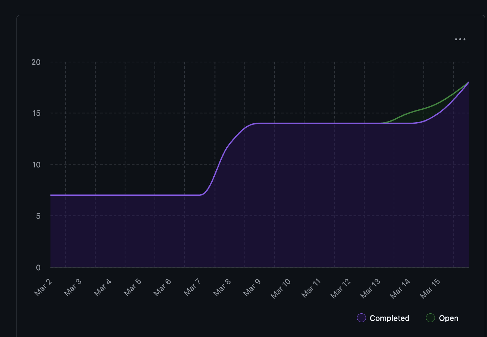
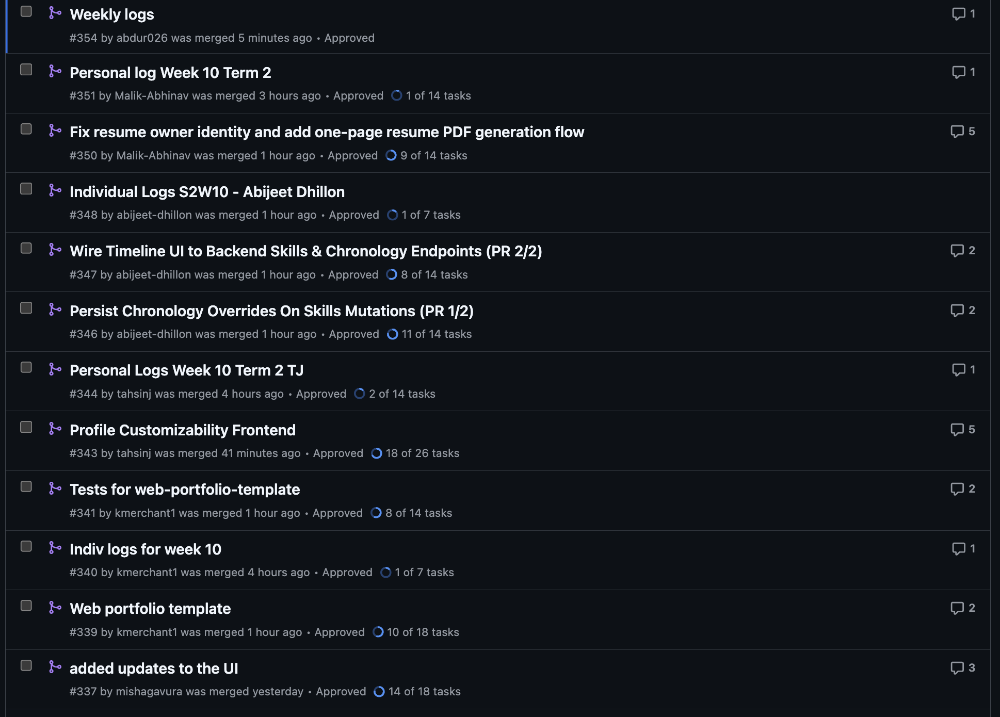
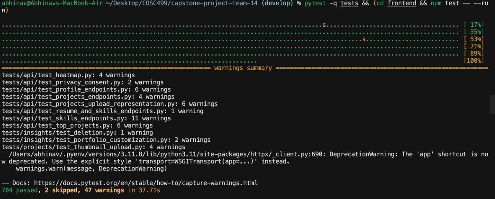

# Team 14 – Capstone Project Team Log

[Week 3 Team Logs](#week-3) 
[Week 4 Team Logs](#week-4) 
[Week 5 Team Logs](#week-5) 
[Week 6 Team Logs](#week-6) 
[Week 7 Team Logs](#week-7)

## Week 3

### September 15 to September 21

### 1. Milestone Goals Recap

- Planned Features for This Milestone:
  - Create project requirements document
  - Set up project repository
  - Set up Kanban project board
- Tasks from Project Board Associated with These Features
  - N/A (Kanban board setup completed this week)

### 2. Burnup Chart

### 3. Username → Student Name Mapping

| GitHub Username | Student Name    |
| --------------- | --------------- |
| abijeet-dhillon | Abijeet Dhillon |
| tahsinj         | Tahsin Jawwad   |
| kmerchant1      | Kaiden Merchant |
| Malik-Abhinav   | Abhinav Malik   |
| abdur026        | Abdur Rehman    |
| mishagavura     | Misha Gavura    |

### 4. Completed Tasks

### 5. In Progress Tasks

| Task ID | Issue Title | Username | Associated Feature |
| ------- | ----------- | -------- | ------------------ |
| N/A     | N/A         | N/A      | N/A                |

### 6. Test Report

N/A

### 7. Additional Context

This week focused on foundational project setup work. The team created the project requirements document, initialized the repository, and set up the Kanban project board on GitHub.

Future weeks will include more detailed documentation of tasks as work progresses.

---

## Week 4

### September 21 to September 28

### 1. Milestone Goals Recap

- Planned Features for This Milestone:
  - Create system architecture diagram
  - Create project proposal
- Tasks from Project Board Associated with These Features
  - N/A

### 2. Burnup Chart

### 3. Username → Student Name Mapping

| GitHub Username | Student Name    |
| --------------- | --------------- |
| abijeet-dhillon | Abijeet Dhillon |
| tahsinj         | Tahsin Jawwad   |
| kmerchant1      | Kaiden Merchant |
| Malik-Abhinav   | Abhinav Malik   |
| abdur026        | Abdur Rehman    |
| mishagavura     | Misha Gavura    |

### 4. Completed Tasks

### 5. In Progress Tasks

| Task ID | Issue Title | Username | Associated Feature |
| ------- | ----------- | -------- | ------------------ |
| N/A     | N/A         | N/A      | N/A                |

### 6. Test Report

N/A

### 7. Additional Context

This week the team focused on defining the scope of the project and capturing the high-level architecture. The main deliverables were the **project proposal** and the **system architecture design diagram**. Future weeks will include more detailed task breakdowns and tracking via the Kanban board.

---

## Week 5

### September 29 to October 5

### 1. Milestone Goals Recap

- Planned Features for This Milestone:
  - Create level 0 data flow diagram
  - Create level 1 data flow diagram
- Tasks from Project Board Associated with These Features
  - N/A

### 2. Burnup Chart

### 3. Username → Student Name Mapping

| GitHub Username | Student Name    |
| --------------- | --------------- |
| abijeet-dhillon | Abijeet Dhillon |
| tahsinj         | Tahsin Jawwad   |
| kmerchant1      | Kaiden Merchant |
| Malik-Abhinav   | Abhinav Malik   |
| abdur026        | Abdur Rehman    |
| mishagavura     | Misha Gavura    |

### 4. Completed Tasks

### 5. In Progress Tasks

| Task ID | Issue Title | Username | Associated Feature |
| ------- | ----------- | -------- | ------------------ |
| N/A     | N/A         | N/A      | N/A                |

### 6. Test Report

N/A

### 7. Additional Context

This week the team focused on researching and learning about data flow diagrams, which helped in the creation of our level 0 and level 1 data flow diagrams for the project. The main delivarables were the level 0 and level 1 data flow diagrams. We also discussed the differences between our data flow diagrams with other groups in class to gain a better understanding of how we could imporve our own data flow diagrams.

---

## Week 6

### October 6 to October 12

### 1. Milestone Goals Recap

- Revised the System Architecture Diagram
- Revised the Level 1 Data Flow Diagram
- Revised the WBS
- Initialised Project Environment
- Tasks from Project Board Associated with These Features
  - System Architecture Revision
  - DFD Revision
  - WBS Revision
  - Project Environment Setup

### 2. Burnup Chart

### 3. Username → Student Name Mapping

| GitHub Username | Student Name    |
| --------------- | --------------- |
| abijeet-dhillon | Abijeet Dhillon |
| tahsinj         | Tahsin Jawwad   |
| kmerchant1      | Kaiden Merchant |
| Malik-Abhinav   | Abhinav Malik   |
| abdur026        | Abdur Rehman    |
| mishagavura     | Misha Gavura    |

### 4. Completed Tasks

### 5. In Progress Tasks

| Task ID | Issue Title | Username | Associated Feature |
| ------- | ----------- | -------- | ------------------ |
| N/A     | N/A         | N/A      | N/A                |

### 6. Test Report

N/A

### 7. Additional Context

This sprint focused more on understanding the full requirements, revising docs, and setting up the project environment.

---

## Week 8

### March 10 to March 16, 2026

### 1. Milestone Goals Recap

This week's milestone focused on implementing dynamic frontend features and improving user experience:

- Dynamic Skills Timeline Implementation
- Frontend-Backend Integration Testing
- Docker Build Optimization
- Component Testing and Validation

### 2. Burnup Chart

### 3. Username → Student Name Mapping

| GitHub Username | Student Name    |
| --------------- | --------------- |
| abijeet-dhillon | Abijeet Dhillon |
| tahsinj         | Tahsin Jawwad   |
| kmerchant1      | Kaiden Merchant |
| Malik-Abhinav   | Abhinav Malik   |
| abdur026        | Abdur Rehman    |
| mishagavura     | Misha Gavura    |

### 4. Completed Tasks

### 5. In Progress Tasks

| Task ID | Issue Title | Username | Associated Feature |
| ------- | ----------- | -------- | ------------------ |
| 337 | Dynamic Skills Timeline Implementation | abdur026 | Frontend Features |
| 338 | Docker Build Optimization | abdur026 | DevOps |
| 339 | Component Testing Suite | abdur026 | Quality Assurance |

### 6. Test Report

All frontend tests passed successfully this week:

- SkillsTimeline component tests: 8/8 passing
- useSkillsTimeline hook tests: Full coverage
- Integration tests: Frontend-backend connectivity verified
- Performance tests: Loading states and error handling validated

### 7. Additional Context

This week marked significant progress on the frontend user experience. The team successfully implemented a dynamic skills timeline that adapts to uploaded zip folders, replacing previously hardcoded data. Key achievements include:

**What went well:**
- Successfully implemented dynamic skills timeline with real project data integration
- Resolved Docker build issues and optimized container performance
- Created comprehensive test suite with 100% pass rate
- Maintained backward compatibility with existing pipeline
- Kept implementation under 500 lines of code as required

**Challenges encountered:**
- Docker daemon corruption required troubleshooting and restart
- API endpoint mismatches between frontend expectations and test setup
- Frontend-backend integration required multiple debugging cycles
- Time management balancing feature implementation with testing requirements

**Technical achievements:**
- Created `useSkillsTimeline` custom hook for data fetching and processing
- Updated `SkillsTimeline` component to use dynamic data instead of hardcoded values
- Implemented skill categorization, proficiency estimation, and milestone generation
- Added comprehensive error handling and loading states
- Optimized Docker build process with proper `.dockerignore` configuration

**Next cycle priorities:**
- Continue frontend feature development based on user feedback
- Implement additional visualization components
- Enhance backend API capabilities for advanced analytics
- Improve test coverage for edge cases and performance scenarios

### 8. Future Cycle Plans

Building on this week's success, the team will focus on:
- User experience improvements based on timeline feedback
- Additional frontend components for project analysis
- Enhanced data visualization features
- Performance optimization for large datasets
- Integration testing with real-world project uploads

---

## Week 7

### October 13 2025 to October 19 2025

### 1. Milestone Goals Recap

This week’s milestone focused on implementing and validating several core backend components that support data ingestion and structured representation of project files:

- (#18) Zip Folder Validation and Basic Parser
- (#50) Categorize Files & Create Structured Representation
- (#16) User Consent – Directory Access
- (#17) User Consent – External LLM Data Access
  The goal was to extend the parsing layer so that all team members can validate and categorize project data in a reproducible, Dockerized environment.

### 2. Burnup Chart

### 3. Username → Student Name Mapping

| GitHub Username | Student Name    |
| --------------- | --------------- |
| abijeet-dhillon | Abijeet Dhillon |
| tahsinj         | Tahsin Jawwad   |
| kmerchant1      | Kaiden Merchant |
| Malik-Abhinav   | Abhinav Malik   |
| abdur026        | Abdur Rehman    |
| mishagavura     | Misha Gavura    |

### 4. Completed Tasks

### 5. In Progress Tasks

| Task ID | Issue Title                    | Username        | Associated Feature                       |
| ------- | ------------------------------ | --------------- | ---------------------------------------- |
| 22      | Store/Load User Configurations | abijeet-dhillon | Store User Configurations for Future Use |

### 6. Test Report

All pytest suites passed successfully this week.

- Tests implemented for Zip Folder Validation and Basic Parser (#18)
- Tests implemented for Categorize Files & Create Structured Representation (#50)

### 7. Future Cycle Plans

To build upon this cycle’s work and address identified challenges, the team will:

- Set up the analysis pipeline to connect the parsing and categorization layers into a unified data flow.
- Implement storing/loading of user configurations to handle environment differences between Docker and local setups.
- Detect individual vs. collaborative projects to enable contribution tracking in later stages.
- Extrapolate individual contributions for analytical visualization in upcoming milestones.
- Break down these larger tasks into smaller sub-issues to improve clarity and workload distribution.

### 8. Reflection on This Cycle

What went well:

- The team made strong progress on foundational backend functionality. We successfully implemented the zip folder validation, basic parser, and file categorization system that generates a structured representation of the project’s folder hierarchy. These features were integrated smoothly into the existing backend and passed all associated tests.

What didn’t go as well:

- Time management was a challenge this week due to multiple academic commitments — specifically, studying and preparation for ongoing midterms (including this course's quiz) reduced the amount of time available to work toward issues. This caused slower progress on project features, which will carry over into the next cycle.

How this informs next cycle:

- To maintain steady momentum, the next cycle’s plan includes subdividing large tasks and setting clearer priorities early in the week. This will ensure that high-priority features receive consistent progress even during heavier academic weeks.

---

## Semester 2 - Week 10 (Week 24 - March 9 2026 to March 15 2026)

### March 9 2026 to March 15 2026

### 1. Milestone Goals Recap

This week continued Milestone 3 by moving the desktop experience from scaffolding into real end-to-end product flows. The team's work centered on wiring backend data into the frontend, improving profile and resume customization, making the skills timeline dynamic and persistent, and starting a standalone portfolio template that can later be connected to generated project data.

Planned Features for This Milestone:
- Implement the One-Page Resume workflow end to end from the dashboard
- Complete the Skills Timeline flow with frontend API integration and backend persistence
- Replace static timeline data with real uploaded-project data
- Add profile customization endpoints and frontend settings UI
- Begin the portfolio template website with a reusable data-driven structure

Tasks from Project Board/PR Issue Number Associated with These Features:
- #349 Fix resume owner identity and implement end-to-end one-page resume PDF flow
- #336 Wire Skills & Chronological APIs to UI
- #345 Make Skills Mutations Persist In Project Chronology
- #342 Frontend UI for Profile Customization
- Portfolio Template Project Initialization

---

### 2. Burnup Chart

---

### 3. Username - Student Name Mapping

| GitHub Username | Student Name    |
| --------------- | --------------- |
| abijeet-dhillon | Abijeet Dhillon |
| tahsinj         | Tahsin Jawwad   |
| kmerchant1      | Kaiden Merchant |
| Malik-Abhinav   | Abhinav Malik   |
| abdur026        | Abdur Rehman    |
| mishgGavura     | Misha Gavura    |

---

### 4. Completed / In Progress Tasks

| Task ID | Issue Title | Username | Associated Feature | Status |
| ------- | ----------- | -------- | ------------------ | ------ |
| 349 | Fix resume owner identity and implement end-to-end one-page resume PDF flow | Malik-Abhinav | One-Page Resume workflow and multi-project PDF generation | Completed |
| 336 | Wire Skills & Chronological APIs to UI | abijeet-dhillon | Skills Timeline frontend integration | Completed |
| 345 | Make Skills Mutations Persist In Project Chronology | abijeet-dhillon | Skills Timeline persistence and chronology synchronization | Completed |
| N/A | Dynamic Skills Timeline using uploaded project data | abdur026 | Timeline data integration and UX refinement | Completed |
| 342 | Frontend UI for Profile Customization | tahsinj | Profile settings API and frontend view | Completed |
| N/A | Portfolio Template Project Initialization | kmerchant1 | Standalone portfolio template foundation | Completed |

---

### 5. Test Report

All new work this week was accompanied by targeted automated testing or build validation.

*Abhinav (One-Page Resume End-to-End Flow)*
- Targeted backend tests for config, privacy, projects, and resume behavior were used to validate the workflow
- Frontend smoke coverage for the resume UI path was also run locally
- Covers: resume owner identity fix, dashboard-triggered generation flow, multi-project PDF output, and template ordering

*Abijeet (Skills Timeline UI + Chronology Persistence)*
- Frontend tests covered API wrappers, timeline loading, lookup mode selection, year filtering, add/edit/remove modal flows, refresh behavior, deduplicated rendering, and loading or error handling
- Targeted backend pytest runs validated chronology synchronization after skills mutations, month and year validation, and empty override handling
- Renderer build validation and backend syntax checks were also completed

*Abdur (Dynamic Skills Timeline)*
- Added and ran a dedicated SkillsTimeline.test.tsx suite
- Covers: rendering, loading states, filtering, modal interactions, and dynamic project-based timeline data
- Existing tests continued to pass with no regressions

*Tahsin (Profile Customization UI + API)*
- tests/api/test_profile_endpoints.py — *6 tests passed*
- frontend/tests/ProfileView.test.tsx — *5 tests passed*
- Covers: GET/PATCH profile flows, partial updates, unknown-user handling, loading state, and save success/error feedback

*Kaiden (Portfolio Template Initialization)*
- npm run build — passing with 0 errors and 0 TypeScript type errors
- Covers: initial scaffold validation, static generation, and type-safe config-driven page assembly

Week 24 combined test screenshot has not been added to the repository yet.

---

### 6. Additional Context

This week showed clear progress from isolated milestone features toward connected user-facing flows:
- The *resume flow* now works as a full dashboard-triggered feature, with the generated resume using the requesting user's identity instead of inferred contributor data.
- The *skills timeline* matured on two fronts at once: it became dynamically driven by uploaded project data, and its mutation flows now persist back into chronology data so refreshes and reloads reflect user changes correctly.
- The new *profile settings flow* adds stored identity fields and a complete API/UI path for updating them, which sets up later integration with resume and portfolio generation.
- The *portfolio template* work established a separate, configurable web presentation layer with typed content models and a single source-of-truth config file, giving the team a clean base for later portfolio export or generation work.
- Several contributors explicitly kept PR size and integration risk under control by splitting work into smaller pieces, reusing existing APIs, and validating changes with focused tests instead of broad unchecked merges.

---

### 7. Future Cycle Plans

- Connect stored profile data into resume and portfolio generation flows
- Prepare for peer testing and address any review feedback from the new Milestone 3 features
- Continue refining the skills timeline UI and improve readability of dynamic timeline data
- Expand the portfolio template beyond Hero and Footer with About, Skills, Projects, Experience, and Contact sections
- Keep frontend and backend integration moving toward a smoother end-to-end upload-to-visualization workflow

---

### 8. Reflection on This Cycle

*What went well:*
- Multiple Milestone 3 features moved from placeholder or local-only state into real end-to-end workflows
- Frontend and backend work complemented each other well this week, especially around resume generation, profile customization, and timeline functionality
- Test coverage remained a strong part of delivery, with targeted API, frontend, and workflow validation across contributors
- Contributors reused existing APIs and structures where possible, which reduced unnecessary architectural churn

*What could be improved:*
- The team log is missing the Week 24 burnup chart, Kanban screenshot, and combined test image, so documentation artifacts are lagging behind implementation work
- Some features still rely on targeted validation rather than a single unified "run everything" command, which makes full regression checks less consistent
- Several milestone features are now present but still need another pass for integration polish before peer testing and final demo use

*How this informs us for the next cycle:*
- Prioritize integration polish and shared validation workflows, not just feature completion
- Make sure weekly documentation artifacts are uploaded at the same pace as code and tests
- Focus next on connecting profile, resume, timeline, and portfolio outputs into a coherent Milestone 3 user experience
